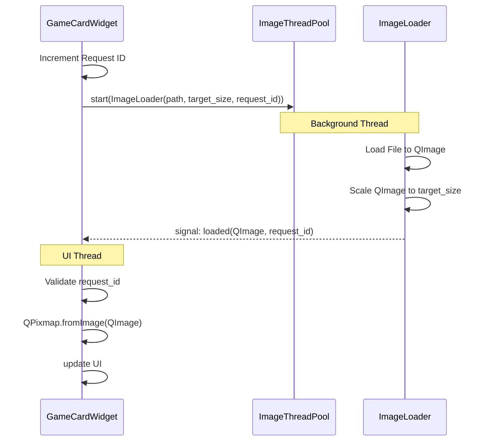

# Design Document: Async Image Decoding Optimization

## Overview
大量のゲームカードが表示される環境において、画像の読み込みとデコード、および表示サイズへのスケーリング処理をメインUIスレッドから完全に分離します。これにより、スクロール時のFPS低下を防ぎ、爆速起動後も快適な操作性を維持します。

### Goals
- 画像のデコードおよびスケーリング処理をバックグラウンドスレッドで完遂する
- メインUIスレッドのブロック時間を最小化する
- ウィジェットの再利用（仮想化）時に、古い画像ロードリクエストによる上書きを防止する
- 画像ロード専用のリソース管理（ThreadPool）を導入する

### Non-Goals
- 画像のオンメモリキャッシュ機能の実装（本設計ではディスクからの都度ロードを最適化対象とする）
- ネットワーク経由の画像取得（ローカルパスの画像のみを対象とする）

## Architecture

### Existing Architecture Analysis
- **現状**: `ImageLoader` (QRunnable) がバックグラウンドで `QPixmap` を作成し、UIスレッドの `_on_image_loaded` で `scaled()` を実行している。
- **問題点**: 
    1. `QPixmap` のバックグラウンド作成はスレッドセーフティに欠ける可能性がある。
    2. `scaled()` 処理がUIスレッドで行われているため、スクロール中にプチフリーズが発生する。

### Architecture Pattern & Boundary Map
**Selected Pattern**: Async Task with Request Tracking
- `ImageLoader` は独立したワーカとして、入力（パス、サイズ）を受け取り出力（デコード済みQImage）を生成する。
- `GameCardWidget` はリクエストごとにインクリメンタルなIDを発行し、受信したデータの整合性を検証する。



## Technology Stack

| Layer | Choice / Version | Role in Feature | Notes |
|-------|------------------|-----------------|-------|
| UI Framework | PySide6 | GUI components | `QImage`, `QPixmap`, `QThreadPool` |
| Image Processing | PIL (Pillow) | Initial decoding | `ImageLoader` 内で使用 |
| Concurrency | QThreadPool | Resource management | 画像専用のプールを管理 |

## Requirements Traceability

| Requirement | Summary | Components | Interfaces | Flows |
|-------------|---------|------------|------------|-------|
| 1.1 | 非同期デコード | ImageLoader | image_loaded(QImage) | Sequence |
| 1.2 | 非同期スケーリング | ImageLoader | target_size param | Sequence |
| 2.1 | 専用ワーカープール | MainWindow/Service | QThreadPool usage | - |
| 3.2 | リクエスト管理 | GameCardWidget | request_id check | Sequence |

## Components and Interfaces

### UI Layer

#### GameCardWidget
| Field | Detail |
|-------|--------|
| Intent | ゲーム情報の表示と画像ロードのトリガー |
| Requirements | 1.3, 3.1, 3.2 |

**Responsibilities & Constraints**
- 画像ロード要求時にユニークな `_current_request_id` を発行する。
- `ImageLoader` からの通知を受け取った際、IDが一致する場合のみUIを更新する。

**Contracts**: Service [ ] / API [ ] / Event [x] / Batch [ ] / State [x]

##### Event Contract
- `image_loaded(image: QImage, request_id: int)`: `ImageLoader` から受信。

##### State Management
- `_current_request_id`: 現在進行中の最新リクエストID。

---

### Infrastructure Layer

#### ImageLoader (QRunnable)
| Field | Detail |
|-------|--------|
| Intent | 画像の読み込み・デコード・スケーリングのバックグラウンド実行 |
| Requirements | 1.1, 1.2, 2.3 |

**Responsibilities & Constraints**
- 指定されたパスから画像を読み込み、`QImage` としてデコードする。
- 読み込み後、指定された `target_size` に `Qt.SmoothTransformation` でスケーリングする。
- 完了後、`QImage` と `request_id` をシグナルで送信する。

##### Service Interface
```python
class ImageLoader(QRunnable):
    def __init__(self, image_path: Path, target_size: QSize, request_id: int): ...
```

---

#### AsyncImagePool
| Field | Detail |
|-------|--------|
| Intent | 画像読み込みタスク専用のスレッドプール管理 |
| Requirements | 2.1, 2.2 |

**Responsibilities & Constraints**
- グローバルプールとは別に、画像処理専用の `QThreadPool` インスタンスを保持する。
- 同時実行数を制限し、大量のスクロールが発生してもシステム全体のレスポンスを損なわないようにする。

## Testing Strategy
- **Unit Tests**:
    - `ImageLoader` が指定サイズに正しくスケーリングされた `QImage` を返すことの検証。
    - 存在しないパスや破損した画像に対するエラーハンドリングの検証。
- **Integration Tests**:
    - `GameCardWidget` でリクエストIDが不一致の場合にUI更新がスキップされることの検証。
    - 高速な連続更新（再利用）時に最終的な最新画像のみが表示されることの検証。
- **Performance Tests**:
    - 1000件以上の画像ロードが走る状況でのメインスレッドのFPS計測。
