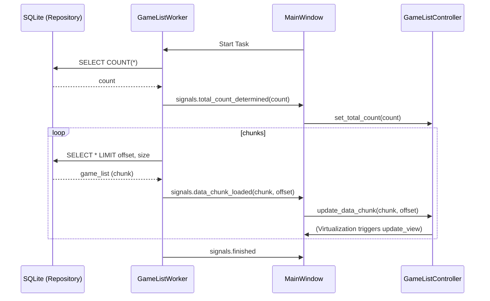

# Design Document: Async Sequential Grid Display

## Overview
この機能は、LitheLauncherの起動時にゲームリストが即座に表示され始めるようにします。全データ（1000件以上）の読み込み完了を待たずに、準備ができたゲームカードから順次UIに追加していくことで、体感の待ち時間を大幅に削減します。

### Goals
- アプリケーション表示から0.7秒以内に最初のゲームカードが表示され始める。
- 大量データ読み込み中も、スクロールやリサイズなどのUI操作がスムーズに行える。
- スクロールバーのサイズを起動直後に確定させ、全体像をユーザーに提示する。

### Non-Goals
- データベース自体のクエリ高速化（本件はUIへのデリバリー最適化に注力）。
- 画像読み込みの最適化（既存の `ImageLoader` で対応済み）。

## Architecture

### Existing Architecture Analysis
- **Worker**: `GameListWorker` が `QRunnable` で動作。
- **Controller**: `GameListController` が仮想化を担当。
- **View**: `MainWindow` が `FlowLayout` を含むスクロールエリアを保持。

### Architecture Pattern & Boundary Map



### Technology Stack

| Layer | Choice / Version | Role in Feature | Notes |
|-------|------------------|-----------------|-------|
| Frontend | PySide6 | UI Framework | シグナル・スロットによる非同期通信 |
| Backend | Python 3.x | Logic | WorkerとControllerのロジック |
| Data | SQLite | Storage | `fetchone` またはチャンク取得への変更 |

## System Flows

### 逐次ロードフロー
1. `GameListWorker` 起動。
2. 全件数を取得し、UIに通知。
3. 初期表示分（例: 最初のリクエスト）を最優先で取得・通知。
4. 以降、一定件数（例: 100件）ごとにデータを取得・通知。
5. UI側（MainWindow）は通知を受けるたびにControllerを更新し、現在表示中の範囲であればウィジェットを即座に更新。

## Requirements Traceability

| Requirement | Summary | Components | Interfaces | Flows |
|-------------|---------|------------|------------|-------|
| 1.1 | 非同期データ読み込み | GameListWorker | data_chunk_loaded | 逐次ロードフロー |
| 1.2 | 逐次追加表示 | MainWindow, GameListController | update_data_chunk | 逐次ロードフロー |
| 2.1 | UI応答性維持 | MainWindow | eventFilter | 既存の仮想化ロジック |
| 3.1 | 0.7秒起動死守 | GameListWorker | (Initial Chunk) | 最初の通知を最優先 |

## Components and Interfaces

### [Data Access Layer]

#### GameRepository / GameService
- **Intent**: データをストリーミング形式で提供するためのインターフェースを提供。
- **Requirements**: 1.1, 1.3
- **Contracts**: Service [X]

```python
# GameService
def get_game_list_stream(chunk_size: int = 50):
    # ジェネレータとして実装し、(offset, list) を返す
    pass
```

### [Logic Layer]

#### GameListWorker
- **Intent**: バックグラウンドスレッドでデータを取得し、逐次シグナルを発行。
- **Requirements**: 1.1, 1.3
- **Contracts**: Service [X], Event [X]

```python
class GameListWorkerSignals(QObject):
    total_determined = Signal(int)
    data_chunk_loaded = Signal(list, int) # (data, offset)
    load_failed = Signal(str)
```

#### GameListController
- **Intent**: データの部分的な更新を受け入れ、仮想化表示に反映。
- **Requirements**: 1.2, 2.1
- **Contracts**: State [X]

```python
class GameListController:
    def set_total_count(self, count: int):
        self.data = [None] * count # Noneで初期化
        
    def update_data_chunk(self, chunk: list, offset: int):
        for i, item in enumerate(chunk):
            self.data[offset + i] = item
```

## Error Handling

### Error Strategy
- DBアクセスエラー時、`load_failed` シグナルを発行し、UI側でエラーダイアログを表示。
- 部分的な読み込み失敗時は、その時点までのデータを表示し続ける。

## Testing Strategy
- **Unit Tests**: 
    - `GameListController.update_data_chunk` が正しくデータを穴埋めできるか。
    - `GameListWorker` が正しいオフセットでシグナルを発行するか。
- **Integration Tests**: 
    - `MainWindow` がチャンク受信のたびに再描画（表示範囲内であれば）をトリガーするか。
- **Performance Tests**:
    - 5000件のモックデータを用いて、表示開始までの時間が0.7秒以内であることを確認（`main.py` のタイミングログを使用）。
