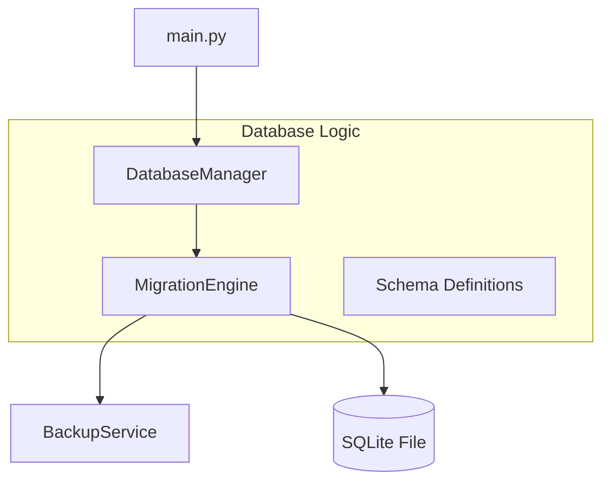
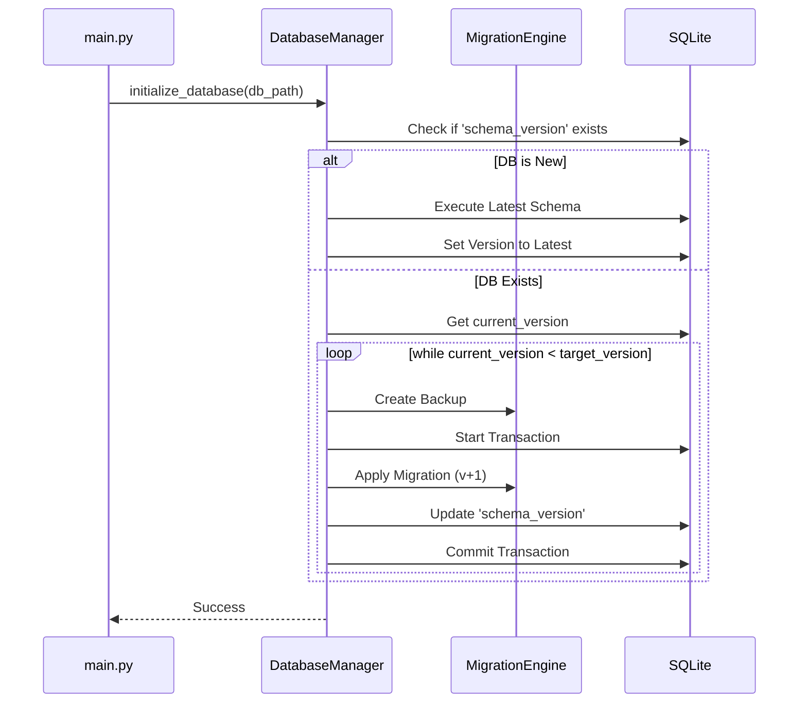

# Technical Design: code-first-db-migration

---
**Purpose**: 繝・・繧ｿ繝吶・繧ｹ縺ｮ繧ｹ繧ｭ繝ｼ繝槫ｮ夂ｾｩ繧偵さ繝ｼ繝峨・繝ｼ繧ｹ縺ｫ遘ｻ陦後＠縲∝ｮ牙・縺九▽閾ｪ蜍募喧縺輔ｌ縺溘・繧､繧ｰ繝ｬ繝ｼ繧ｷ繝ｧ繝ｳ繝｡繧ｫ繝九ぜ繝繧貞ｮ溯｣・☆繧九◆繧√・隧ｳ邏ｰ縺ｪ險ｭ險医ｒ螳夂ｾｩ縺励∪縺吶€・
---

## Overview
縺薙・讖溯・縺ｯ縲￣yzree Game Launcher 縺ｮ繝・・繧ｿ繝吶・繧ｹ邂｡逅・Ο繧ｸ繝・け繧偵€∝ｾ捺擂縺ｮ蜻ｽ莉､逧・ｼ域焔邯壹″逧・ｼ峨↑險倩ｿｰ縺九ｉ縲∝ｮ｣險€逧・↑繝舌・繧ｸ繝ｧ繝ｳ繝吶・繧ｹ縺ｮ繝槭う繧ｰ繝ｬ繝ｼ繧ｷ繝ｧ繝ｳ繧ｷ繧ｹ繝・Β縺ｸ縺ｨ蛻ｷ譁ｰ縺吶ｋ繧ゅ・縺ｧ縺吶€・
**Purpose**: 繧｢繝励Μ繧ｱ繝ｼ繧ｷ繝ｧ繝ｳ縺ｮ繧｢繝・・繝・・繝医↓莨ｴ縺・ョ繝ｼ繧ｿ讒矩€縺ｮ螟画峩繧偵€∽ｺｺ逧・Α繧ｹ繧呈賜髯､縺励※螳牙・縺ｫ螳溯｡後〒縺阪ｋ繧医≧縺ｫ縺励∪縺吶€・**Users**: 髢狗匱閠・ｼ医せ繧ｭ繝ｼ繝樒ｮ｡逅・・邁｡邏蛹厄ｼ峨♀繧医・荳€闊ｬ繝ｦ繝ｼ繧ｶ繝ｼ・郁・蜍慕噪縺ｪ繝・・繧ｿ蠑輔″邯吶℃・峨€・**Impact**: `src/database.py` 縺ｮ蜀・Κ讒矩€縺悟､ｧ蟷・↓繝ｪ繝輔ぃ繧ｯ繧ｿ繝ｪ繝ｳ繧ｰ縺輔ｌ縲∵眠縺溘↓繝舌・繧ｸ繝ｧ繝ｳ邂｡逅・畑縺ｮ繝・・繝悶Ν縺悟ｰ主・縺輔ｌ縺ｾ縺吶€・
### Goals
- 繝・・繧ｿ繝吶・繧ｹ縺ｮ蜈ｨ繧ｹ繧ｭ繝ｼ繝槭ｒ Python 繧ｳ繝ｼ繝牙・縺ｧ螳夂ｾｩ繝ｻ邂｡逅・☆繧九€・- 襍ｷ蜍墓凾縺ｫ迴ｾ蝨ｨ縺ｮ DB 繝舌・繧ｸ繝ｧ繝ｳ繧定・蜍墓､懃衍縺励€∝ｿ・ｦ√↓蠢懊§縺ｦ繝槭う繧ｰ繝ｬ繝ｼ繧ｷ繝ｧ繝ｳ繧貞ｮ溯｡後☆繧九€・- 繝槭う繧ｰ繝ｬ繝ｼ繧ｷ繝ｧ繝ｳ螳溯｡悟燕縺ｫ閾ｪ蜍慕噪縺ｫ繝・・繧ｿ繝吶・繧ｹ縺ｮ繝舌ャ繧ｯ繧｢繝・・繧剃ｽ懈・縺吶ｋ縲・- 螳溯｡悟ｱ･豁ｴ繧偵ョ繝ｼ繧ｿ繝吶・繧ｹ蜀・↓險倬鹸縺励€√ヨ繝ｬ繝ｼ繧ｵ繝薙Μ繝・ぅ繧堤｢ｺ菫昴☆繧九€・
### Non-Goals
- 莉悶・繝・・繧ｿ繝吶・繧ｹ・・ostgreSQL遲会ｼ峨∈縺ｮ蟇ｾ蠢懶ｼ・QLite 縺ｫ迚ｹ蛹厄ｼ峨€・- 螟夜Κ縺ｮ繝槭う繧ｰ繝ｬ繝ｼ繧ｷ繝ｧ繝ｳ繝・・繝ｫ・・lembic 遲会ｼ峨・蟆主・・井ｾ晏ｭ俶€ｧ繧呈椛縺医ｋ縺溘ａ閾ｪ菴懊お繝ｳ繧ｸ繝ｳ繧呈治逕ｨ・峨€・
## Architecture

### Architecture Pattern & Boundary Map

**Architecture Integration**:
- **Selected pattern**: Embedded Migration Manager. `DatabaseManager` 繧ｯ繝ｩ繧ｹ縺後お繝ｳ繝医Μ繝ｼ繝昴う繝ｳ繝医→縺ｪ繧翫€∝・驛ｨ縺ｧ繝槭う繧ｰ繝ｬ繝ｼ繧ｷ繝ｧ繝ｳ縺ｮ螳溯｡後ｒ蛻ｶ蠕｡縺励∪縺吶€・- **Domain/feature boundaries**: 繧ｹ繧ｭ繝ｼ繝槫ｮ夂ｾｩ・・chemaDef・峨→驕ｩ逕ｨ繝ｭ繧ｸ繝・け・・ngine・峨ｒ蛻・屬縺励€∽ｿ晏ｮ域€ｧ繧帝ｫ倥ａ縺ｾ縺吶€・- **Existing patterns preserved**: `initialize_database` 髢｢謨ｰ縺ｮ繧､繝ｳ繧ｿ繝ｼ繝輔ぉ繝ｼ繧ｹ繧堤ｶｭ謖√＠縲～main.py` 縺ｸ縺ｮ蠖ｱ髻ｿ繧呈怙蟆城剞縺ｫ謚代∴縺ｾ縺吶€・
### Technology Stack

| Layer | Choice / Version | Role in Feature | Notes |
|-------|------------------|-----------------|-------|
| Backend | Python 3.x | `DatabaseManager` 繧ｯ繝ｩ繧ｹ縺ｮ螳溯｣・| 讓呎ｺ悶Λ繧､繝悶Λ繝ｪ縺ｮ縺ｿ繧剃ｽｿ逕ｨ縲・|
| Data | SQLite | 繝舌・繧ｸ繝ｧ繝ｳ邂｡逅・ユ繝ｼ繝悶Ν縺ｮ霑ｽ蜉 | `schema_version` 繝・・繝悶Ν繧貞ｰ主・縲・|
| Infra | `shutil` | 迚ｩ逅・ヰ繝・け繧｢繝・・縺ｮ菴懈・ | `shutil.copy2` 繧剃ｽｿ逕ｨ縲・|

## System Flows

### 繝・・繧ｿ繝吶・繧ｹ蛻晄悄蛹悶・繝槭う繧ｰ繝ｬ繝ｼ繧ｷ繝ｧ繝ｳ繝輔Ο繝ｼ

## Requirements Traceability

| Requirement | Summary | Components | Interfaces | Flows |
|-------------|---------|------------|------------|-------|
| 1.1 | 繧ｹ繧ｭ繝ｼ繝槭・繧ｳ繝ｼ繝牙ｮ夂ｾｩ | SchemaDef | N/A | 蛻晄悄蛹・|
| 1.2 | 蜈ｨ讒矩€縺ｮ逕滓・讖溯・ | DatabaseManager | `create_all()` | 蛻晄悄蛹・|
| 2.1 | 繝舌・繧ｸ繝ｧ繝ｳ邂｡逅・ユ繝ｼ繝悶Ν | MigrationEngine | `schema_version` table | N/A |
| 2.2 | 繝舌・繧ｸ繝ｧ繝ｳ豈碑ｼ・| MigrationEngine | `needs_migration()` | 蛻晄悄蛹・|
| 3.1 | 鬆・ｬ｡螳溯｡後Ο繧ｸ繝・け | MigrationEngine | `apply_migrations()` | 繝槭う繧ｰ繝ｬ繝ｼ繧ｷ繝ｧ繝ｳ |
| 3.2 | 繝医Λ繝ｳ繧ｶ繧ｯ繧ｷ繝ｧ繝ｳ蛻ｶ蠕｡ | DatabaseManager | Python context manager | 繝槭う繧ｰ繝ｬ繝ｼ繧ｷ繝ｧ繝ｳ |
| 4.1 | 閾ｪ蜍輔ヰ繝・け繧｢繝・・ | BackupService | `create_backup()` | 繝槭う繧ｰ繝ｬ繝ｼ繧ｷ繝ｧ繝ｳ |
| 4.2 | 繝ｭ繝ｼ繝ｫ繝舌ャ繧ｯ蜃ｦ逅・| DatabaseManager | `try...except` | 繝槭う繧ｰ繝ｬ繝ｼ繧ｷ繝ｧ繝ｳ |
| 5.1 | 繝ｭ繧ｰ險倬鹸 | DatabaseManager | `logging` | 繝槭う繧ｰ繝ｬ繝ｼ繧ｷ繝ｧ繝ｳ |
| 5.2 | 螳溯｡悟ｱ･豁ｴ縺ｮ菫晏ｭ・| MigrationEngine | `migration_history` table | 繝槭う繧ｰ繝ｬ繝ｼ繧ｷ繝ｧ繝ｳ |

## Components and Interfaces

### Backend / Services

#### DatabaseManager (Refactored `src/database.py`)

| Field | Detail |
|-------|--------|
| Intent | DB縺ｮ蛻晄悄蛹悶€∵磁邯壹€√・繧､繧ｰ繝ｬ繝ｼ繧ｷ繝ｧ繝ｳ縺ｮ繧ｪ繝ｼ繧ｱ繧ｹ繝医Ξ繝ｼ繧ｷ繝ｧ繝ｳ繧定｡後≧ |
| Requirements | 1.2, 3.2, 4.2, 5.1 |

**Responsibilities & Constraints**
- `main.py` 縺九ｉ縺ｮ蛻晄悄蛹悶Μ繧ｯ繧ｨ繧ｹ繝医・蜿礼炊縲・- `MigrationEngine` 繧貞他縺ｳ蜃ｺ縺励€∝ｮ牙・縺ｪ鬆・ｺ上〒繝槭う繧ｰ繝ｬ繝ｼ繧ｷ繝ｧ繝ｳ繧貞ｮ溯｡後€・- 繧ｨ繝ｩ繝ｼ逋ｺ逕滓凾縺ｮ迚ｩ逅・ヰ繝・け繧｢繝・・縺九ｉ縺ｮ蠕ｩ蜈・ｼ亥ｿ・ｦ√↓蠢懊§縺ｦ・峨€・
#### MigrationEngine

| Field | Detail |
|-------|--------|
| Intent | 繧ｹ繧ｭ繝ｼ繝槫､画峩縺ｮ螳滄圀縺ｮ驕ｩ逕ｨ縺ｨ繝舌・繧ｸ繝ｧ繝ｳ邂｡逅・ｒ諡・ｽ・|
| Requirements | 2.1, 2.2, 3.1, 5.2 |

**Responsibilities & Constraints**
- 迴ｾ蝨ｨ縺ｮ繝舌・繧ｸ繝ｧ繝ｳ縺ｮ迚ｹ螳壹€・- 繝舌・繧ｸ繝ｧ繝ｳ縺斐→縺ｮ SQL 蟾ｮ蛻・ｼ・P繧ｹ繧ｯ繝ｪ繝励ヨ・峨・螳夂ｾｩ菫晄戟縲・- 螻･豁ｴ繝・・繝悶Ν縺ｸ縺ｮ譖ｸ縺崎ｾｼ縺ｿ縲・
## Data Models

### Logical Data Model

**schema_version (Internal Table)**:
- `version`: `INTEGER` (Current version number)
- `applied_at`: `TEXT` (Timestamp)

**migration_history (Internal Table)**:
- `id`: `INTEGER PRIMARY KEY`
- `from_version`: `INTEGER`
- `to_version`: `INTEGER`
- `applied_at`: `TEXT`
- `status`: `TEXT` (SUCCESS/FAILED)

## Error Handling

### Error Strategy
- **Backup Failure**: 繝槭う繧ｰ繝ｬ繝ｼ繧ｷ繝ｧ繝ｳ繧剃ｸｭ豁｢縺励€∽ｾ句､悶ｒ繧ｹ繝ｭ繝ｼ縲・- **Migration SQL Failure**: 繝医Λ繝ｳ繧ｶ繧ｯ繧ｷ繝ｧ繝ｳ繧偵Ο繝ｼ繝ｫ繝舌ャ繧ｯ縺励€．B繝輔ぃ繧､繝ｫ繧偵ヰ繝・け繧｢繝・・縺九ｉ蠕ｩ譌ｧ縲ゅΟ繧ｰ縺ｫ隧ｳ邏ｰ繧定ｨ倬鹸縲・
## Testing Strategy

- **Unit Tests**:
    - 繝舌・繧ｸ繝ｧ繝ｳ豈碑ｼ・Ο繧ｸ繝・け縺ｮ繝・せ繝医€・    - 遨ｺ縺ｮ繝・・繧ｿ繝吶・繧ｹ縺ｸ縺ｮ蛻晄悄驕ｩ逕ｨ繝・せ繝医€・- **Integration Tests**:
    - 繝舌・繧ｸ繝ｧ繝ｳ 1 縺ｮ迥ｶ諷九・ DB 繧剃ｽ懈・縺励€∵怙譁ｰ繝舌・繧ｸ繝ｧ繝ｳ縺ｾ縺ｧ豁｣蟶ｸ縺ｫ繧｢繝・・繧ｰ繝ｬ繝ｼ繝峨＆繧後ｋ縺九・讀懆ｨｼ縲・    - 騾比ｸｭ縺ｮ繝槭う繧ｰ繝ｬ繝ｼ繧ｷ繝ｧ繝ｳ縺ｧ繧ｨ繝ｩ繝ｼ繧堤匱逕溘＆縺帙€√Ο繝ｼ繝ｫ繝舌ャ繧ｯ・亥ｾｩ譌ｧ・峨′豁｣縺励￥陦後ｏ繧後ｋ縺九・讀懆ｨｼ縲・
