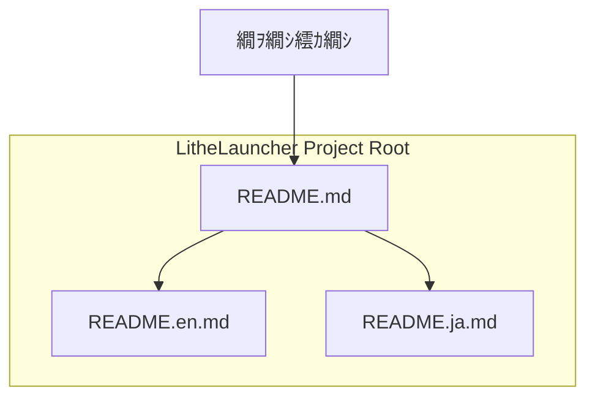

# Design Document Template

---
**Purpose**: README.md縺ｮ菴懈・縺ｫ髢｢縺吶ｋ謚€陦楢ｨｭ險医ｒ隧ｳ邏ｰ縺ｫ險倩ｿｰ縺励€∝ｮ溯｣・・荳€雋ｫ諤ｧ繧堤｢ｺ菫昴＠縺ｾ縺吶€・
**Approach**:
- 譛ｬ繝峨く繝･繝｡繝ｳ繝医・縲ヽEADME.md縺ｮ讒矩€縲∝・螳ｹ縲√♀繧医・螟夊ｨ€隱槫ｯｾ蠢懊・螳溯｣・↓髢｢縺吶ｋ豎ｺ螳壻ｺ矩・ｒ謠蝉ｾ帙＠縺ｾ縺吶€・
---

## Overview 
**Purpose**: LitheLauncher Game Launcher 縺ｮ縺溘ａ縺ｮ蛹・峡逧・〒繝ｦ繝ｼ繧ｶ繝ｼ繝輔Ξ繝ｳ繝峨Μ繝ｼ縺ｪ `README.md` 繧剃ｽ懈・縺励∪縺吶€ゅ％繧後↓繧医ｊ縲√・繝ｭ繧ｸ繧ｧ繧ｯ繝医・讎りｦ√€√そ繝・ヨ繧｢繝・・譁ｹ豕輔€∵ｩ溯・縲√♀繧医・雋｢迪ｮ繧ｬ繧､繝峨Λ繧､繝ｳ繧呈・遒ｺ縺ｫ莨昴∴縺ｾ縺吶€ょ､夊ｨ€隱橸ｼ域律譛ｬ隱槭→闍ｱ隱橸ｼ峨↓蟇ｾ蠢懊☆繧九％縺ｨ縺ｧ縲√ｈ繧雁ｹ・ｺ・＞繝ｦ繝ｼ繧ｶ繝ｼ縺ｫ繧｢繧ｯ繧ｻ繧ｹ蜿ｯ閭ｽ縺ｫ縺励∪縺吶€・**Users**: LitheLauncher Game Launcher 縺ｮ髢狗匱閠・→繝ｦ繝ｼ繧ｶ繝ｼ縲・**Impact**: 繝励Ο繧ｸ繧ｧ繧ｯ繝医・繝峨く繝･繝｡繝ｳ繝・・繧ｷ繝ｧ繝ｳ縺ｮ雉ｪ繧貞髄荳翫＆縺帙€∵眠隕上Θ繝ｼ繧ｶ繝ｼ縺ｮ繧ｪ繝ｳ繝懊・繝・ぅ繝ｳ繧ｰ繧貞ｮｹ譏薙↓縺励∪縺吶€・
### Goals
- LitheLauncher Game Launcher縺ｮ荳ｻ隕√↑諠・ｱ繧堤ｶｲ鄒・＠縺欒EADME.md繧呈署萓帙☆繧九％縺ｨ縲・- 譌･譛ｬ隱樒沿縺ｨ闍ｱ隱樒沿縺ｮ荳｡譁ｹ縺ｮREADME.md繧呈署萓帙☆繧九％縺ｨ縲・- 繝ｦ繝ｼ繧ｶ繝ｼ縺後・繝ｭ繧ｸ繧ｧ繧ｯ繝医・讎りｦ√→菴ｿ逕ｨ譁ｹ豕輔ｒ霑・€溘↓逅・ｧ｣縺ｧ縺阪ｋ繧医≧縺ｫ縺吶ｋ縺薙→縲・
### Non-Goals
- README.md縺ｮ閾ｪ蜍慕函謌舌ヤ繝ｼ繝ｫ縺ｮ髢狗匱縲・- 繝峨く繝･繝｡繝ｳ繝育ｮ｡逅・す繧ｹ繝・Β縺ｮ蟆主・縲・- 闍ｱ隱槭→譌･譛ｬ隱樔ｻ･螟悶・險€隱槭∈縺ｮ蟇ｾ蠢懊€・
## Architecture

### Existing Architecture Analysis
- **迴ｾ蝨ｨ縺ｮ繧｢繝ｼ繧ｭ繝・け繝√Ε繝代ち繝ｼ繝ｳ縺ｨ蛻ｶ邏・*: LitheLauncher繝励Ο繧ｸ繧ｧ繧ｯ繝医・縲￣ython縺ｨPySide6繧堤畑縺・◆繝・せ繧ｯ繝医ャ繝励い繝励Μ繧ｱ繝ｼ繧ｷ繝ｧ繝ｳ縺ｧ縺ゅｊ縲～src/`繝・ぅ繝ｬ繧ｯ繝医Μ蜀・↓蜷・Δ繧ｸ繝･繝ｼ繝ｫ縺碁・鄂ｮ縺輔ｌ縺ｦ縺・∪縺吶€ゅラ繧ｭ繝･繝｡繝ｳ繝・・繧ｷ繝ｧ繝ｳ縺ｯ荳ｻ縺ｫ繧ｳ繝ｼ繝峨さ繝｡繝ｳ繝医ｄ・亥ｭ伜惠縺吶ｋ蝣ｴ蜷茨ｼ牙挨騾斐ラ繧ｭ繝･繝｡繝ｳ繝医ヵ繧｡繧､繝ｫ縺ｧ陦後ｏ繧後∪縺吶€３EADME.md縺ｯ繝励Ο繧ｸ繧ｧ繧ｯ繝医・繝ｫ繝ｼ繝医↓驟咲ｽｮ縺輔ｌ繧倶ｸ€闊ｬ逧・↑繝輔ぃ繧､繝ｫ縺ｧ縺吶€・- **譌｢蟄倥・繝峨Γ繧､繝ｳ蠅・阜**: 縺ｪ縺暦ｼ・EADME.md縺ｯ迢ｬ遶九＠縺溘ラ繧ｭ繝･繝｡繝ｳ繝茨ｼ峨€・- **邨ｱ蜷医・繧､繝ｳ繝・*: 縺ｪ縺暦ｼ・EADME.md縺ｯ迢ｬ遶九＠縺溘ラ繧ｭ繝･繝｡繝ｳ繝茨ｼ峨€・
### Architecture Pattern & Boundary Map

**Architecture Integration**:
- **Selected pattern**: Simple File Organization縲ＡREADME.md` 繧偵Ν繝ｼ繝医↓驟咲ｽｮ縺励€∬ｨ€隱槫崋譛峨・繝輔ぃ繧､繝ｫ (`README.en.md`, `README.ja.md`) 繧貞盾辣ｧ縺吶ｋ繧ｷ繝ｳ繝励Ν縺ｪ繝輔ぃ繧､繝ｫ讒区・繧呈治逕ｨ縺励∪縺吶€・- **Domain/feature boundaries**: README.md 縺ｮ菴懈・縺ｯ縲∵里蟄倥・繧｢繝励Μ繧ｱ繝ｼ繧ｷ繝ｧ繝ｳ縺ｮ繝峨Γ繧､繝ｳ蠅・阜縺ｫ蠖ｱ髻ｿ繧剃ｸ弱∴縺ｾ縺帙ｓ縲ゅラ繧ｭ繝･繝｡繝ｳ繝・・繧ｷ繝ｧ繝ｳ縺ｨ縺・≧迢ｬ遶九＠縺滄伜沺縺ｨ縺励※謇ｱ縺・∪縺吶€・- **Existing patterns preserved**: 縺ｪ縺暦ｼ医ラ繧ｭ繝･繝｡繝ｳ繝・・繧ｷ繝ｧ繝ｳ縺ｫ髢｢縺吶ｋ譌｢蟄倥・繝代ち繝ｼ繝ｳ縺ｯ迚ｹ縺ｫ縺ｪ縺暦ｼ峨€・- **New components rationale**: `README.md` (讎りｦ√→繝ｪ繝ｳ繧ｯ), `README.en.md` (闍ｱ隱槭・螳悟・迚・, `README.ja.md` (譌･譛ｬ隱槭・螳悟・迚・ 縺ｮ3縺､縺ｮ繝輔ぃ繧､繝ｫ繧剃ｽ懈・縺励∪縺吶€・- **Steering compliance**: 繝峨く繝･繝｡繝ｳ繝・・繧ｷ繝ｧ繝ｳ縺ｯ繝励Ο繧ｸ繧ｧ繧ｯ繝医・逅・ｧ｣繧呈ｷｱ繧√ｋ荳翫〒驥崎ｦ√〒縺ゅｊ縲￣yzree繝励Ο繧ｸ繧ｧ繧ｯ繝医・蜈ｨ菴鍋噪縺ｪ蜩∬ｳｪ蜷台ｸ翫↓雋｢迪ｮ縺励∪縺吶€・
### Technology Stack

| Layer | Choice / Version | Role in Feature | Notes |
|-------|------------------|-----------------|-------|
| 繝峨く繝･繝｡繝ｳ繝・・繧ｷ繝ｧ繝ｳ | Markdown | README.md縺ｮ險倩ｿｰ蠖｢蠑・| GitHub縺ｮ繝ｬ繝ｳ繝€繝ｪ繝ｳ繧ｰ讓呎ｺ・|
| 鄙ｻ險ｳ | 謇句虚 / 繝・・繝ｫ陬懷勧 | 譌･譛ｬ隱槭→闍ｱ隱槭・鄙ｻ險ｳ | 迴ｾ譎らせ縺ｧ縺ｯ迚ｹ蛻･縺ｪ繝・・繝ｫ縺ｯ荳崎ｦ・|

## System Flows

> README.md縺ｮ菴懈・縺ｯ隍・尅縺ｪ繧ｷ繧ｹ繝・Β繝輔Ο繝ｼ繧剃ｼｴ繧上↑縺・◆繧√€√％縺ｮ繧ｻ繧ｯ繧ｷ繝ｧ繝ｳ縺ｯ逵∫払縺励∪縺吶€・
## Requirements Traceability

| Requirement | Summary | Components | Interfaces | Flows |
|-------------|---------|------------|------------|-------|
| 1.1 | 繝励Ο繧ｸ繧ｧ繧ｯ繝医・逶ｮ逧・→讎りｦ√ｒ險倩ｿｰ | `README.md` (`README.en.md`, `README.ja.md`) | 縺ｪ縺・| 縺ｪ縺・|
| 1.2 | 荳ｻ隕√↑讖溯・繧呈・遒ｺ縺ｫ蛻玲嫌 | `README.md` (`README.en.md`, `README.ja.md`) | 縺ｪ縺・| 縺ｪ縺・|
| 1.3 | 繧ｿ繝ｼ繧ｲ繝・ヨ繝ｦ繝ｼ繧ｶ繝ｼ繧定ｨ倩ｿｰ | `README.md` (`README.en.md`, `README.ja.md`) | 縺ｪ縺・| 縺ｪ縺・|
| 2.1 | 蠢・ｦ√↑蜑肴署譚｡莉ｶ繧呈・險・| `README.md` (`README.en.md`, `README.ja.md`) | 縺ｪ縺・| 縺ｪ縺・|
| 2.2 | 繧｢繝励Μ繧ｱ繝ｼ繧ｷ繝ｧ繝ｳ縺ｮ繧､繝ｳ繧ｹ繝医・繝ｫ謇矩・ｒ險倩ｿｰ | `README.md` (`README.en.md`, `README.ja.md`) | 縺ｪ縺・| 縺ｪ縺・|
| 2.3 | 繧｢繝励Μ繧ｱ繝ｼ繧ｷ繝ｧ繝ｳ縺ｮ襍ｷ蜍墓婿豕輔ｒ險倩ｿｰ | `README.md` (`README.en.md`, `README.ja.md`) | 縺ｪ縺・| 縺ｪ縺・|
| 3.1 | 蜷・ｸｻ隕∵ｩ溯・縺ｮ菴ｿ逕ｨ謇矩・ｒ隱ｬ譏・| `README.md` (`README.en.md`, `README.ja.md`) | 縺ｪ縺・| 縺ｪ縺・|
| 3.2 | Pre/Post-Launch Commands縺ｮ險ｭ螳壽婿豕輔→蛻ｩ逕ｨ萓九ｒ謠蝉ｾ・| `README.md` (`README.en.md`, `README.ja.md`) | 縺ｪ縺・| 縺ｪ縺・|
| 3.3 | Save Data Synchronization縺ｮ險ｭ螳壽婿豕輔→蜷梧悄縺ｮ謖吝虚繧定ｪｬ譏・| `README.md` (`README.en.md`, `README.ja.md`) | 縺ｪ縺・| 縺ｪ縺・|
| 4.1 | 雋｢迪ｮ繧ｬ繧､繝峨Λ繧､繝ｳ繧呈署萓帙☆繧・| `README.md` (`README.en.md`, `README.ja.md`) | 縺ｪ縺・| 縺ｪ縺・|
| 4.2 | 繝・せ繝医・螳溯｡梧婿豕輔ｄ髢狗匱迺ｰ蠅・↓髢｢縺吶ｋ諠・ｱ繧呈署萓・| `README.md` (`README.en.md`, `README.ja.md`) | 縺ｪ縺・| 縺ｪ縺・|
| 4.3 | 繝ｩ繧､繧ｻ繝ｳ繧ｹ諠・ｱ繧呈・險倥☆繧・| `README.md` (`README.en.md`, `README.ja.md`) | 縺ｪ縺・| 縺ｪ縺・|
| 5.1 | 譌･譛ｬ隱樒沿縺ｨ闍ｱ隱樒沿縺ｮ荳｡譁ｹ繧呈署萓帙☆繧・| `README.en.md`, `README.ja.md` | 縺ｪ縺・| 縺ｪ縺・|
| 5.2 | 蜷・ｨ€隱樒沿縺悟酔縺俶ュ蝣ｱ繧堤ｶｲ鄒・＠縲∵ｭ｣遒ｺ縺ｧ縺ゅｋ縺薙→繧剃ｿ晁ｨｼ縺吶ｋ | `README.en.md`, `README.ja.md` | 縺ｪ縺・| 縺ｪ縺・|
| 5.3 | 繝ｦ繝ｼ繧ｶ繝ｼ縺悟茜逕ｨ縺吶ｋ險€隱槭↓蠢懊§縺ｦ驕ｩ蛻・↑險€隱樒沿縺悟盾辣ｧ縺ｧ縺阪ｋ繧医≧縺ｫ縺吶ｋ | `README.md` (繝ｪ繝ｳ繧ｯ) | 縺ｪ縺・| 縺ｪ縺・|

## Components and Interfaces

### 繝峨く繝･繝｡繝ｳ繝・・繧ｷ繝ｧ繝ｳ繝ｬ繧､繝､繝ｼ

#### README.md (繝ｫ繝ｼ繝・

| Field | Detail |
|-------|--------|
| Intent | 繝励Ο繧ｸ繧ｧ繧ｯ繝医・譛€繧ょ渕譛ｬ逧・↑諠・ｱ繧呈署遉ｺ縺励€∝､夊ｨ€隱樒沿縺ｸ縺ｮ繝昴・繧ｿ繝ｫ縺ｨ縺励※讖溯・縺吶ｋ縲・|
| Requirements | 1.1, 1.2, 1.3, 2.1, 2.2, 2.3, 3.1, 3.2, 3.3, 4.1, 4.2, 4.3, 5.3 |

**Responsibilities & Constraints**
- 繝励Ο繧ｸ繧ｧ繧ｯ繝医・邁｡貎斐↑讎りｦ√ｒ謠蝉ｾ帙☆繧九€・- 闍ｱ隱槭→譌･譛ｬ隱槭・螳悟・迚・`README.en.md` 縺翫ｈ縺ｳ `README.ja.md` 縺ｸ縺ｮ繝ｪ繝ｳ繧ｯ繧呈署萓帙☆繧九€・- 荳ｻ隕√↑繝舌ャ繧ｸ・医ン繝ｫ繝峨せ繝・・繧ｿ繧ｹ縲√Λ繧､繧ｻ繝ｳ繧ｹ縺ｪ縺ｩ・峨ｒ菫晄戟縺吶ｋ縲・- 蜈ｨ縺ｦ縺ｮ隧ｳ邏ｰ諠・ｱ繧堤ｶｲ鄒・☆繧九・縺ｧ縺ｯ縺ｪ縺上€∬ｦ∫ｴ・ュ蝣ｱ縺ｫ迚ｹ蛹悶☆繧九€・
**Dependencies**
- Outbound: `README.en.md`, `README.ja.md` 窶・隧ｳ邏ｰ縺ｪ繝峨く繝･繝｡繝ｳ繝医ｒ謠蝉ｾ・(P0)

**Contracts**: State [x]

##### State Management
- State model: Markdown蠖｢蠑上・繝・く繧ｹ繝医ヵ繧｡繧､繝ｫ縲・- Persistence & consistency: Git繝ｪ繝昴ず繝医Μ縺ｧ邂｡逅・＆繧後€∽ｻ悶・繧ｳ繝ｼ繝牙､画峩縺ｨ蜷梧悄縺輔ｌ繧九€・
**Implementation Notes**
- Integration: 繝励Ο繧ｸ繧ｧ繧ｯ繝医・繝ｫ繝ｼ繝医ョ繧｣繝ｬ繧ｯ繝医Μ縺ｫ驟咲ｽｮ縲・- Validation: 繝槭・繧ｯ繝€繧ｦ繝ｳ繝ｪ繝ｳ繧ｿ繝ｼ縺ｧ讒区枚繝√ぉ繝・け繧定｡後≧・域焔蜍輔∪縺溘・CI・峨€・- Risks: 螟夊ｨ€隱樒沿縺ｨ縺ｮ諠・ｱ荵夜屬縲・
#### README.en.md (闍ｱ隱槫ｮ悟・迚・

| Field | Detail |
|-------|--------|
| Intent | 繝励Ο繧ｸ繧ｧ繧ｯ繝医↓髢｢縺吶ｋ螳悟・縺ｪ諠・ｱ繧定恭隱槭〒謠蝉ｾ帙☆繧九€・|
| Requirements | 1.1, 1.2, 1.3, 2.1, 2.2, 2.3, 3.1, 3.2, 3.3, 4.1, 4.2, 4.3, 5.1, 5.2 |

**Responsibilities & Constraints**
- 繝励Ο繧ｸ繧ｧ繧ｯ繝医・讎りｦ√€√う繝ｳ繧ｹ繝医・繝ｫ譁ｹ豕輔€∽ｽｿ逕ｨ譁ｹ豕輔€∵ｩ溯・隧ｳ邏ｰ縲∬ｲ｢迪ｮ繧ｬ繧､繝峨Λ繧､繝ｳ縲√Λ繧､繧ｻ繝ｳ繧ｹ諠・ｱ縺ｪ縺ｩ縲√☆縺ｹ縺ｦ縺ｮ隕∽ｻｶ繧呈ｺ€縺溘☆諠・ｱ繧定恭隱槭〒謠蝉ｾ帙☆繧九€・- 繝ｫ繝ｼ繝医・ `README.md` 縺九ｉ蜿ら・縺輔ｌ繧九€・
**Dependencies**
- Inbound: `README.md` 窶・蜿ら・蜈・(P0)

**Contracts**: State [x]

##### State Management
- State model: Markdown蠖｢蠑上・繝・く繧ｹ繝医ヵ繧｡繧､繝ｫ縲・- Persistence & consistency: Git繝ｪ繝昴ず繝医Μ縺ｧ邂｡逅・€・
**Implementation Notes**
- Integration: 繝励Ο繧ｸ繧ｧ繧ｯ繝医・繝ｫ繝ｼ繝医ョ繧｣繝ｬ繧ｯ繝医Μ縺ｫ驟咲ｽｮ縲・- Validation: 闍ｱ隱槭→縺励※縺ｮ豁｣遒ｺ諤ｧ縲∝・螳ｹ縺ｮ荳€雋ｫ諤ｧ縲・- Risks: 譌･譛ｬ隱樒沿縺ｨ縺ｮ諠・ｱ荵夜屬縲・
#### README.ja.md (譌･譛ｬ隱槫ｮ悟・迚・

| Field | Detail |
|-------|--------|
| Intent | 繝励Ο繧ｸ繧ｧ繧ｯ繝医↓髢｢縺吶ｋ螳悟・縺ｪ諠・ｱ繧呈律譛ｬ隱槭〒謠蝉ｾ帙☆繧九€・|
| Requirements | 1.1, 1.2, 1.3, 2.1, 2.2, 2.3, 3.1, 3.2, 3.3, 4.1, 4.2, 4.3, 5.1, 5.2 |

**Responsibilities & Constraints**
- 繝励Ο繧ｸ繧ｧ繧ｯ繝医・讎りｦ√€√う繝ｳ繧ｹ繝医・繝ｫ譁ｹ豕輔€∽ｽｿ逕ｨ譁ｹ豕輔€∵ｩ溯・隧ｳ邏ｰ縲∬ｲ｢迪ｮ繧ｬ繧､繝峨Λ繧､繝ｳ縲√Λ繧､繧ｻ繝ｳ繧ｹ諠・ｱ縺ｪ縺ｩ縲√☆縺ｹ縺ｦ縺ｮ隕∽ｻｶ繧呈ｺ€縺溘☆諠・ｱ繧呈律譛ｬ隱槭〒謠蝉ｾ帙☆繧九€・- 繝ｫ繝ｼ繝医・ `README.md` 縺九ｉ蜿ら・縺輔ｌ繧九€・
**Dependencies**
- Inbound: `README.md` 窶・蜿ら・蜈・(P0)

**Contracts**: State [x]

##### State Management
- State model: Markdown蠖｢蠑上・繝・く繧ｹ繝医ヵ繧｡繧､繝ｫ縲・- Persistence & consistency: Git繝ｪ繝昴ず繝医Μ縺ｧ邂｡逅・€・
**Implementation Notes**
- Integration: 繝励Ο繧ｸ繧ｧ繧ｯ繝医・繝ｫ繝ｼ繝医ョ繧｣繝ｬ繧ｯ繝医Μ縺ｫ驟咲ｽｮ縲・- Validation: 譌･譛ｬ隱槭→縺励※縺ｮ豁｣遒ｺ諤ｧ縲∝・螳ｹ縺ｮ荳€雋ｫ諤ｧ縲・- Risks: 闍ｱ隱樒沿縺ｨ縺ｮ諠・ｱ荵夜屬縲・
## Data Models

### Domain Model
- README.md縺ｯ縲√・繝ｭ繧ｸ繧ｧ繧ｯ繝医ラ繧ｭ繝･繝｡繝ｳ繝・・繧ｷ繝ｧ繝ｳ縺ｨ縺・≧繝峨Γ繧､繝ｳ縺ｫ縺翫￠繧九€後ラ繧ｭ繝･繝｡繝ｳ繝医€阪お繝ｳ繝・ぅ繝・ぅ縺ｨ縺励※謇ｱ繧上ｌ縺ｾ縺吶€・- 螟夊ｨ€隱樒沿縺ｯ縲∝腰荳€縺ｮ繝峨く繝･繝｡繝ｳ繝医・逡ｰ縺ｪ繧九€瑚｡ｨ迴ｾ縲阪→縺励※謇ｱ繧上ｌ縺ｾ縺吶€・
### Logical Data Model

**Structure Definition**:
- `README.md`: 荳ｻ縺ｫ闍ｱ隱槭・邁｡貎斐↑讎りｦ√→縲～README.en.md`縺翫ｈ縺ｳ`README.ja.md`縺ｸ縺ｮ繝ｪ繝ｳ繧ｯ繧貞性繧€縲・- `README.en.md`: 闍ｱ隱槭〒險倩ｿｰ縺輔ｌ縺溷ｮ悟・縺ｪREADME縺ｮ蜀・ｮｹ縲・- `README.ja.md`: 譌･譛ｬ隱槭〒險倩ｿｰ縺輔ｌ縺溷ｮ悟・縺ｪREADME縺ｮ蜀・ｮｹ縲・- 蜷СEADME繝輔ぃ繧､繝ｫ縺ｯ縲｀arkdown蠖｢蠑上・繝・く繧ｹ繝医ョ繝ｼ繧ｿ縲・
**Consistency & Integrity**:
- 蜷・ｨ€隱樒沿縺ｮREADME縺ｮ蜀・ｮｹ縺ｯ縲∝庄閭ｽ縺ｪ髯舌ｊ蜷梧悄縺悟叙繧後※縺・ｋ縺薙→縲・- 蜿ら・縺輔ｌ繧句､夜Κ繝輔ぃ繧､繝ｫ・・CONTRIBUTING.md`, `LICENSE.md`・峨∈縺ｮ繝ｪ繝ｳ繧ｯ縺ｯ譛牙柑縺ｧ縺ゅｋ縺薙→縲・
## Error Handling
- README.md縺ｮ菴懈・繝励Ο繧ｻ繧ｹ縺ｯ荳ｻ縺ｫ謇句虚縺ｾ縺溘・繧ｷ繝ｳ繝励Ν縺ｪ繧ｹ繧ｯ繝ｪ繝励ヨ繝吶・繧ｹ縺ｧ縺ゅｋ縺溘ａ縲∬､・尅縺ｪ繧ｨ繝ｩ繝ｼ繝上Φ繝峨Μ繝ｳ繧ｰ繝｡繧ｫ繝九ぜ繝縺ｯ荳崎ｦ√〒縺吶€・- 繝輔ぃ繧､繝ｫ縺ｮ譖ｸ縺崎ｾｼ縺ｿ繧ｨ繝ｩ繝ｼ縺ｪ縺ｩ縺ｮ蝓ｺ譛ｬ逧・↑蝠城｡後・縲＾S繝ｬ繝吶Ν縺ｾ縺溘・繧ｹ繧ｯ繝ｪ繝励ヨ螳溯｡梧凾縺ｮ繧ｨ繝ｩ繝ｼ縺ｨ縺励※謇ｱ繧上ｌ縺ｾ縺吶€・
## Testing Strategy

### Unit Tests
- 隧ｲ蠖薙↑縺暦ｼ井ｸｻ縺ｫ繝峨く繝･繝｡繝ｳ繝医さ繝ｳ繝・Φ繝・・讀懆ｨｼ縺ｧ縺ゅｋ縺溘ａ・峨€・
### Integration Tests
- **README繝輔ぃ繧､繝ｫ縺ｮ蟄伜惠遒ｺ隱・*: 譛溷ｾ・＆繧後ｋ縺吶∋縺ｦ縺ｮREADME繝輔ぃ繧､繝ｫ (`README.md`, `README.en.md`, `README.ja.md`) 縺後・繝ｭ繧ｸ繧ｧ繧ｯ繝医Ν繝ｼ繝医↓蟄伜惠縺吶ｋ縺薙→繧堤｢ｺ隱阪☆繧九€・- **繝ｪ繝ｳ繧ｯ縺ｮ譛牙柑諤ｧ遒ｺ隱・*: 蜷СEADME繝輔ぃ繧､繝ｫ蜀・・蜀・Κ繝ｪ繝ｳ繧ｯ・井ｻ悶・README繧・､夜Κ繝輔ぃ繧､繝ｫ縺ｸ縺ｮ繝ｪ繝ｳ繧ｯ・峨′譛牙柑縺ｧ縺ゅｋ縺薙→繧堤｢ｺ隱阪☆繧九€・- **繧ｳ繝ｳ繝・Φ繝・・蝓ｺ譛ｬ逧・↑謨ｴ蜷域€ｧ遒ｺ隱・*: 蜷・ｨ€隱樒沿縺ｧ荳ｻ隕√↑繧ｻ繧ｯ繧ｷ繝ｧ繝ｳ・域ｦりｦ√€√う繝ｳ繧ｹ繝医・繝ｫ縺ｪ縺ｩ・峨′蟄伜惠縺吶ｋ縺薙→繧堤｢ｺ隱阪☆繧具ｼ医く繝ｼ繝ｯ繝ｼ繝峨・繝・メ繝ｳ繧ｰ縺ｪ縺ｩ・峨€・
### E2E/UI Tests (if applicable)
- GitHub縺ｪ縺ｩ縺ｮ繝励Λ繝・ヨ繝輔か繝ｼ繝縺ｧREADME縺碁←蛻・↓繝ｬ繝ｳ繝€繝ｪ繝ｳ繧ｰ縺輔ｌ繧九％縺ｨ繧呈焔蜍輔〒遒ｺ隱阪☆繧九€・
## Risks & Mitigations
- **繝ｪ繧ｹ繧ｯ**: 螟夊ｨ€隱樒沿髢薙〒諠・ｱ縺ｮ蜷梧悄縺悟叙繧後↑縺上↑繧句庄閭ｽ諤ｧ縲・  - **邱ｩ蜥檎ｭ・*: 譖ｴ譁ｰ譎ゅ↓荳｡譁ｹ縺ｮ險€隱樒沿繧貞酔譎ゅ↓譖ｴ譁ｰ縺吶ｋ驕狗畑繝ｫ繝ｼ繝ｫ繧定ｨｭ縺代ｋ縲・I/CD縺ｫ螟夊ｨ€隱樒沿縺ｮ蟾ｮ逡ｰ繧偵メ繧ｧ繝・け縺吶ｋ莉慕ｵ・∩繧貞ｰ主・縺吶ｋ・亥ｰ・擂・峨€・- **繝ｪ繧ｹ繧ｯ**: 鄙ｻ險ｳ縺ｮ蜩∬ｳｪ縲・  - **邱ｩ蜥檎ｭ・*: 繝阪う繝・ぅ繝悶せ繝斐・繧ｫ繝ｼ縺ｾ縺溘・繝励Ο縺ｮ鄙ｻ險ｳ閠・↓繧医ｋ繝ｬ繝薙Η繝ｼ繧呈耳螂ｨ縲・
---
