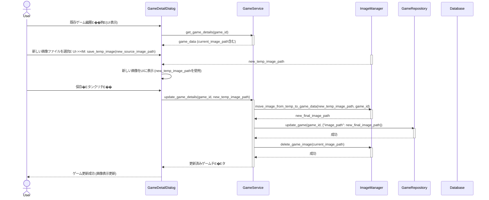

# Design Document Template

---
**Purpose**: Provide sufficient detail to ensure implementation consistency across different implementers, preventing interpretation drift.

**Approach**:
- Include essential sections that directly inform implementation decisions
- Omit optional sections unless critical to preventing implementation errors
- Match detail level to feature complexity
- Use diagrams and tables over lengthy prose

**Warning**: Approaching 1000 lines indicates excessive feature complexity that may require design simplification.
---

## Overview 
**Purpose**: ゲーム登録フローにおいて、画像を含む全ての入力頁E��を�E由に設定し、その惁E��を保持できるようにする機�Eを提供します、E**Users**: LitheLauncher Game Launcherのユーザーは、ゲーム登録前にすべての詳細を確認し、画像をプレビューできるようになります、E**Impact**: `GameDetailDialog` の UI ロジチE��、`GameService` の画像�E琁E��ジチE��、`ImageManager` の画像操作メソチE��が変更されます、E

### Goals
- 登録画面で入力された全頁E�� (画像含む) を、ゲーム保存前に保持する (Req 1.1)、E- 選択された画像を一時的に保存し、UI に表示する (Req 1.2, 1.3)、E- ゲーム登録がキャンセルされた場合、一時保存された画像を破棁E��、�E力フィールドをリセチE��する (Req 1.4)、E- ゲーム登録時に一時保存された画像を最終的な場所に移動し、ゲームのメタチE�Eタを更新する (Req 2.1, 2.2)、E- ゲームの画像ファイル管琁E��ゲーム ID に基づぁE��行う (Req 2.3)、E- 不正な画像ファイルの登録を防ぁE(Req 2.4)、E- 既存ゲームの画像を更新し、古ぁE��像を削除する (Req 3.1, 3.2)、E
### Non-Goals
- 画像�E一括インポ�EチEエクスポ�Eト機�E、E- 高度な画像編雁E���E (リサイズ、トリミングなど)、E
## Architecture

### Existing Architecture Analysis
*   **既存�EアーキチE��チャパターンと制紁E*: Service Layer, Repository Pattern。UI (PySide6) -> `GameService` -> `GameRepository` -> SQLite DB、E*   **既存�Eドメイン墁E��**: `GameService` はビジネスロジチE��、`ImageManager` は画像ファイル操作、`game_detail_dialog.py` はUIプレゼンチE�Eション、E*   **統合�EインチE*: `GameDetailDialog` と `GameService`、`GameService` と `ImageManager`、`GameService` と `GameRepository`、E
### Architecture Pattern & Boundary Map
**RECOMMENDED**: Include Mermaid diagram showing the chosen architecture pattern and system boundaries (required for complex features, optional for simple additions)

```mermaid
graph TD
    UI[GameDetailDialog (PySide6)] --> GS[GameService]
    GS --> GR[GameRepository]
    GS --> IM[ImageManager]
    UI --> IM
    GR --> DB[(SQLite Database)]
    IM --> FS[File System]

    subgraph "LitheLauncher Application Boundary"
        UI
        GS
        GR
        IM
        DB
        FS
    end

    style UI fill:#bbf,stroke:#33c,stroke-width:2px;
    style GS fill:#bfb,stroke:#3c3,stroke-width:2px;
    style GR fill:#fbb,stroke:#c33,stroke-width:2px;
    style IM fill:#ffb,stroke:#cc3,stroke-width:2px;
    style DB fill:#eee,stroke:#999,stroke-width:2px;
    style FS fill:#eee,stroke:#999,stroke-width:2px;
```
**Architecture Integration**:
- Selected pattern: ハイブリチE��アプローチ。既存コンポ�Eネント�E拡張と `ImageManager` への新しい責務�E追加、E- Domain/feature boundaries:
    *   `GameDetailDialog` は、�E力データ�E�画像パスを含む�E�を自身のインスタンス変数で保持し、`GameService` を介して `ImageManager` の一時画像操作メソチE��を呼び出します、E    *   `GameService` は、ゲーム登録・更新時に `ImageManager` の一時画像移動�E削除メソチE��を呼び出します、E    *   `ImageManager` が、一時ファイルの管琁E��ゲーム ID に基づく最終ファイル管琁E�EすべてのロジチE��をカプセル化します、E- Existing patterns preserved: Service Layer, Repository Pattern, モジュラーチE��イン、E- New components rationale: なし。既存コンポ�Eネントを拡張、E- Steering compliance: モジュラーチE��インと責務�E刁E��原則を維持、E
### Technology Stack

| Layer | Choice / Version | Role in Feature | Notes |
|-------|------------------|-----------------|-------|
| Frontend | PySide6 | ゲーム登録・編雁EI、画像選択ダイアログ | `src/game_detail_dialog.py` の拡張、E|
| Backend / Services | Python 3.x | ゲームチE�Eタ処琁E��ジチE��、画像パス管琁E| `src/game_service.py` の拡張、E|
| Data / Storage | SQLite (via `src/database.py`) | ゲームメタチE�Eタ (`image_path`) の永続化 | `Game` チE�Eブルの `image_path` カラムを更新、E|
| Utilities | Python `pathlib`, `tempfile`, `uuid` | ファイルパス操作、一時ファイル管琁E| `src/image_manager.py` で利用、E|
| Image Processing | Pillow (PIL) | 画像ファイルのバリチE�Eション | `src/image_manager.py` で利用�E�研究頁E���E�、E|

## System Flows

### 1. 新規ゲーム登録フローにおける画像�E琁E```mermaid
sequenceDiagram
    actor User
    participant UI as GameDetailDialog
    participant GS as GameService
    participant IM as ImageManager
    participant GR as GameRepository
    participant DB as Database

    User->>UI: 新規ゲーム登録開姁E(UI表示)
    User->>UI: 画像ファイルを選抁E    UI->>IM: save_temp_image(source_image_path)
    activate IM
    IM-->>UI: temp_image_path
    deactivate IM
    UI->>UI: 選択画像をUIに表示 (temp_image_pathを使用)
    User->>UI: 登録惁E��入力、登録ボタンクリチE��
    UI->>GS: register_game(game_data, temp_image_path)
    activate GS
    GS->>GR: add_game(game_data without final image path)
    activate GR
    GR-->>GS: game_id
    deactivate GR
    GS->>IM: move_image_from_temp_to_game_data(temp_image_path, game_id)
    activate IM
    IM-->>GS: final_image_path
    deactivate IM
    GS->>GR: update_game(game_id, {"image_path": final_image_path})
    activate GR
    GR-->>GS: 成功
    deactivate GR
    GS-->>UI: 登録済みゲームチE�Eタ
    deactivate GS
    UI-->>User: ゲーム登録成功 (画像表示更新)

    alt 登録キャンセル晁E        User->>UI: キャンセルボタンクリチE��
        UI->>IM: cleanup_temp_image(temp_image_path)
        activate IM
        IM-->>UI: 成功
        deactivate IM
        UI->>User: 登録フロー中止
    end
```
**フローレベルの決宁E*: `GameDetailDialog` ぁE`ImageManager` を利用して画像を一時保存し、`GameService` ぁE`GameRepository` へのゲーム登録と `ImageManager` による最終的な画像移動をオーケストレーションします、E
### 2. 既存ゲームの画像更新フロー

**フローレベルの決宁E*: 既存画像�E更新は、新規登録と同様に一時保存メカニズムを利用し、`GameService` が古ぁE��像�E削除めE`ImageManager` に委譲します、E
## Requirements Traceability

| Requirement | Summary | Components | Interfaces | Flows |
|-------------|---------|------------|------------|-------|
| 1.1 | 登録前�E入力データ保持 | `GameDetailDialog` | `GameDetailDialog` UI状慁E| 新規ゲーム登録フロー |
| 1.2 | 画像選択時のUI表示 | `GameDetailDialog` | `GameDetailDialog` UI更新 | 新規ゲーム登録フロー |
| 1.3 | 登録前�E画像一時保孁E| `GameDetailDialog`, `ImageManager` | `ImageManager.save_temp_image` | 新規ゲーム登録フロー |
| 1.4 | キャンセル時�E画像破棁E��リセチE�� | `GameDetailDialog`, `ImageManager` | `ImageManager.cleanup_temp_image` | 新規ゲーム登録フロー |
| 2.1 | 登録成功時�E画像移勁E| `GameService`, `ImageManager` | `ImageManager.move_image_from_temp_to_game_data` | 新規ゲーム登録フロー |
| 2.2 | ゲームメタチE�Eタの更新 | `GameService`, `GameRepository` | `GameRepository.update_game` | 新規ゲーム登録フロー |
| 2.3 | ゲームIDベ�Eスの画像管琁E| `ImageManager` | `ImageManager` の全メソチE�� | 新規ゲーム登録フロー, 既存ゲームの画像更新フロー |
| 2.4 | 不正画像登録の防止 | `GameService`, `ImageManager` | `ImageManager.validate_image` | 新規ゲーム登録フロー |
| 3.1 | 既存ゲームの画像更新 | `GameDetailDialog`, `GameService` | `ImageManager.save_temp_image`, `ImageManager.move_image_from_temp_to_game_data` | 既存ゲームの画像更新フロー |
| 3.2 | 古ぁE��像ファイルの削除 | `GameService`, `ImageManager` | `ImageManager.delete_game_image` | 既存ゲームの画像更新フロー |

## Components and Interfaces

| Component | Domain/Layer | Intent | Req Coverage | Key Dependencies (P0/P1) | Contracts |
|---|---|---|---|---|---|
| `GameDetailDialog` | UI | ゲーム登録・編雁EIの提侁E| 1.1, 1.2, 1.3, 1.4, 3.1 | `GameService` (P0), `ImageManager` (P0) | UI状慁E|
| `GameService` | Backend / Service | ゲームのビジネスロジチE��管琁E| 2.1, 2.2, 2.4, 3.1, 3.2 | `GameRepository` (P0), `ImageManager` (P0) | Service |
| `ImageManager` | Backend / Service | 画像ファイルの操作�E管琁E| 1.3, 1.4, 2.1, 2.3, 2.4, 3.1, 3.2 | `Pathlib` (P0), `tempfile` (P0), `Pillow` (P1) | Service |

### UI Layer

#### GameDetailDialog

| Field | Detail |
|-------|--------|
| Intent | ゲームの登録および詳細編雁E�Eためのユーザーインターフェースを提供し、�E力データを一時的に保持する、E|
| Requirements | 1.1, 1.2, 1.3, 1.4, 3.1 |

**Responsibilities & Constraints**
*   全ての入力フィールド�E値をインスタンス変数として保持、E*   画像選択ダイアログの起動と、E��択された画像パスの取得、E*   `ImageManager` を介した一時画像�E保存とUIへの表示、E*   登録完亁E��、キャンセル時に対応する�E琁E(`GameService` めE`ImageManager` のメソチE��呼び出ぁE を行う、E*   QDialog の `accepted()` / `rejected()` シグナルを利用して、登録の確定また�Eキャンセルを制御、E
**Dependencies**
*   Outbound: `GameService`  EゲームチE�Eタの登録・更新 (P0)
*   Outbound: `ImageManager`  E画像ファイルの一時保存、クリーンアチE�E (P0)

**Contracts**: State [x]

##### State Management
*   **State model**:
    *   `_temp_image_path: Path | None`�E�選択された画像�E一時保存パス、E    *   `_game_data: Dict[str, Any]`�E�タイトル、説明などの入力フィールド�E値、E*   **Persistence & consistency**: ダイアログインスタンスの生存期間中のみチE�Eタを保持、E*   **Concurrency strategy**: UIスレチE��で実行、E
**Implementation Notes**
*   **Integration**: `GameDetailDialog` ぁE`GameService` と `ImageManager` のインスタンスを受け取るよぁE��コンストラクタを変更、E*   **Validation**: 画像選択時に `ImageManager.validate_image` を呼び出し、結果をUIに表示、E*   **Risks**: ダイアログのライフサイクルと一時ファイルの管琁E��褁E��になる可能性、E
### Backend / Service Layer

#### GameService

| Field | Detail |
|---|---|
| Intent | ゲームのビジネスロジチE��を管琁E��、画像�E琁E��ゲーム登録・更新のオーケストレーションを行う、E|
| Requirements | 2.1, 2.2, 2.4, 3.1, 3.2 |

**Responsibilities & Constraints**
*   `register_game` および `update_game_details` メソチE��を拡張し、一時画像パスを受け取る、E*   ゲーム登録・更新時に `ImageManager` を介して一時画像を最終的な場所へ移動させる、E*   ゲームメタチE�Eタ (`image_path`) めE`GameRepository` を介して更新する、E*   既存ゲームの画像更新時、`ImageManager` を介して古ぁE��像を削除する、E*   画像検証 (`ImageManager.validate_image`) を呼び出し、結果に応じて登録・更新処琁E��制御、E
**Dependencies**
*   Outbound: `GameRepository`  EゲームチE�Eタの永続化 (P0)
*   Outbound: `ImageManager`  E画像ファイル操佁E(P0)

**Contracts**: Service [x]

##### Service Interface
```python
from typing import Dict, Any, Optional
from pathlib import Path

class GameService:
    # ... 既存メソチE�� ...
    def register_game(self, game_data: Dict[str, Any], temp_image_path: Path | None = None) -> Dict[str, Any]:
        """新規ゲームを登録し、一時保存された画像を永続化する、E""
        pass
    
    def update_game_details(self, game_id: int, updates: Dict[str, Any], temp_image_path: Path | None = None) -> Dict[str, Any]:
        """既存ゲームを更新し、画像が更新された場合�E古ぁE��像を削除して新しい画像を永続化する、E""
        pass
```
*   **Preconditions**: `game_data` は有効なゲーム惁E��を含む。`temp_image_path` は有効な一時画像パス、また�E None、E*   **Postconditions**: ゲームが登録・更新され、E��連する画像が適刁E��保存�E削除される、E
**Implementation Notes**
*   **Integration**: `GameDetailDialog` から `temp_image_path` を受け取るよぁE��変更、E*   **Validation**: `ImageManager.validate_image` の結果に基づぁE��エラーハンドリング、E
#### ImageManager

| Field | Detail |
|---|---|
| Intent | 画像ファイルの一時保存、最終パスへの移動、削除、バリチE�Eションを行う、E|
| Requirements | 1.3, 1.4, 2.1, 2.3, 2.4, 3.1, 3.2 |

**Responsibilities & Constraints**
*   `game_id` に依存しなぁE��時保存メカニズムを提供、E*   一時保存された画像をゲームの最終ディレクトリに移動させる、E*   古ぁE��像ファイルめE��時ファイルを安�Eに削除する、E*   画像ファイルの有効性をチェチE��する、E*   アプリケーションチE�EタチE��レクトリの構造 (`data/[game_id]/images/`) を管琁E��E
**Dependencies**
*   External: `Pathlib`  Eファイルパス操佁E(P0)
*   External: `tempfile`  E一時ファイル管琁E(P0)
*   External: `Pillow`  E画像ファイルバリチE�Eション (P1)

**Contracts**: Service [x]

##### Service Interface
```python
from pathlib import Path
from typing import Optional

class ImageManager:
    # ... 既存メソチE�� ...
    def save_temp_image(self, source_path: Path) -> Path:
        """画像を一時ディレクトリにコピ�Eし、一時パスを返す、E""
        pass

    def move_image_from_temp_to_game_data(self, temp_path: Path, game_id: str) -> Path:
        """一時画像を最終的な game_id チE��レクトリに移動させ、最終パスを返す。移動�Eの一時画像�E削除、E""
        pass
    
    def delete_game_image(self, game_id: str, image_path: Path | None) -> None:
        """特定�Eゲームに関連する画像ファイルを削除する、E""
        pass

    def cleanup_temp_image(self, temp_path: Path | None) -> None:
        """持E��された一時画像を削除する、E""
        pass

    def validate_image(self, image_path: Path) -> bool:
        """画像ファイルの有効性をチェチE��する、E""
        pass
```
*   **Preconditions**: `source_path` は有効なファイルパス。`temp_path` は有効な一時ファイルパス。`game_id` は有効なゲームID斁E���E、E*   **Postconditions**: 画像ファイルが一時ディレクトリまた�E最終ディレクトリに保孁E移勁E削除される。バリチE�Eション結果が返される、E
**Implementation Notes**
*   **Integration**: `GameDetailDialog` および `GameService` から呼び出される、E*   **Validation**: Pillow ライブラリを使用して、画像�E読み込みチE��トなどを行う、E*   **Risks**: ファイルシスチE��操作�E失敗、一時ファイルの残留、E
## Data Models

Focus on the portions of the data landscape that change with this feature.

### Logical Data Model
**Structure Definition**:
- 変更なし。`Game` チE�Eブルの `image_path` フィールド�E既存�Eまま利用、E
## Error Handling

### Error Strategy
*   `ImageManager.validate_image` で画像バリチE�Eションに失敗した場合、`GameService` ぁE`ExecutableValidationError` また�E新しい `ImageValidationError` (新規作�Eを検訁E を発生させ、`GameDetailDialog` でユーザーにエラーメチE��ージを表示しまぁE(Req 2.4)、E*   ファイル操作関連のエラーは、E��刁E��ロギングと共に上位層へ伝播させる、E### Error Categories and Responses
*   ユーザーエラー (4xx 相彁E: 画像バリチE�Eションエラー -> UIに明確なメチE��ージを表示、E
## Testing Strategy

*   **ユニットテスチE*:
    *   `GameDetailDialog`:
        *   入力フィールド�E値が保持されること、E        *   画像選択時に `ImageManager.save_temp_image` が呼ばれ、画像がUIに表示されること、E        *   キャンセル時に `ImageManager.cleanup_temp_image` が呼ばれ、�E力がリセチE��されること、E    *   `ImageManager`:
        *   `save_temp_image` がファイルを一時ディレクトリにコピ�Eすること、E        *   `move_image_from_temp_to_game_data` がファイルを移動し、一時ファイルを削除すること、E        *   `delete_game_image` が指定されたファイルを削除すること、E        *   `cleanup_temp_image` が一時ファイルを削除すること、E        *   `validate_image` が有効/無効な画像ファイルに対して正しい結果を返すこと、E    *   `GameService`:
        *   `register_game` ぁE`ImageManager` を呼び出して画像を移動させ、`image_path` を更新すること、E        *   `update_game_details` ぁE`ImageManager` を呼び出して新しい画像を移動させ、古ぁE��像を削除すること、E        *   不正な画像パスが渡された場合にエラーを発生させること、E*   **統合テスチE*:
    *   `GameDetailDialog` から `GameService` を経由して `ImageManager` までの画像登録フロー、E    *   `GameDetailDialog` から `GameService` を経由して `ImageManager` までの画像更新フロー、E    *   登録キャンセル時に一時画像が正しく削除されること、E
