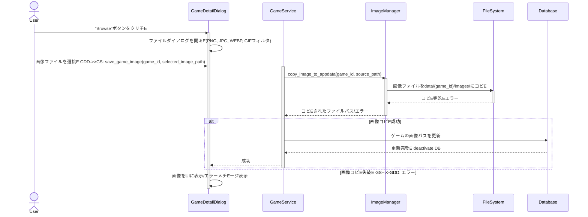

# Design Document Template

---
**Purpose**: Provide sufficient detail to ensure implementation consistency across different implementers, preventing interpretation drift.

**Approach**:
- Include essential sections that directly inform implementation decisions
- Omit optional sections unless critical to preventing implementation errors
- Match detail level to feature complexity
- Use diagrams and tables over lengthy prose

**Warning**: Approaching 1000 lines indicates excessive feature complexity that may require design simplification.
---

## Overview
**Purpose**: こE機Eは、ゲーム詳細画面で画像を選択してゲームに紐付け、一覧画面で非同期に表示する機Eを提供します。これにより、ユーザーはゲームの視覚的なカスタマイズが可能になり、アプリケーションの応答性が向上します、E**Users**: LitheLauncher Game Launcherのユーザーは、ゲームのカバE画像などを設定E閲覧できます、E**Impact**: ゲーム詳細ダイアログに画像選択UIが追加され、ゲームチEEタに画像パスが保存されるようになります。ゲーム一覧画面では、画像を非同期にロードして表示する仕絁Eが導Eされます、E
### Goals
- ゲーム詳細画面で、ユーザーが画像ファイル (PNG, JPG, WEBP, GIF) を選択し、アプリケーションチEEタチEレクトリにコピEできること、E- 選択された画像EパスがゲームのメタチEEタとして永続化されること、E- ゲーム詳細画面に選択された画像が表示されること、E- ゲーム一覧画面で、ゲーム画像を非同期にロードし、表示すること、E- 画像E琁EよEファイル操作におけるエラーを適刁Eハンドリングし、ユーザーに通知すること、E- UIの応答性を維持すること、E
### Non-Goals
- 画像編雁EE (トリミング、フィルタリングなど)、E- 褁E画像E管琁EE、E- 画像Eクラウド同期機E (リモートストレージサービスとの連携は封E皁E検討事頁E、E
## Architecture

### Architecture Pattern & Boundary Map


**Architecture Integration**:
- Selected pattern: **Modularity & Service-Oriented (Extension)**. 既存ELitheLauncherのサービス層とUI層を拡張し、画像管琁E非同期ロードEための新しいモジュール (`ImageManager`, `ImageLoader`) を導Eします。これにより、既存EアーキチEチャパターンとの整合性を保ちつつ、新しい機Eを追加します、E- Domain/feature boundaries: `GameService`はゲームチEEタに関するビジネスロジチEを担当し、`ImageManager`は画像ファイルの操作と管琁E拁Eします。`ImageLoader`はUI層で画像E非同期ロードを拁Eします、E- Existing patterns preserved: Service Layer, Repository Pattern, UI Layerの明確な刁E、E- New components rationale:
    - `ImageManager`: 画像ファイルのコピE、削除、パス生EとぁEた低レベルのファイルシスチE操作と、Pillowを使用した画像E琁E忁Eに応じてEをカプセル化します。これにより、`GameService`からファイル操作E詳細をE離し、E忁EE刁Eを俁Eします、E    - `ImageLoader`: PySide6の`QRunnable`と`QThreadPool`を利用して、バチEグラウンドでの画像ロードE琁EUI更新のためのシグナル発行を拁Eします。これにより、UIの応答性を確保し、E同期処琁EEロジチEを集中管琁Eます、E- Steering compliance: モジュラーチEインと関忁EE刁EとぁE原則を維持します、E
### Technology Stack

| Layer | Choice / Version | Role in Feature | Notes |
|-------|------------------|-----------------|-------|
| Frontend / CLI | PySide6 | UIコンポEネンチE(GameDetailDialog, MainWindow, GameCardWidget) の拡張と画像表示、E| Qtのシグナル/スロチEとQPixmapを活用、E|
| Backend / Services | Python 3.x, Pillow | 画像ファイルのコピE、パスの管琁EPillowを用ぁE画像E琁E読み込み、形式変換Eを拁E、E| Pillowは新規追加依存、E|
| Data / Storage | SQLite (via `database.py`) | ゲームメタチEEタE画像パスEE永続化、E| 既存EチEEタベEススキーマに画像パスを追加、E|
| Messaging / Events | PySide6 Signals/Slots | UIスレチEとバックグラウンドスレチE間E非同期通信、E| ImageLoaderからUIコンポEネントへの画像ロード完亁E知、E|
| Infrastructure / Runtime | Python Virtual Environment | 依存関俁E(Pillow) の管琁EE| `requirements.txt`にPillowを追加、E|

## System Flows

### 1. ゲーム詳細画面での画像選択E保存フロー



### 2. ゲーム一覧画面での画像非同期ロードフロー

```mermaid
sequenceDiagram
    actor User
    participant MW as MainWindow
    participant GCW as GameCardWidget
    participant IL as ImageLoader
    participant IM as ImageManager
    participant FS as FileSystem

    User->>MW: 一覧画面を表示
    activate MW
    loop 各GameCard
        MW->>GCW: ゲーム惁E (画像パス含む) を渡ぁE        activate GCW
        GCW->>GCW: プレースホルダー画像を表示
        GCW->>IL: load_image_async(image_path)
        activate IL
        IL->>IL: QThreadPoolで画像ロードタスクを開姁E        alt 画像ロードE劁E            IL->>IL: ロードした画像をQPixmapに変換
            IL-->>GCW: image_loaded(QPixmap) シグナル
            GCW->>GCW: プレースホルダーを実画像に置き換ぁE        else 画像ロード失敁E            IL-->>GCW: image_load_failed() シグナル
            GCW->>GCW: エラー画像表示 (オプション)
        end
        deactivate IL
        deactivate GCW
    end
    deactivate MW
```

## Requirements Traceability

| Requirement | Summary | Components | Interfaces | Flows |
|-------------|---------|------------|------------|-------|
| 1.1 | "Browse"ボタン表示 | `GameDetailDialog` | UI (`QPushButton`) | ゲーム詳細画面での画像選択E保存フロー |
| 1.2 | ファイルダイアログ表示 | `GameDetailDialog` | UI (`QFileDialog`) | ゲーム詳細画面での画像選択E保存フロー |
| 1.3 | ファイルフィルタリング | `GameDetailDialog` | UI (`QFileDialog`フィルタ) | ゲーム詳細画面での画像選択E保存フロー |
| 2.1 | 画像コピE | `GameService`, `ImageManager`, `FileSystem` | `ImageManager.copy_image_to_appdata` | ゲーム詳細画面での画像選択E保存フロー |
| 2.2 | 画像パス保孁E| `GameService`, `GameRepository`, `Database` | `GameService.save_game_image` | ゲーム詳細画面での画像選択E保存フロー |
| 2.3 | コピE失敗エラー | `GameService`, `ImageManager`, `GameDetailDialog` | エラー通知メカニズム | ゲーム詳細画面での画像選択E保存フロー |
| 3.1 | 詳細画面画像表示 | `GameDetailDialog` | UI (`QLabel`またE`QGraphicsView`) | ゲーム詳細画面での画像選択E保存フロー |
| 3.2 | 詳細画面画像更新 | `GameDetailDialog` | UI更新ロジチE | ゲーム詳細画面での画像選択E保存フロー |
| 4.1 | 一覧画面非同期表示 | `MainWindow`, `GameCardWidget`, `ImageLoader` | `ImageLoader.load_image_async` | ゲーム一覧画面での画像非同期ロードフロー |
| 4.2 | プレースホルダー表示 | `GameCardWidget`, `ImageLoader` | UI更新ロジチE | ゲーム一覧画面での画像非同期ロードフロー |
| 4.3 | 実画像置き換ぁE| `GameCardWidget`, `ImageLoader` | `ImageLoader.image_loaded`シグナル | ゲーム一覧画面での画像非同期ロードフロー |

## Components and Interfaces

### UI Layer

#### GameDetailDialog
| Field | Detail |
|-------|--------|
| Intent | ゲームの詳細惁Eを表示・編雁E、画像選択E保存機Eを提供すめE|
| Requirements | 1.1, 1.2, 1.3, 2.3, 3.1, 3.2 |
| Owner / Reviewers | UI Team |

**Responsibilities & Constraints**
- ゲーム詳細惁Eの表示と編雁EE- 画像選択用の"Browse"ボタンの提供とファイルダイアログの起動、E- 選択された画像パスを`GameService`に渡し、結果を受け取る、E- 選択された画像をUI上に表示し、更新する、E- エラーメチEージの表示、E
**Dependencies**
- Inbound: `MainWindow`  E詳細ダイアログの起勁E(P0)
- Outbound: `GameService`  Eゲーム惁Eの保存、画像ファイルの保孁E(P0)
- Outbound: `QFileDialog`  Eファイル選択ダイアログ (P0)

**Contracts**: Service [X] / API [ ] / Event [ ] / Batch [ ] / State [ ]

##### Service Interface
```python
# GameDetailDialogはGameServiceと連携しまぁE# GameServiceの既存Eインターフェースに以下E機Eが追加/利用されまぁEclass GameService:
    def save_game_image(self, game_id: str, source_image_path: Path) -> Path:
        """
        持Eされた画像をappdataにコピEし、ゲームの画像パスを更新します、E        成功した場合EコピEされた画像EPathを返します、E        """
        pass
    
    def get_game_image_path(self, game_id: str) -> Optional[Path]:
        """
        持Eされたゲームの画像パスを取得します、E        """
        pass
```

**Implementation Notes**
- `QFileDialog`を使用してファイル選択を行い、E択されたファイルのパスを`GameService.save_game_image`に渡す、E- `GameService`から返された画像パスを使用して`QPixmap`をロードし、UI (`QLabel`など) に表示する、E- `GameService`からのエラーを適刁Eハンドルし、ユーザーに通知する、E
#### MainWindow
| Field | Detail |
|-------|--------|
| Intent | メインアプリケーションウィンドウとしてゲーム一覧を表示し、各ゲームカードを管琁EめE|
| Requirements | 4.1 |
| Owner / Reviewers | UI Team |

**Responsibilities & Constraints**
- ゲームカードウィジェチE (`GameCardWidget`) の生Eと配置、E- `GameCardWidget`への画像パスの提供、E
**Dependencies**
- Outbound: `GameCardWidget`  Eゲーム惁Eの表示 (P0)

**Contracts**: Service [ ] / API [ ] / Event [ ] / Batch [ ] / State [ ]

**Implementation Notes**
- 既存Eゲーム一覧表示ロジチEを拡張し、各ゲームカードに画像パスを渡す、E- `GameCardWidget`が`ImageLoader`を利用して非同期に画像をロードするため、`MainWindow`側での直接皁E画像ロードE琁EE不要、E
#### GameCardWidget
| Field | Detail |
|-------|--------|
| Intent | 一覧画面の吁Eームエントリを表示し、画像を非同期にロードして表示する |
| Requirements | 4.1, 4.2, 4.3 |
| Owner / Reviewers | UI Team |

**Responsibilities & Constraints**
- ゲームのタイトル、情報、およE関連画像E表示、E- `ImageLoader`からのシグナルを受け取り、ロードされた画像をUIに表示、E- 画像ロード中はプレースホルダー画像を表示、E
**Dependencies**
- Inbound: `MainWindow`  Eゲーム惁Eの提侁E(P0)
- Outbound: `ImageLoader`  E画像E非同期ローチE(P0)

**Contracts**: Service [ ] / API [ ] / Event [X] / Batch [ ] / State [ ]

##### Event Contract
- Subscribed events:
    - `ImageLoader.image_loaded(QPixmap)`: 画像ロードが成功した際に受け取る、E    - `ImageLoader.image_load_failed()`: 画像ロードが失敗した際に受け取る、E
**Implementation Notes**
- `ImageLoader`のインスタンスを生成し、`image_loaded`シグナルと`image_load_failed`シグナルをE身のスロチEに接続する、E- `ImageLoader.load_image_async`を呼び出して画像Eロードを開始し、ロード中はプレースホルダーを表示する、E
### Service Layer

#### GameService
| Field | Detail |
|-------|--------|
| Intent | ゲームチEEタに関するビジネスロジチEと画像ファイルの管琁E連携する |
| Requirements | 2.1, 2.2, 2.3 |
| Owner / Reviewers | Core Logic Team |

**Responsibilities & Constraints**
- ゲームの画像パスの保存、更新、取得、E- `ImageManager`を介した画像ファイルのコピE操作Eトリガー、E- ファイル操作エラーのハンドリングと`GameDetailDialog`への通知、E
**Dependencies**
- Outbound: `ImageManager`  E画像ファイルの操佁E(P0)
- Outbound: `GameRepository`  EゲームチEEタE画像パス含むEE永続化 (P0)

**Contracts**: Service [X] / API [ ] / Event [ ] / Batch [ ] / State [ ]

##### Service Interface
```python
# 既存EGameServiceインターフェースを拡張
class GameService:
    # ... 既存EメソチE ...

    def save_game_image(self, game_id: str, source_image_path: Path) -> Path:
        """
        持Eされた画像をappdataにコピEし、ゲームの画像パスを更新します、E        成功した場合EコピEされた画像EPathを返します、E        """
        pass

    def get_game_image_path(game_id: str) -> Optional[Path]:
        """
        持Eされたゲームの画像パスを取得します、E        """
        pass
```

#### ImageManager (新規コンポEネンチE
| Field | Detail |
|-------|--------|
| Intent | 画像ファイルのコピE、削除、パス生EとぁEた低レベルのファイルシスチE操作を管琁EめE|
| Requirements | 2.1, 2.3 |
| Owner / Reviewers | Core Logic Team |

**Responsibilities & Constraints**
- 選択された画像ファイルをアプリケーションの`data/`チEレクトリ (`data/{game_id}/images/`形弁E にコピEする、E- コピE先Eファイルパスを生成する、E- ファイル操作エラー (権限、ディスク容量など) を適刁Eハンドリングし、`GameService`に通知する、E- Pillowライブラリを使用して、忁Eに応じて画像形式E変換などを行うE今回は直接皁E変換は不要だが、封E皁E拡張を見越してE、E
**Dependencies**
- Outbound: `FileSystem`  EファイルコピE操佁E(P0)
- Outbound: `Pillow`  E画像E琁E(P0)

**Contracts**: Service [X] / API [ ] / Event [ ] / Batch [ ] / State [ ]

##### Service Interface
```python
from pathlib import Path
from typing import Optional

class ImageManager:
    def copy_image_to_appdata(self, game_id: str, source_path: Path) -> Path:
        """
        持Eされた画像をappdata冁EEゲーム固有ディレクトリにコピEします、E        コピEされたファイルのPathを返します、E        """
        pass

    def get_appdata_image_path(self, game_id: str, filename: str) -> Path:
        """
        持EされたゲームIDとファイル名に基づぁE、appdata冁EE画像パスを生成します、E        """
        pass

    def delete_game_image(self, game_id: str, filename: str) -> None:
        """
        持Eされたゲームの画像をappdataから削除します、E        """
        pass
```

#### ImageLoader (新規コンポEネンチE
| Field | Detail |
|-------|--------|
| Intent | バックグラウンドスレチEで画像を非同期にロードし、UIスレチEに結果を通知する |
| Requirements | 4.1, 4.2, 4.3 |
| Owner / Reviewers | UI Team |

**Responsibilities & Constraints**
- `QRunnable`を継承し、`QThreadPool`で実行可能な画像ロードタスクを定義、E- バックグラウンドスレチEで持Eされた画像ファイルをロードし、`QPixmap`に変換する、E- ロード完亁EたE失敗時にUIスレチEへのシグナルを発行、E- UIスレチEをブロチEしなぁEと、E
**Dependencies**
- Inbound: `GameCardWidget`  Eロード要汁E(P0)
- Outbound: `Pillow`  E画像ファイルの読み込み (P0)
- Outbound: `PySide6.QtGui.QPixmap`  Eロードした画像E変換 (P0)

**Contracts**: Service [ ] / API [ ] / Event [X] / Batch [ ] / State [ ]

##### Event Contract
- Published events:
    - `image_loaded(QPixmap)`: 画像が正常にロードされ、`QPixmap`オブジェクトをUIスレチEに送信するシグナル、E    - `image_load_failed()`: 画像ロード中にエラーが発生した場合にUIスレチEに通知するシグナル、E
**Implementation Notes**
- `QRunnable`を継承したクラスとして実裁E、`run`メソチE冁EPillowを使用して画像をロードし、`QPixmap`に変換する、E- `QObject`を継承した冁Eクラスにシグナルを定義し、スレチEセーフな形でUIスレチEに結果を通知する、E
### Data Layer

#### GameRepository
- 既存EコンポEネント。ゲームオブジェクトに画像パスを格納するフィールドを追加し、データベEスとの永続化ロジチEを更新、E
#### Database
- 既存EコンポEネント。ゲームチEEブルのスキーマに画像パスを格納するカラムを追加、E
## Data Models

### Domain Model
- `Game` エンチEチE: 既存E`Game`エンチEチEに画像パスを表すフィールドを追加、E
### Logical Data Model
- `Game`チEEブル: `image_path` (TEXT) カラムを追加、E
## Error Handling

### Error Strategy
- **ファイル操作エラー**: `ImageManager`冁E`try-except`ブロチEを用ぁE`FileNotFoundError`, `PermissionError`, `IOError`などを捕捉。`GameService`を通じて`GameDetailDialog`にエラーメチEージを返す、E- **画像ロードエラー**: `ImageLoader`冁EPillowによる画像読み込みエラーや`QPixmap`変換エラーを捕捉。`image_load_failed`シグナルを通じて`GameCardWidget`に通知、E- **UIエラー**: `GameDetailDialog`および`GameCardWidget`は受け取ったエラー惁Eに基づき、ユーザーフレンドリーなメチEージを表示、E
## Testing Strategy

- **Unit Tests**:
    - `ImageManager`: `copy_image_to_appdata`, `get_appdata_image_path`などのファイル操作ロジチE、E    - `ImageLoader`: `run`メソチE冁EE画像ロードとシグナル発行ロジチEEモチE化したQPixmap変換とシグナル接続）、E    - `GameService`: `save_game_image`が`ImageManager`と`GameRepository`を正しく呼び出すか、E- **Integration Tests**:
    - `GameDetailDialog`と`GameService`の連携: "Browse"ボタンクリチEから画像保存までのフロー、E    - `MainWindow`と`GameCardWidget`と`ImageLoader`の連携: 一覧画面での非同期画像表示フロー、E- **E2E/UI Tests (pytest-qt)**:
    - ゲーム詳細画面で画像を正しく選択E保存し、UIに表示されること、E    - ゲーム一覧画面で褁EのゲームカードE画像が非同期に表示されること、E    - 無効なファイルを選択した場合やファイルコピE失敗時のエラーメチEージ表示、E
