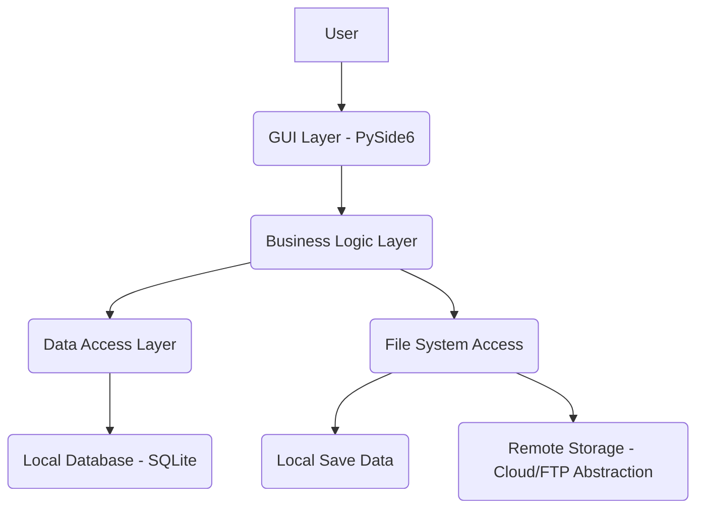
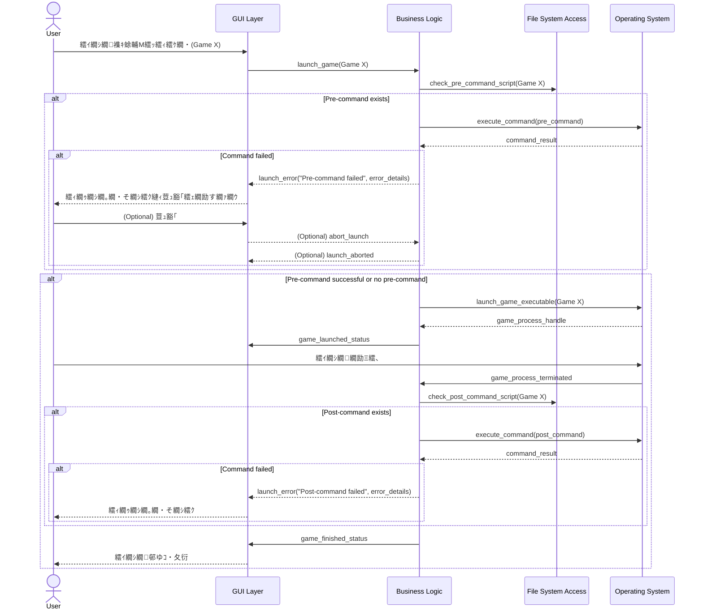

# Technical Design Document: Game Launcher

## Overview
**Purpose**: 譛ｬ繝峨く繝･繝｡繝ｳ繝医・縲√ご繝ｼ繝繝ｩ繝ｳ繝√Ε繝ｼ讖溯・縺ｮ謚€陦楢ｨｭ險医ｒ險倩ｿｰ縺励∪縺吶€ゅΘ繝ｼ繧ｶ繝ｼ縺後ご繝ｼ繝縺ｮ繧ｫ繝ｼ繝峨Μ繧ｹ繝医€√き繝舌・繧｢繝ｼ繝医€√ち繧､繝医Ν縲∬ｪｬ譏弱ｒ邂｡逅・＠縲√ご繝ｼ繝縺ｮ襍ｷ蜍募燕蠕後↓莉ｻ諢上・繧ｳ繝槭Φ繝峨ｒ螳溯｡後＠縲√そ繝ｼ繝悶ョ繝ｼ繧ｿ繧偵Μ繝｢繝ｼ繝医せ繝医Ξ繝ｼ繧ｸ縺ｨ蜷梧悄縺吶ｋ繝・せ繧ｯ繝医ャ繝励い繝励Μ繧ｱ繝ｼ繧ｷ繝ｧ繝ｳ繧単yside6繧堤畑縺・※螳溽樟縺励∪縺吶€・**Users**: 繧ｲ繝ｼ繝繝ｦ繝ｼ繧ｶ繝ｼ縺ｯ縲√ご繝ｼ繝縺ｮ邂｡逅・€∬ｵｷ蜍輔€√そ繝ｼ繝悶ョ繝ｼ繧ｿ蜷梧悄繧貞柑邇・噪縺ｫ陦後＞縲√ｈ繧願憶縺・ご繝ｼ繝菴馴ｨ薙ｒ蠕励ｋ縺薙→縺後〒縺阪∪縺吶€・**Impact**: 繧ｲ繝ｼ繝邂｡逅・・荳€蜈・喧縲√そ繝ｼ繝悶ョ繝ｼ繧ｿ縺ｮ螳牙・諤ｧ蜷台ｸ翫€√ご繝ｼ繝襍ｷ蜍輔・繝ｭ繧ｻ繧ｹ縺ｮ繧ｫ繧ｹ繧ｿ繝槭う繧ｺ諤ｧ繧呈署萓帙＠縺ｾ縺吶€・
### Goals
- 繝ｦ繝ｼ繧ｶ繝ｼ繝輔Ξ繝ｳ繝峨Μ繝ｼ縺ｪGUI縺ｫ繧医ｋ繧ｲ繝ｼ繝縺ｮ逋ｻ骭ｲ縲∫ｷｨ髮・€∝炎髯､縲∬｡ｨ遉ｺ縲・- 繧ｲ繝ｼ繝襍ｷ蜍募燕蠕後・繧ｫ繧ｹ繧ｿ繝繧ｳ繝槭Φ繝峨・螳溯｡後€・- 繧ｲ繝ｼ繝縺ｮ繧ｻ繝ｼ繝悶ョ繝ｼ繧ｿ縺ｨ繝ｪ繝｢繝ｼ繝医せ繝医Ξ繝ｼ繧ｸ髢薙・閾ｪ蜍募酔譛溘€・- 蝣・欧縺ｪ繧ｨ繝ｩ繝ｼ繝上Φ繝峨Μ繝ｳ繧ｰ縺ｨ繝ｦ繝ｼ繧ｶ繝ｼ縺ｸ縺ｮ繝輔ぅ繝ｼ繝峨ヰ繝・け縲・
### Non-Goals
- 繧ｪ繝ｳ繝ｩ繧､繝ｳ繝槭Ν繝√・繝ｬ繧､讖溯・縺ｮ逶ｴ謗･逧・↑繧ｵ繝昴・繝医€・- 繧ｲ繝ｼ繝縺ｮ繝€繧ｦ繝ｳ繝ｭ繝ｼ繝峨∪縺溘・繧､繝ｳ繧ｹ繝医・繝ｫ讖溯・縲・- 隍・焚縺ｮ繝励Λ繝・ヨ繝輔か繝ｼ繝縺ｸ縺ｮ蟇ｾ蠢懶ｼ・indows繝・せ繧ｯ繝医ャ繝励い繝励Μ繧ｱ繝ｼ繧ｷ繝ｧ繝ｳ縺ｫ髯仙ｮ夲ｼ峨€・- 隧ｳ邏ｰ縺ｪ繝舌・繧ｸ繝ｧ繝ｳ邂｡逅・ｩ溯・縲・
## Architecture

### High-Level Architecture
譛ｬ繧ｲ繝ｼ繝繝ｩ繝ｳ繝√Ε繝ｼ縺ｯ縲￣ySide6繧剃ｽｿ逕ｨ縺励◆繝・せ繧ｯ繝医ャ繝励い繝励Μ繧ｱ繝ｼ繧ｷ繝ｧ繝ｳ縺ｨ縺励※讒狗ｯ峨＆繧後∪縺吶€ゅい繝励Μ繧ｱ繝ｼ繧ｷ繝ｧ繝ｳ縺ｯ荳ｻ縺ｫ縲√Θ繝ｼ繧ｶ繝ｼ繧､繝ｳ繧ｿ繝ｼ繝輔ぉ繝ｼ繧ｹ螻､縲√ン繧ｸ繝阪せ繝ｭ繧ｸ繝・け螻､縲√ョ繝ｼ繧ｿ繧｢繧ｯ繧ｻ繧ｹ螻､縺ｧ讒区・縺輔ｌ縺ｾ縺吶€ゅご繝ｼ繝繝・・繧ｿ縺ｯ繝ｭ繝ｼ繧ｫ繝ｫ縺ｮSQLite繝・・繧ｿ繝吶・繧ｹ縺ｫ菫晏ｭ倥＆繧後€√そ繝ｼ繝悶ョ繝ｼ繧ｿ縺ｯ繝輔ぃ繧､繝ｫ繧ｷ繧ｹ繝・Β繧帝€壹§縺ｦ邂｡逅・＆繧後€√Μ繝｢繝ｼ繝医せ繝医Ξ繝ｼ繧ｸ縺ｨ蜷梧悄縺輔ｌ縺ｾ縺吶€・


**Architecture Integration**:
- Existing patterns preserved: N/A (譁ｰ隕上い繝励Μ繧ｱ繝ｼ繧ｷ繝ｧ繝ｳ)
- New components rationale:
    - GUI Layer: PySide6繧剃ｽｿ逕ｨ縺励€√け繝ｭ繧ｹ繝励Λ繝・ヨ繝輔か繝ｼ繝縺ｪ繝・せ繧ｯ繝医ャ繝励い繝励Μ繧ｱ繝ｼ繧ｷ繝ｧ繝ｳ縺ｨ縺励※縲∫峩諢溽噪縺ｧ蠢懃ｭ疲€ｧ縺ｮ鬮倥＞繝ｦ繝ｼ繧ｶ繝ｼ繧､繝ｳ繧ｿ繝ｼ繝輔ぉ繝ｼ繧ｹ繧呈署萓帙＠縺ｾ縺吶€・    - Business Logic Layer: 繧｢繝励Μ繧ｱ繝ｼ繧ｷ繝ｧ繝ｳ縺ｮ荳ｭ譬ｸ縺ｨ縺ｪ繧九Ο繧ｸ繝・け・医ご繝ｼ繝邂｡逅・€√さ繝槭Φ繝牙ｮ溯｡後€∝酔譛溷・逅・ｼ峨ｒ繧ｫ繝励そ繝ｫ蛹悶＠縺ｾ縺吶€・    - Data Access Layer: 繝・・繧ｿ繝吶・繧ｹ謫堺ｽ懊ｒ謚ｽ雎｡蛹悶＠縲√ン繧ｸ繝阪せ繝ｭ繧ｸ繝・け螻､縺ｨ豌ｸ邯壼喧螻､縺ｮ蛻・屬繧剃ｿ・€ｲ縺励∪縺吶€・    - File System Access: 繝ｭ繝ｼ繧ｫ繝ｫ縺ｮ繧ｻ繝ｼ繝悶ョ繝ｼ繧ｿ繧・き繝舌・繧｢繝ｼ繝医ヵ繧｡繧､繝ｫ縺ｸ縺ｮ繧｢繧ｯ繧ｻ繧ｹ繧堤ｮ｡逅・＠縺ｾ縺吶€・    - Remote Storage Abstraction: 繧ｻ繝ｼ繝悶ョ繝ｼ繧ｿ縺ｮ蜷梧悄蜈医→縺励※縲∝・菴鍋噪縺ｪ繝ｪ繝｢繝ｼ繝医せ繝医Ξ繝ｼ繧ｸ繧ｵ繝ｼ繝薙せ縺ｫ萓晏ｭ倥＠縺ｪ縺・歓雎｡螻､繧呈署萓帙＠縺ｾ縺吶€・- Technology alignment: Python縺ｨPySide6縺ｮ謚€陦薙せ繧ｿ繝・け縺ｫ螳悟・縺ｫ貅匁侠縺励∪縺吶€・- Steering compliance: N/A (繧ｹ繝・い繝ｪ繝ｳ繧ｰ繝峨く繝･繝｡繝ｳ繝医′蟄伜惠縺励↑縺・◆繧√€√ョ繝輔か繝ｫ繝医・繝吶せ繝医・繝ｩ繧ｯ繝・ぅ繧ｹ縺ｫ蠕薙＞縺ｾ縺・

### Technology Stack and Design Decisions

**Technology Stack**:
- **Frontend**: PySide6 (Python繝舌う繝ｳ繝・ぅ繝ｳ繧ｰ for Qt)
    - **Selection**: GUI繧｢繝励Μ繧ｱ繝ｼ繧ｷ繝ｧ繝ｳ髢狗匱縺ｫ縺翫＞縺ｦ縲￣ython縺ｮ繧ｨ繧ｳ繧ｷ繧ｹ繝・Β蜀・〒繝ｪ繝・メ縺ｪUI繧呈署萓帙〒縺阪ｋ縺溘ａ驕ｸ謚槭＠縺ｾ縺励◆縲２t縺ｮ謌千・縺励◆繝輔Ξ繝ｼ繝繝ｯ繝ｼ繧ｯ縺ｨ雎雁ｯ後↑繧ｦ繧｣繧ｸ繧ｧ繝・ヨ繧貞茜逕ｨ縺ｧ縺阪∪縺吶€・    - **Rationale**: 繝ｦ繝ｼ繧ｶ繝ｼ繝輔Ξ繝ｳ繝峨Μ繝ｼ縺ｪ繧ｫ繝ｼ繝峨Μ繧ｹ繝郁｡ｨ遉ｺ繧・匳骭ｲ繝輔か繝ｼ繝縺ｮ螳溯｣・↓驕ｩ縺励※縺・∪縺吶€・- **Backend/Logic**: Python
    - **Selection**: PySide6縺ｨ縺ｮ隕ｪ蜥梧€ｧ縺碁ｫ倥￥縲√せ繧ｯ繝ｪ繝励ヨ縺ｮ螳溯｡後ｄ繝輔ぃ繧､繝ｫ繧ｷ繧ｹ繝・Β謫堺ｽ懊′螳ｹ譏薙〒縺ゅｋ縺溘ａ驕ｸ謚槭＠縺ｾ縺励◆縲・- **Database**: SQLite
    - **Selection**: 霆ｽ驥上〒繧ｻ繝・ヨ繧｢繝・・縺御ｸ崎ｦ√↑繝輔ぃ繧､繝ｫ繝吶・繧ｹ縺ｮ繝・・繧ｿ繝吶・繧ｹ縺ｧ縺ゅｊ縲√ョ繧ｹ繧ｯ繝医ャ繝励い繝励Μ繧ｱ繝ｼ繧ｷ繝ｧ繝ｳ縺ｮ繝ｭ繝ｼ繧ｫ繝ｫ繝・・繧ｿ豌ｸ邯壼喧縺ｫ驕ｩ縺励※縺・ｋ縺溘ａ驕ｸ謚槭＠縺ｾ縺励◆縲・    - **Rationale**: 繧ｲ繝ｼ繝諠・ｱ縺ｮ菫晏ｭ假ｼ医ち繧､繝医Ν縲∬ｪｬ譏弱€√き繝舌・繧｢繝ｼ繝医ヱ繧ｹ縲√さ繝槭Φ繝峨€√そ繝ｼ繝悶ヵ繧ｩ繝ｫ繝€險ｭ螳夲ｼ峨↓蛻ｩ逕ｨ縺励∪縺吶€・- **Environment Management**: venv
    - **Selection**: 繝励Ο繧ｸ繧ｧ繧ｯ繝亥崋譛峨・萓晏ｭ倬未菫ゅｒ蛻・屬縺励€∫腸蠅・・荳€雋ｫ諤ｧ繧剃ｿ昴▽縺溘ａ縺ｫ讓呎ｺ也噪縺ｪPython縺ｮ莉ｮ諠ｳ迺ｰ蠅・ｮ｡逅・ヤ繝ｼ繝ｫ繧帝∈謚槭＠縺ｾ縺励◆縲・- **External Dependencies**: 螟夜Κ繧ｹ繝医Ξ繝ｼ繧ｸ繧ｯ繝ｩ繧､繧｢繝ｳ繝・(萓・ `dropbox`, `google-api-python-client`, `ftplib` 縺ｪ縺ｩ)
    - **Rationale**: 繧ｻ繝ｼ繝悶ョ繝ｼ繧ｿ蜷梧悄讖溯・繧貞ｮ溽樟縺吶ｋ縺溘ａ縺ｫ縲・∈謚槭＆繧後◆繝ｪ繝｢繝ｼ繝医せ繝医Ξ繝ｼ繧ｸ縺ｫ蠢懊§縺溘け繝ｩ繧､繧｢繝ｳ繝医Λ繧､繝悶Λ繝ｪ繧貞ｰ主・縺励∪縺吶€ゅ％繧後・螳溯｣・ヵ繧ｧ繝ｼ繧ｺ縺ｧ蜈ｷ菴灘喧縺輔ｌ縺ｾ縺吶€・
**Key Design Decisions**:
- **Decision**: 繝ｭ繝ｼ繧ｫ繝ｫ繝・・繧ｿ繝吶・繧ｹ縺ｨ縺励※SQLite繧呈治逕ｨ縲・- **Context**: 繧ｲ繝ｼ繝諠・ｱ縺ｮ豌ｸ邯壼喧縲・ｫ倬€溘↑隱ｭ縺ｿ譖ｸ縺阪€∫ｰ｡蜊倥↑繝・・繝ｭ繧､繝｡繝ｳ繝医′豎ゅａ繧峨ｌ繧九€・- **Alternatives**: JSON繝輔ぃ繧､繝ｫ縲，SV繝輔ぃ繧､繝ｫ縲￣ostgreSQL (繝ｭ繝ｼ繧ｫ繝ｫ縺ｧ縺ｮ繧ｻ繝・ヨ繧｢繝・・縺瑚､・尅)縲・- **Selected Approach**: SQLite縺ｯ繝輔ぃ繧､繝ｫ繝吶・繧ｹ縺ｧ縺ゅｊ縲∝､夜Κ繧ｵ繝ｼ繝舌・縺御ｸ崎ｦ√〒縲￣yside6繧｢繝励Μ繧ｱ繝ｼ繧ｷ繝ｧ繝ｳ縺ｫ繝舌Φ繝峨Ν縺励ｄ縺吶＞縺溘ａ縲√ョ繧ｹ繧ｯ繝医ャ繝励い繝励Μ繧ｱ繝ｼ繧ｷ繝ｧ繝ｳ縺ｮ隕∽ｻｶ縺ｫ譛€驕ｩ縺ｧ縺吶€ゅせ繧ｭ繝ｼ繝樒ｮ｡逅・ｂ蜿ｯ閭ｽ縺ｧ縺吶€・- **Rationale**: 險ｭ螳壹・螳ｹ譏薙＆縲√ヱ繝輔か繝ｼ繝槭Φ繧ｹ縲√ョ繝ｼ繧ｿ讒矩€縺ｮ譟碑ｻ滓€ｧ繧定€・・縲・- **Trade-offs**: 螟ｧ隕乗ｨ｡縺ｪ蜷梧凾繧｢繧ｯ繧ｻ繧ｹ繧・・謨｣繝医Λ繝ｳ繧ｶ繧ｯ繧ｷ繝ｧ繝ｳ縺ｫ縺ｯ荳榊髄縺阪〒縺吶′縲∵悽繧｢繝励Μ繧ｱ繝ｼ繧ｷ繝ｧ繝ｳ縺ｮ隕∽ｻｶ縺ｫ縺ｯ驕ｩ蜷医＠縺ｾ縺吶€・
## System Flows

### Game Launch with Pre/Post Commands


### Save Data Synchronization
```mermaid
sequenceDiagram
    actor User
    participant GUI as GUI Layer
    participant BL as Business Logic
    participant FS as File System Access
    participant RS as Remote Storage Abstraction
    User->>GUI: 繧ｲ繝ｼ繝襍ｷ蜍輔Μ繧ｯ繧ｨ繧ｹ繝・(Game Y)
    GUI->>BL: launch_game(Game Y)
    alt Sync enabled (on launch)
        BL->>RS: download_save_data(Game Y, remote_path, local_path)
        alt Download failed
            RS-->>BL: download_error
            BL-->>GUI: sync_error("Download failed", error_details)
            GUI-->>User: 繧ｨ繝ｩ繝ｼ繝｡繝・そ繝ｼ繧ｸ縺ｨ邯夊｡・荳ｭ豁｢繧ｪ繝励す繝ｧ繝ｳ
            User->>GUI: (Optional) 邯夊｡・荳ｭ豁｢驕ｸ謚・            alt User chose abort
                BL-->>GUI: launch_aborted
                GUI-->>User: 襍ｷ蜍穂ｸｭ豁｢
            end
        end
    end
    BL->>OS: launch_game_executable(Game Y)
    OS-->>BL: game_process_handle
    User->>OS: 繧ｲ繝ｼ繝繝励Ξ繧､
    OS->>BL: game_process_terminated
    alt Sync enabled (on exit)
        BL->>RS: upload_save_data(Game Y, local_path, remote_path)
        alt Upload failed
            RS-->>BL: upload_error
            BL-->>GUI: sync_error("Upload failed", error_details)
            GUI-->>User: 繧ｨ繝ｩ繝ｼ繝｡繝・そ繝ｼ繧ｸ縺ｨ蜀崎ｩｦ陦後が繝励す繝ｧ繝ｳ
            User->>GUI: (Optional) 蜀崎ｩｦ陦・            alt User chose retry
                BL->>RS: reupload_save_data(...)
            end
        end
    end
    BL->>GUI: game_finished_status
```

## Components and Interfaces

### Game Management

#### GameRepository (DAL)
**Responsibility & Boundaries**
- **Primary Responsibility**: 繧ｲ繝ｼ繝繝・・繧ｿ縺ｮ豌ｸ邯壼喧・・RUD謫堺ｽ懶ｼ峨ｒ邂｡逅・＠縺ｾ縺吶€・- **Domain Boundary**: 繝・・繧ｿ繧｢繧ｯ繧ｻ繧ｹ螻､
- **Data Ownership**: 繧ｲ繝ｼ繝繧ｪ繝悶ず繧ｧ繧ｯ繝医・繝・・繧ｿ・・D, 繧ｿ繧､繝医Ν, 隱ｬ譏・ 繧ｫ繝舌・繧｢繝ｼ繝医ヱ繧ｹ, 螳溯｡悟燕繧ｳ繝槭Φ繝・ 螳溯｡悟ｾ後さ繝槭Φ繝・ 繧ｻ繝ｼ繝悶ヵ繧ｩ繝ｫ繝€・・- **Transaction Boundary**: 蜷ГRUD謫堺ｽ懊・迢ｬ遶九＠縺溘ヨ繝ｩ繝ｳ繧ｶ繧ｯ繧ｷ繝ｧ繝ｳ縲・
**Dependencies**
- **Inbound**: Business Logic Layer (e.g., GameService)
- **Outbound**: SQLite繝・・繧ｿ繝吶・繧ｹ
- **External**: N/A

**Contract Definition**:
**Service Interface**:
```python
class GameRepository:
    def add_game(game_data: dict) -> int:
        """譁ｰ縺励＞繧ｲ繝ｼ繝繧偵ョ繝ｼ繧ｿ繝吶・繧ｹ縺ｫ霑ｽ蜉縺励€！D繧定ｿ斐☆"""
    def get_game(game_id: int) -> dict:
        """謖・ｮ壹＆繧後◆ID縺ｮ繧ｲ繝ｼ繝繝・・繧ｿ繧貞叙蠕励☆繧・""
    def get_all_games() -> list[dict]:
        """縺吶∋縺ｦ縺ｮ繧ｲ繝ｼ繝繝・・繧ｿ繧貞叙蠕励☆繧・""
    def update_game(game_id: int, game_data: dict) -> None:
        """謖・ｮ壹＆繧後◆ID縺ｮ繧ｲ繝ｼ繝繝・・繧ｿ繧呈峩譁ｰ縺吶ｋ"""
    def delete_game(game_id: int) -> None:
        """謖・ｮ壹＆繧後◆ID縺ｮ繧ｲ繝ｼ繝繝・・繧ｿ繧貞炎髯､縺吶ｋ"""
```

#### GameService (BL)
**Responsibility & Boundaries**
- **Primary Responsibility**: 繧ｲ繝ｼ繝縺ｮ繝薙ず繝阪せ繝ｭ繧ｸ繝・け・育匳骭ｲ縲∫ｷｨ髮・€∝炎髯､縲∝叙蠕暦ｼ峨ｒ謠蝉ｾ帙＠縺ｾ縺吶€・- **Domain Boundary**: 繝薙ず繝阪せ繝ｭ繧ｸ繝・け螻､
- **Data Ownership**: 繧ｲ繝ｼ繝繝・・繧ｿ縺ｫ髢｢縺吶ｋ謫堺ｽ懊・隱ｿ謨ｴ縲・- **Transaction Boundary**: GameRepository縺ｮ謫堺ｽ懊ｒ隱ｿ謨ｴ縲・
**Dependencies**
- **Inbound**: GUI Layer
- **Outbound**: GameRepository, File System Access
- **External**: N/A

**Contract Definition**:
**Service Interface**:
```python
class GameService:
    def register_game(title: str, description: str, cover_art_path: str, pre_command: str, post_command: str, save_folder: str) -> dict:
        """譁ｰ縺励＞繧ｲ繝ｼ繝繧堤匳骭ｲ縺吶ｋ"""
    def update_game_details(game_id: int, title: str = None, description: str = None, cover_art_path: str = None, pre_command: str = None, post_command: str = None, save_folder: str = None) -> dict:
        """譌｢蟄倥・繧ｲ繝ｼ繝縺ｮ隧ｳ邏ｰ繧呈峩譁ｰ縺吶ｋ"""
    def remove_game(game_id: int) -> None:
        """繧ｲ繝ｼ繝繧貞炎髯､縺吶ｋ"""
    def get_game_list() -> list[dict]:
        """逋ｻ骭ｲ縺輔ｌ縺ｦ縺・ｋ縺吶∋縺ｦ縺ｮ繧ｲ繝ｼ繝縺ｮ繝ｪ繧ｹ繝医ｒ蜿門ｾ励☆繧・""
    def get_game_details(game_id: int) -> dict:
        """謖・ｮ壹＆繧後◆繧ｲ繝ｼ繝縺ｮ蜈ｨ隧ｳ邏ｰ繧貞叙蠕励☆繧・""
```

### Game Launcher

#### LauncherService (BL)
**Responsibility & Boundaries**
- **Primary Responsibility**: 繧ｲ繝ｼ繝縺ｮ襍ｷ蜍輔€√さ繝槭Φ繝牙ｮ溯｡後€√そ繝ｼ繝悶ョ繝ｼ繧ｿ蜷梧悄繝ｭ繧ｸ繝・け繧堤ｮ｡逅・＠縺ｾ縺吶€・- **Domain Boundary**: 繝薙ず繝阪せ繝ｭ繧ｸ繝・け螻､
- **Data Ownership**: 螳溯｡御ｸｭ縺ｮ繧ｲ繝ｼ繝繝励Ο繧ｻ繧ｹ縲∝酔譛溽憾諷・- **Transaction Boundary**: 襍ｷ蜍輔€∝酔譛滓桃菴・
**Dependencies**
- **Inbound**: GUI Layer
- **Outbound**: GameService, File System Access, Remote Storage Abstraction, Operating System
- **External**: N/A

**Contract Definition**:
**Service Interface**:
```python
class LauncherService:
    def launch_game(game_id: int) -> bool:
        """謖・ｮ壹＆繧後◆繧ｲ繝ｼ繝繧定ｵｷ蜍輔＠縲√さ繝槭Φ繝牙ｮ溯｡後・蜷梧悄繧貞性繧€繝励Ο繧ｻ繧ｹ繧堤ｮ｡逅・☆繧・""
    def execute_command(command: str) -> tuple[int, str, str]: # exit_code, stdout, stderr
        """螟夜Κ繧ｳ繝槭Φ繝峨ｒ螳溯｡後☆繧・""
    def sync_save_data(game_id: int, direction: str) -> bool: # direction: "download" or "upload"
        """謖・ｮ壹＆繧後◆繧ｲ繝ｼ繝縺ｮ繧ｻ繝ｼ繝悶ョ繝ｼ繧ｿ繧貞酔譛溘☆繧・""
```

### UI Components

#### Main Window (GUI)
**Responsibility & Boundaries**
- **Primary Responsibility**: 繧ｲ繝ｼ繝繝ｩ繝ｳ繝√Ε繝ｼ縺ｮ繝｡繧､繝ｳ繧､繝ｳ繧ｿ繝ｼ繝輔ぉ繝ｼ繧ｹ繧呈署萓帙＠縲√ご繝ｼ繝縺ｮ繧ｫ繝ｼ繝峨Μ繧ｹ繝医ｒ陦ｨ遉ｺ縺励∪縺吶€・- **Domain Boundary**: 繝ｦ繝ｼ繧ｶ繝ｼ繧､繝ｳ繧ｿ繝ｼ繝輔ぉ繝ｼ繧ｹ螻､
- **Data Ownership**: UI縺ｮ迥ｶ諷・- **Transaction Boundary**: N/A

**Dependencies**
- **Inbound**: User input
- **Outbound**: GameService, LauncherService

#### Game Detail/Edit Dialog (GUI)
**Responsibility & Boundaries**
- **Primary Responsibility**: 蛟九€・・繧ｲ繝ｼ繝縺ｮ隧ｳ邏ｰ陦ｨ遉ｺ縲√♀繧医・逋ｻ骭ｲ繝ｻ邱ｨ髮・ヵ繧ｩ繝ｼ繝繧呈署萓帙＠縺ｾ縺吶€・- **Domain Boundary**: 繝ｦ繝ｼ繧ｶ繝ｼ繧､繝ｳ繧ｿ繝ｼ繝輔ぉ繝ｼ繧ｹ螻､
- **Data Ownership**: 繝輔か繝ｼ繝蜈･蜉帙ョ繝ｼ繧ｿ
- **Transaction Boundary**: N/A

**Dependencies**
- **Inbound**: User input
- **Outbound**: GameService, File System Access (for cover art selection, save folder browsing)

## Data Models

### Logical Data Model

#### Game
**Structure Definition**:
- `id`: INTEGER, Primary Key (閾ｪ蜍墓治逡ｪ)
- `title`: TEXT, Not Null (繧ｲ繝ｼ繝縺ｮ繧ｿ繧､繝医Ν)
- `description`: TEXT (繧ｲ繝ｼ繝縺ｮ隱ｬ譏・
- `cover_art_path`: TEXT (繧ｫ繝舌・繧｢繝ｼ繝育判蜒上∈縺ｮ繝代せ)
- `pre_command`: TEXT (繧ｲ繝ｼ繝襍ｷ蜍募燕縺ｫ螳溯｡後☆繧九さ繝槭Φ繝・
- `post_command`: TEXT (繧ｲ繝ｼ繝邨ゆｺ・ｾ後↓螳溯｡後☆繧九さ繝槭Φ繝・
- `save_folder`: TEXT (繧ｻ繝ｼ繝悶ョ繝ｼ繧ｿ縺梧ｼ邏阪＆繧後※縺・ｋ繝ｭ繝ｼ繧ｫ繝ｫ繝代せ)
- `sync_enabled`: INTEGER (BOOLEAN縺ｨ縺励※菴ｿ逕ｨ, 0=false, 1=true, 繧ｻ繝ｼ繝悶ョ繝ｼ繧ｿ蜷梧悄縺ｮ譛牙柑/辟｡蜉ｹ)
- `remote_sync_path`: TEXT (繝ｪ繝｢繝ｼ繝医せ繝医Ξ繝ｼ繧ｸ荳翫・蜷梧悄蜈医ヱ繧ｹ縲∬ｨｭ螳壹＆繧後※縺・ｋ蝣ｴ蜷・
- `created_at`: TEXT (ISO 8601蠖｢蠑上・菴懈・譌･譎・
- `updated_at`: TEXT (ISO 8601蠖｢蠑上・譛€邨よ峩譁ｰ譌･譎・

## Error Handling

### Error Strategy
繧｢繝励Μ繧ｱ繝ｼ繧ｷ繝ｧ繝ｳ蜈ｨ菴薙〒荳€雋ｫ縺励◆繧ｨ繝ｩ繝ｼ繝上Φ繝峨Μ繝ｳ繧ｰ謌ｦ逡･繧呈治逕ｨ縺励∪縺吶€ゆｸｻ縺ｫ縲√Θ繝ｼ繧ｶ繝ｼ縺ｸ縺ｮ驕ｩ蛻・↑繝輔ぅ繝ｼ繝峨ヰ繝・け縺ｨ縲∝・驛ｨ逧・↑繝ｭ繧ｰ險倬鹸縺ｫ辟ｦ轤ｹ繧貞ｽ薙※縺ｾ縺吶€ゅン繧ｸ繝阪せ繝ｭ繧ｸ繝・け螻､縺ｧ縺ｯ繧ｫ繧ｹ繧ｿ繝萓句､悶ｒ菴ｿ逕ｨ縺励€；UI螻､縺ｧ縺ｯ縺薙ｌ繧峨・萓句､悶ｒ謐墓拷縺励※繝ｦ繝ｼ繧ｶ繝ｼ繝輔Ξ繝ｳ繝峨Μ繝ｼ縺ｪ繝｡繝・そ繝ｼ繧ｸ縺ｫ螟画鋤縺励∪縺吶€・
### Error Categories and Responses
- **User Errors (GUI蜈･蜉帶､懆ｨｼ)**:
    - **Invalid input**: 繧ｿ繧､繝医Ν譛ｪ蜈･蜉帙€∫┌蜉ｹ縺ｪ繝代せ縺ｪ縺ｩ縲・    - **Response**: 繝輔ぅ繝ｼ繝ｫ繝峨＃縺ｨ縺ｮ繧ｨ繝ｩ繝ｼ繝｡繝・そ繝ｼ繧ｸ縲√∪縺溘・繝€繧､繧｢繝ｭ繧ｰ縺ｫ繧医ｋ隴ｦ蜻翫€・- **System Errors (繧ｳ繝槭Φ繝牙ｮ溯｡後€√ヵ繧｡繧､繝ｫI/O縲．B謫堺ｽ・**:
    - **Command execution failure**: 螳溯｡悟燕/蠕後さ繝槭Φ繝峨・螟ｱ謨励€・    - **File I/O error**: 繧ｫ繝舌・繧｢繝ｼ繝医ヱ繧ｹ縺ｮ辟｡蜉ｹ縲√そ繝ｼ繝悶ヵ繧ｩ繝ｫ繝€縺ｸ縺ｮ繧｢繧ｯ繧ｻ繧ｹ螟ｱ謨励€・    - **DB operation failure**: 繝・・繧ｿ繝吶・繧ｹ縺ｮ隱ｭ縺ｿ譖ｸ縺榊､ｱ謨励€・    - **Response**: 繧ｨ繝ｩ繝ｼ繝｡繝・そ繝ｼ繧ｸ繝€繧､繧｢繝ｭ繧ｰ繧定｡ｨ遉ｺ縺励€∵桃菴懊・邯夊｡・荳ｭ豁｢縲∝・隧ｦ陦後↑縺ｩ縺ｮ驕ｸ謚櫁い繧呈署萓帙☆繧九€ゅΟ繧ｰ繝輔ぃ繧､繝ｫ縺ｫ隧ｳ邏ｰ繧定ｨ倬鹸縲・- **Synchronization Errors (繝ｪ繝｢繝ｼ繝医せ繝医Ξ繝ｼ繧ｸ騾｣謳ｺ)**:
    - **Network error**: 繝ｪ繝｢繝ｼ繝医せ繝医Ξ繝ｼ繧ｸ縺ｸ縺ｮ謗･邯壼､ｱ謨励€・    - **Authentication error**: 繝ｪ繝｢繝ｼ繝医せ繝医Ξ繝ｼ繧ｸ縺ｸ縺ｮ隱崎ｨｼ螟ｱ謨励€・    - **API error**: 繝ｪ繝｢繝ｼ繝医せ繝医Ξ繝ｼ繧ｸAPI縺ｮ莠域悄縺帙〓蠢懃ｭ斐€・    - **Response**: 繧ｨ繝ｩ繝ｼ繝｡繝・そ繝ｼ繧ｸ繝€繧､繧｢繝ｭ繧ｰ繧定｡ｨ遉ｺ縺励€∝・隧ｦ陦後が繝励す繝ｧ繝ｳ繧呈署萓帙☆繧九€ゅΟ繧ｰ繝輔ぃ繧､繝ｫ縺ｫ隧ｳ邏ｰ繧定ｨ倬鹸縲・
### Monitoring
- 繝ｭ繧ｰ繝輔ぃ繧､繝ｫ縺ｸ縺ｮ繧ｨ繝ｩ繝ｼ繧､繝吶Φ繝医・險倬鹸縲・- 繝ｦ繝ｼ繧ｶ繝ｼ縺ｸ縺ｮ逶ｴ謗･逧・↑繧ｨ繝ｩ繝ｼ繝｡繝・そ繝ｼ繧ｸ陦ｨ遉ｺ縲・- 繝・ヰ繝・げ繝｢繝ｼ繝峨〒縺ｮ隧ｳ邏ｰ縺ｪ繧ｹ繧ｿ繝・け繝医Ξ繝ｼ繧ｹ蜃ｺ蜉帙€・
## Testing Strategy

- **Unit Tests**:
    - `GameRepository` 縺ｮCRUD謫堺ｽ懊・繝・せ繝医€・    - `GameService` 縺ｮ繝薙ず繝阪せ繝ｭ繧ｸ繝・け・医ご繝ｼ繝逋ｻ骭ｲ縲∵峩譁ｰ縲∝炎髯､・峨・繝・せ繝医€・    - `LauncherService` 縺ｮ繧ｳ繝槭Φ繝牙ｮ溯｡後Ο繧ｸ繝・け縺ｮ繝・せ繝医€・    - 繧ｻ繝ｼ繝悶ョ繝ｼ繧ｿ蜷梧悄繝ｭ繧ｸ繝・け縺ｮ繧ｳ繧｢讖溯・繝・せ繝医€・- **Integration Tests**:
    - `GameService` 縺ｨ `GameRepository` 髢薙・騾｣謳ｺ繝・せ繝茨ｼ・B謫堺ｽ懊ｒ蜷ｫ繧€・峨€・    - `LauncherService` 縺ｨ繝輔ぃ繧､繝ｫ繧ｷ繧ｹ繝・Β繧｢繧ｯ繧ｻ繧ｹ縲＾S繧ｳ繝槭Φ繝牙ｮ溯｡後・騾｣謳ｺ繝・せ繝医€・    - `LauncherService` 縺ｨ繝ｪ繝｢繝ｼ繝医せ繝医Ξ繝ｼ繧ｸ謚ｽ雎｡蛹門ｱ､髢薙・騾｣謳ｺ繝・せ繝茨ｼ医Δ繝・け縺輔ｌ縺溘Μ繝｢繝ｼ繝医せ繝医Ξ繝ｼ繧ｸ繧剃ｽｿ逕ｨ・峨€・- **E2E/UI Tests**:
    - PySide6繧｢繝励Μ繧ｱ繝ｼ繧ｷ繝ｧ繝ｳ縺ｮ荳ｻ隕√↑繝ｦ繝ｼ繧ｶ繝ｼ繝輔Ο繝ｼ・医ご繝ｼ繝逋ｻ骭ｲ縲∬ｵｷ蜍輔€∫ｷｨ髮・€∝炎髯､・峨・繝・せ繝医€・    - 繝｡繧､繝ｳ逕ｻ髱｢縺ｧ縺ｮ繧ｫ繝ｼ繝峨Μ繧ｹ繝郁｡ｨ遉ｺ縲∬ｩｳ邏ｰ陦ｨ遉ｺ縺ｮ蜍穂ｽ懃｢ｺ隱阪€・    - 繧ｨ繝ｩ繝ｼ繝｡繝・そ繝ｼ繧ｸ縺ｮ陦ｨ遉ｺ縺ｨ繝ｦ繝ｼ繧ｶ繝ｼ繧､繝ｳ繧ｿ繝ｩ繧ｯ繧ｷ繝ｧ繝ｳ縺ｮ繝・せ繝医€・
## Security Considerations
- **Data Protection**: 繝ｭ繝ｼ繧ｫ繝ｫ縺ｫ菫晏ｭ倥＆繧後ｋ繧ｲ繝ｼ繝繝・・繧ｿ・・QLite繝・・繧ｿ繝吶・繧ｹ・峨・縲√い繧ｯ繧ｻ繧ｹ蛻ｶ髯舌・縺ゅｋ繝ｦ繝ｼ繧ｶ繝ｼ繝励Ο繝輔ぃ繧､繝ｫ繝・ぅ繝ｬ繧ｯ繝医Μ縺ｫ驟咲ｽｮ縺励∪縺吶€・- **Command Execution**: 繝ｦ繝ｼ繧ｶ繝ｼ縺悟・蜉帙☆繧句ｮ溯｡悟燕蠕後・繧ｳ繝槭Φ繝峨・縲√そ繧ｭ繝･繝ｪ繝・ぅ繝ｪ繧ｹ繧ｯ繧偵ｂ縺溘ｉ縺吝庄閭ｽ諤ｧ縺後≠繧翫∪縺吶€よが諢上・縺ゅｋ繧ｳ繝槭Φ繝峨・螳溯｡後ｒ髦ｲ縺舌◆繧√・蟇ｾ遲厄ｼ井ｾ・ 繧ｵ繝九ち繧､繧ｺ縲√・繝ｯ繧､繝医Μ繧ｹ繝域婿蠑上€・囈髮｢縺輔ｌ縺溽腸蠅・〒縺ｮ螳溯｡鯉ｼ峨ｒ讀懆ｨ弱＠縺ｾ縺吶€ゅ◆縺縺励€√％縺薙〒縺ｯ繝・せ繧ｯ繝医ャ繝励い繝励Μ繧ｱ繝ｼ繧ｷ繝ｧ繝ｳ縺ｨ縺励※繝ｦ繝ｼ繧ｶ繝ｼ閾ｪ霄ｫ縺梧桃菴懊☆繧九◆繧√€∝ｮ悟・縺ｪ髫秘屬縺ｯ髮｣縺励＞蝣ｴ蜷医′縺ゅｊ縺ｾ縺吶€ゅΘ繝ｼ繧ｶ繝ｼ縺ｸ縺ｮ豕ｨ諢丞繭襍ｷ縺悟ｿ・ｦ√〒縺吶€・- **Remote Storage Integration**: 繝ｪ繝｢繝ｼ繝医せ繝医Ξ繝ｼ繧ｸ縺ｸ縺ｮ隱崎ｨｼ諠・ｱ縺ｯ螳牙・縺ｫ菫晏ｭ倥＆繧後€√い繝励Μ繧ｱ繝ｼ繧ｷ繝ｧ繝ｳ繧ｳ繝ｼ繝峨↓繝上・繝峨さ繝ｼ繝峨＠縺ｪ縺・ｈ縺・↓縺励∪縺呻ｼ井ｾ・ OS縺ｮ繧ｭ繝ｼ繝√ぉ繝ｼ繝ｳ縲∬ｨｭ螳壹ヵ繧｡繧､繝ｫ縺ｧ縺ｮ證怜捷蛹厄ｼ峨€・
