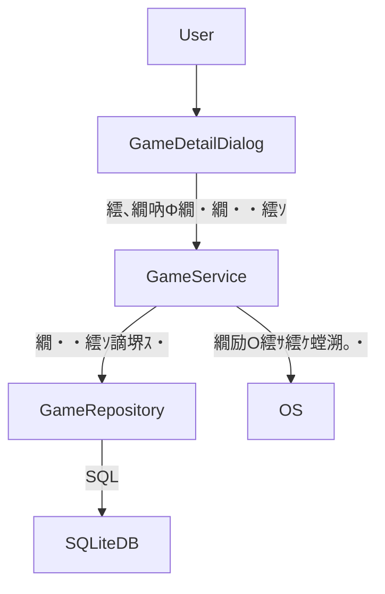
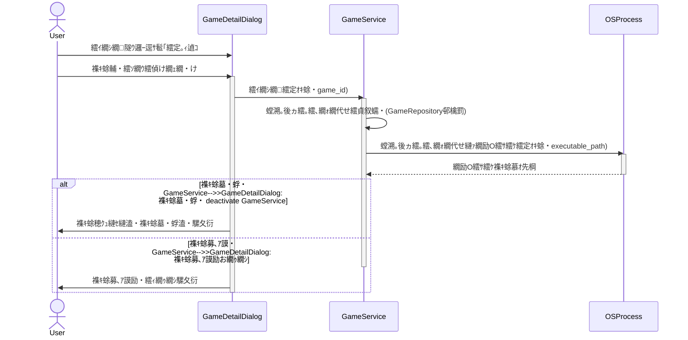

# 謚€陦楢ｨｭ險医ラ繧ｭ繝･繝｡繝ｳ繝・
## 讎りｦ・### 逶ｮ逧・縺薙・讖溯・縺ｯ縲√ご繝ｼ繝繝ｩ繝ｳ繝√Ε繝ｼ縺ｮ繧ｲ繝ｼ繝隧ｳ邏ｰ逕ｻ髱｢縺ｫ縲∝推繧ｲ繝ｼ繝縺ｮ螳溯｡後ヵ繧｡繧､繝ｫ繝代せ繧呈欠螳壹☆繧矩・岼繧定ｿｽ蜉縺吶ｋ縺薙→縺ｧ縲√Θ繝ｼ繧ｶ繝ｼ縺後Λ繝ｳ繝√Ε繝ｼ縺九ｉ逶ｴ謗･繧ｲ繝ｼ繝繧定ｵｷ蜍輔〒縺阪ｋ繧医≧縺ｫ縺吶ｋ繧ゅ・縺ｧ縺吶€・
### 繝ｦ繝ｼ繧ｶ繝ｼ
繧ｲ繝ｼ繝繝ｩ繝ｳ繝√Ε繝ｼ縺ｮ蛻ｩ逕ｨ閠・€ら音縺ｫ縲￣C縺ｫ繧､繝ｳ繧ｹ繝医・繝ｫ縺輔ｌ縺ｦ縺・ｋ繧ｲ繝ｼ繝繧貞柑邇・噪縺ｫ邂｡逅・＠縲∬ｵｷ蜍輔＠縺溘＞縺ｨ閠・∴繧九Θ繝ｼ繧ｶ繝ｼ縲・
### 蠖ｱ髻ｿ
譌｢蟄倥・繧ｲ繝ｼ繝隧ｳ邏ｰ逕ｻ髱｢(`GameDetailDialog`)縺ｫUI隕∫ｴ縺瑚ｿｽ蜉縺輔ｌ縲√ご繝ｼ繝縺ｮ繝・・繧ｿ繝｢繝・Ν(`Game`繝・・繝悶Ν)縺ｫ螳溯｡後ヵ繧｡繧､繝ｫ繝代せ諠・ｱ縺瑚ｿｽ蜉縺輔ｌ縺ｾ縺吶€ゅ％繧後↓繧医ｊ縲√ご繝ｼ繝縺ｮ逋ｻ骭ｲ繝ｻ邱ｨ髮・凾縺翫ｈ縺ｳ襍ｷ蜍墓凾縺ｮ繝輔Ο繝ｼ縺悟､画峩縺輔ｌ縺ｾ縺吶€・
### 繧ｴ繝ｼ繝ｫ
- 繝ｦ繝ｼ繧ｶ繝ｼ縺後ご繝ｼ繝隧ｳ邏ｰ逕ｻ髱｢縺ｧ螳溯｡後ヵ繧｡繧､繝ｫ繝代せ繧貞・蜉帙・菫晏ｭ倥〒縺阪ｋ縺薙→縲・- 菫晏ｭ倥＆繧後◆螳溯｡後ヵ繧｡繧､繝ｫ繝代せ繧剃ｽｿ逕ｨ縺励※繧ｲ繝ｼ繝繧定ｵｷ蜍輔〒縺阪ｋ縺薙→縲・- 螳溯｡後ヵ繧｡繧､繝ｫ繝代せ縺ｮ繝舌Μ繝・・繧ｷ繝ｧ繝ｳ縺碁←蛻・↓陦後ｏ繧後ｋ縺薙→縲・
### 髱槭ざ繝ｼ繝ｫ
- 隍・焚縺ｮ螳溯｡後ヵ繧｡繧､繝ｫ繝代せ縺ｮ邂｡逅・・譛ｬ讖溯・縺ｮ繧ｹ繧ｳ繝ｼ繝怜､悶〒縺吶€・- 繧ｲ繝ｼ繝莉･螟悶・繧｢繝励Μ繧ｱ繝ｼ繧ｷ繝ｧ繝ｳ縺ｮ襍ｷ蜍輔・譛ｬ讖溯・縺ｮ繧ｹ繧ｳ繝ｼ繝怜､悶〒縺吶€・
## 繧｢繝ｼ繧ｭ繝・け繝√Ε

### 譌｢蟄倥い繝ｼ繧ｭ繝・け繝√Ε蛻・梵
迴ｾ蝨ｨ縺ｮ繧ｷ繧ｹ繝・Β縺ｯ縲～PyQt5`繧剃ｽｿ逕ｨ縺励◆繝・せ繧ｯ繝医ャ繝励い繝励Μ繧ｱ繝ｼ繧ｷ繝ｧ繝ｳ縺ｧ縺ゅｊ縲∽ｻ･荳九・荳ｻ隕√↑繧ｳ繝ｳ繝昴・繝阪Φ繝医〒讒区・縺輔ｌ縺ｦ縺・∪縺吶€・- **UI螻､**: `GameDetailDialog` (`src/game_detail_dialog.py`) 縺後ご繝ｼ繝隧ｳ邏ｰ縺ｮ陦ｨ遉ｺ縺ｨ邱ｨ髮・ｒ諡・ｽ薙＠縺ｾ縺吶€・- **繧ｵ繝ｼ繝薙せ螻､**: `GameService` (`src/game_service.py`) 縺後ン繧ｸ繝阪せ繝ｭ繧ｸ繝・け繧貞・逅・＠縲ゞI縺ｨ繝・・繧ｿ繧｢繧ｯ繧ｻ繧ｹ螻､縺ｮ莉ｲ莉九ｒ陦後＞縺ｾ縺吶€・- **繝・・繧ｿ繧｢繧ｯ繧ｻ繧ｹ螻､**: `GameRepository` (`src/game_repository.py`) 縺後ョ繝ｼ繧ｿ繝吶・繧ｹ縺ｨ縺ｮ繧・ｊ蜿悶ｊ繧呈歓雎｡蛹悶＠縺ｾ縺吶€・- **繝・・繧ｿ繝吶・繧ｹ螻､**: `database.py` 縺郡QLite繝・・繧ｿ繝吶・繧ｹ縺ｮ繧ｹ繧ｭ繝ｼ繝槫ｮ夂ｾｩ縺ｨ蛻晄悄蛹悶ｒ諡・ｽ薙＠縺ｾ縺吶€・繝・・繧ｿ豌ｸ邯壼喧縺ｫ縺ｯSQLite繧剃ｽｿ逕ｨ縺励※縺翫ｊ縲～Game`繝・・繝悶Ν縺後ご繝ｼ繝諠・ｱ繧剃ｿ晄戟縺励※縺・∪縺吶€・
### 鬮倥Ξ繝吶Ν繧｢繝ｼ繧ｭ繝・け繝√Ε
譛ｬ讖溯・縺ｯ譌｢蟄倥・繝ｬ繧､繝､繝ｼ繧｢繝ｼ繧ｭ繝・け繝√Ε繧堤ｶｭ謖√＠縲∝推螻､縺ｫ驕ｩ蛻・↑螟画峩繧貞刈縺医ｋ縺薙→縺ｧ螳溽樟縺輔ｌ縺ｾ縺吶€ＡGameDetailDialog`縺ｯ譁ｰ縺励＞UI隕∫ｴ繧呈署萓帙＠縲√Θ繝ｼ繧ｶ繝ｼ蜈･蜉帙ｒ`GameService`縺ｫ貂｡縺励∪縺吶€ＡGameService`縺ｯ繧ｲ繝ｼ繝襍ｷ蜍輔・繝薙ず繝阪せ繝ｭ繧ｸ繝・け繧蛋GameRepository`縺翫ｈ縺ｳOS縺ｮ繝励Ο繧ｻ繧ｹ螳溯｡梧ｩ溯・縺ｨ騾｣謳ｺ縺励※螳溯｡後＠縺ｾ縺吶€・


### 謚€陦薙せ繧ｿ繝・け縺ｨ險ｭ險域ｱｺ螳・
- **謚€陦薙せ繧ｿ繝・け**: Python, PyQt5, SQLite縲よ里蟄倥・謚€陦薙せ繧ｿ繝・け縺ｫ螳悟・縺ｫ貅匁侠縺励∪縺吶€よ眠縺溘↑謚€陦薙・蟆主・縺ｯ縺ゅｊ縺ｾ縺帙ｓ縲・
#### 荳ｻ隕∬ｨｭ險域ｱｺ螳・ 螳溯｡後ヵ繧｡繧､繝ｫ繝代せ縺ｮ豌ｸ邯壼喧
- **豎ｺ螳・*: 譌｢蟄倥・`Game`繝・・繝悶Ν縺ｫ`executable_path`繧ｫ繝ｩ繝繧定ｿｽ蜉縺励∪縺吶€・- **閭梧勹**: 蜷・ご繝ｼ繝縺ｮ螳溯｡後ヵ繧｡繧､繝ｫ繝代せ繧呈ｰｸ邯夂噪縺ｫ菫晏ｭ倥＠縲√ご繝ｼ繝諠・ｱ縺ｨ荳€雋ｫ縺励※邂｡逅・☆繧句ｿ・ｦ√′縺ゅｋ縺溘ａ縺ｧ縺吶€・- **莉｣譖ｿ譯・*:
    1. 譁ｰ縺励＞繝・・繝悶Ν繧剃ｽ懈・縺励€～Game`繝・・繝悶Ν縺ｨ1蟇ｾ1縺ｧ髢｢騾｣莉倥￠繧九€・    2. 險ｭ螳壹ヵ繧｡繧､繝ｫ・井ｾ・ INI, JSON・峨↓菫晏ｭ倥☆繧九€・- **驕ｸ謚槭＆繧後◆繧｢繝励Ο繝ｼ繝・*: 譌｢蟄倥・`Game`繝・・繝悶Ν縺ｫ`executable_path`繧ｫ繝ｩ繝・・EXT蝙具ｼ峨ｒ霑ｽ蜉縺励∪縺吶€・- **逅・罰**: 螳溯｡後ヵ繧｡繧､繝ｫ繝代せ縺ｯ繧ｲ繝ｼ繝縺ｫ蟇・磁縺ｫ髢｢騾｣縺吶ｋ諠・ｱ縺ｧ縺ゅｊ縲√ご繝ｼ繝繧ｨ繝ｳ繝・ぅ繝・ぅ縺ｮ荳€驛ｨ縺ｨ縺励※謇ｱ縺・・縺瑚・辟ｶ縺ｧ縺吶€よ里蟄倥・繝・・繝悶Ν縺ｫ霑ｽ蜉縺吶ｋ縺薙→縺ｧ縲√ョ繝ｼ繧ｿ繝｢繝・Ν縺ｮ隍・尅蛹悶ｒ驕ｿ縺代€√け繧ｨ繝ｪ縺ｮ蜉ｹ邇・€ｧ繧剃ｿ昴▽縺薙→縺後〒縺阪∪縺吶€・- **繝医Ξ繝ｼ繝峨が繝・*: `Game`繝・・繝悶Ν縺ｮ繧ｹ繧ｭ繝ｼ繝槫､画峩縺悟ｿ・ｦ√→縺ｪ繧翫€∵里蟄倥・繝・・繧ｿ繝吶・繧ｹ縺ｫ繝槭う繧ｰ繝ｬ繝ｼ繧ｷ繝ｧ繝ｳ蜃ｦ逅・′蠢・ｦ√→縺ｪ繧句庄閭ｽ諤ｧ縺後≠繧翫∪縺吶€ゅ◆縺縺励€∽ｻ雁屓縺ｯ譁ｰ隕上き繝ｩ繝霑ｽ蜉縺ｮ縺溘ａ縲∽ｺ呈鋤諤ｧ縺ｯ豈碑ｼ・噪邯ｭ謖√＠繧・☆縺・→蛻､譁ｭ縺励∪縺吶€・
## 繧ｷ繧ｹ繝・Β繝輔Ο繝ｼ

### 1. 繧ｲ繝ｼ繝隧ｳ邏ｰ逕ｻ髱｢縺ｧ縺ｮ螳溯｡後ヵ繧｡繧､繝ｫ繝代せ縺ｮ蜈･蜉帙→菫晏ｭ倥ヵ繝ｭ繝ｼ
```mermaid
sequenceDiagram
    actor User
    participant GameDetailDialog
    participant GameService
    participant GameRepository
    participant SQLiteDB

    User->>GameDetailDialog: 繧ｲ繝ｼ繝隧ｳ邏ｰ逕ｻ髱｢繧帝幕縺・    activate GameDetailDialog
    GameDetailDialog->>GameService: 繧ｲ繝ｼ繝繝・・繧ｿ繧偵Ο繝ｼ繝・game_id)
    activate GameService
    GameService->>GameRepository: 繧ｲ繝ｼ繝繧貞叙蠕・game_id)
    activate GameRepository
    GameRepository->>SQLiteDB: SELECT * FROM Game WHERE id = ?
    activate SQLiteDB
    SQLiteDB-->>GameRepository: 繧ｲ繝ｼ繝繝・・繧ｿ
    deactivate SQLiteDB
    GameRepository-->>GameService: 繧ｲ繝ｼ繝繝・・繧ｿ
    deactivate GameRepository
    GameService-->>GameDetailDialog: 繧ｲ繝ｼ繝繝・・繧ｿ
    deactivate GameService
    GameDetailDialog->>User: 螳溯｡後ヵ繧｡繧､繝ｫ繝代せ蜈･蜉幃・岼縺ｨ迴ｾ蝨ｨ縺ｮ繝代せ繧定｡ｨ遉ｺ
    User->>GameDetailDialog: 螳溯｡後ヵ繧｡繧､繝ｫ繝代せ繧貞・蜉・蜿ら・繝懊ち繝ｳ縺ｧ驕ｸ謚・    User->>GameDetailDialog: 菫晏ｭ倥・繧ｿ繝ｳ繧偵け繝ｪ繝・け
    GameDetailDialog->>GameDetailDialog: 蜈･蜉帛€､縺ｮ繝舌Μ繝・・繧ｷ繝ｧ繝ｳ
    alt 譛牙柑縺ｪ繝代せ
        GameDetailDialog->>GameService: 繧ｲ繝ｼ繝繧呈峩譁ｰ(game_id, executable_path, ...)
        activate GameService
        GameService->>GameRepository: 繧ｲ繝ｼ繝繧呈峩譁ｰ(game_id, executable_path, ...)
        activate GameRepository
        GameRepository->>SQLiteDB: UPDATE Game SET executable_path = ? WHERE id = ?
        activate SQLiteDB
        SQLiteDB-->>GameRepository: 譖ｴ譁ｰ謌仙粥
        deactivate SQLiteDB
        GameRepository-->>GameService: 譖ｴ譁ｰ謌仙粥
        deactivate GameRepository
        GameService-->>GameDetailDialog: 譖ｴ譁ｰ謌仙粥
        deactivate GameService
        GameDetailDialog->>User: 菫晏ｭ俶・蜉溘・繝輔ぅ繝ｼ繝峨ヰ繝・け
    else 辟｡蜉ｹ縺ｪ繝代せ
        GameDetailDialog->>User: 繧ｨ繝ｩ繝ｼ繝｡繝・そ繝ｼ繧ｸ繧定｡ｨ遉ｺ
    end
    deactivate GameDetailDialog
```

### 2. 繧ｲ繝ｼ繝襍ｷ蜍輔ヵ繝ｭ繝ｼ


## 隕∵ｱゆｺ矩・・繝医Ξ繝ｼ繧ｵ繝薙Μ繝・ぅ

| 隕∵ｱゆｺ矩・D | 隕∵ｱゆｺ矩・・隕∫ｴ・                               | 繧ｳ繝ｳ繝昴・繝阪Φ繝・                | 繧､繝ｳ繧ｿ繝ｼ繝輔ぉ繝ｼ繧ｹ                 | 繝輔Ο繝ｼ                                    |
| :--------- | :-------------------------------------------- | :--------------------------- | :------------------------------- | :---------------------------------------- |
| 1.1        | 螳溯｡後ヵ繧｡繧､繝ｫ繝代せ蜈･蜉幃・岼縺ｮ陦ｨ遉ｺ                | `GameDetailDialog`           | UI陦ｨ遉ｺ                           | 繧ｲ繝ｼ繝隧ｳ邏ｰ逕ｻ髱｢縺ｧ縺ｮ螳溯｡後ヵ繧｡繧､繝ｫ繝代せ縺ｮ蜈･蜉帙→菫晏ｭ倥ヵ繝ｭ繝ｼ |
| 1.2        | 譛牙柑縺ｪ繝代せ縺ｮ菫晏ｭ・                             | `GameDetailDialog`, `GameService`, `GameRepository`, `SQLiteDB` | `GameService.update_game_details()`, `GameRepository.update_game()` | 繧ｲ繝ｼ繝隧ｳ邏ｰ逕ｻ髱｢縺ｧ縺ｮ螳溯｡後ヵ繧｡繧､繝ｫ繝代せ縺ｮ蜈･蜉帙→菫晏ｭ倥ヵ繝ｭ繝ｼ |
| 1.3        | 辟｡蜉ｹ縺ｪ繝代せ蜈･蜉帶凾縺ｮ繧ｨ繝ｩ繝ｼ陦ｨ遉ｺ                  | `GameDetailDialog`           | UI陦ｨ遉ｺ縲√ヰ繝ｪ繝・・繧ｷ繝ｧ繝ｳ           | 繧ｲ繝ｼ繝隧ｳ邏ｰ逕ｻ髱｢縺ｧ縺ｮ螳溯｡後ヵ繧｡繧､繝ｫ繝代せ縺ｮ蜈･蜉帙→菫晏ｭ倥ヵ繝ｭ繝ｼ |
| 1.4        | 菫晏ｭ倥＆繧後◆繝代せ縺ｮ蛻晄悄陦ｨ遉ｺ                      | `GameDetailDialog`, `GameService`, `GameRepository` | `GameService.get_game_details()`, `GameRepository.get_game()` | 繧ｲ繝ｼ繝隧ｳ邏ｰ逕ｻ髱｢縺ｧ縺ｮ螳溯｡後ヵ繧｡繧､繝ｫ繝代せ縺ｮ蜈･蜉帙→菫晏ｭ倥ヵ繝ｭ繝ｼ |
| 2.1        | 譛牙柑縺ｪ繝代せ縺後≠繧句ｴ蜷医・襍ｷ蜍輔・繧ｿ繝ｳ陦ｨ遉ｺ          | `GameDetailDialog`           | UI陦ｨ遉ｺ                           | 繧ｲ繝ｼ繝襍ｷ蜍輔ヵ繝ｭ繝ｼ                          |
| 2.2        | 襍ｷ蜍輔・繧ｿ繝ｳ繧ｯ繝ｪ繝・け譎ゅ・繧ｲ繝ｼ繝襍ｷ蜍・             | `GameDetailDialog`, `GameService`, `OSProcess` | `GameService.launch_game()`      | 繧ｲ繝ｼ繝襍ｷ蜍輔ヵ繝ｭ繝ｼ                          |
| 2.3        | 繧ｲ繝ｼ繝襍ｷ蜍募､ｱ謨玲凾縺ｮ繧ｨ繝ｩ繝ｼ騾夂衍                  | `GameDetailDialog`, `GameService` | UI陦ｨ遉ｺ                           | 繧ｲ繝ｼ繝襍ｷ蜍輔ヵ繝ｭ繝ｼ                          |
| 2.4        | 繧ｲ繝ｼ繝繝励Ο繧ｻ繧ｹ邨ゆｺ・∪縺ｧ縺ｮ蠕・ｩ・                 | `GameService`, `OSProcess`   | OS繝励Ο繧ｻ繧ｹ邂｡逅・                  | 繧ｲ繝ｼ繝襍ｷ蜍輔ヵ繝ｭ繝ｼ                          |
| 3.1        | UI縺ｸ縺ｮ隱ｿ蜥後・縺ｨ繧後◆邨ｱ蜷・                       | `GameDetailDialog`           | UI繝ｬ繧､繧｢繧ｦ繝・                    | 繧ｲ繝ｼ繝隧ｳ邏ｰ逕ｻ髱｢縺ｧ縺ｮ螳溯｡後ヵ繧｡繧､繝ｫ繝代せ縺ｮ蜈･蜉帙→菫晏ｭ倥ヵ繝ｭ繝ｼ |
| 3.2        | 螟画峩譎ゅ・菫晏ｭ倡憾諷九ヵ繧｣繝ｼ繝峨ヰ繝・け                | `GameDetailDialog`           | UI陦ｨ遉ｺ                           | 繧ｲ繝ｼ繝隧ｳ邏ｰ逕ｻ髱｢縺ｧ縺ｮ螳溯｡後ヵ繧｡繧､繝ｫ繝代せ縺ｮ蜈･蜉帙→菫晏ｭ倥ヵ繝ｭ繝ｼ |

## 繧ｳ繝ｳ繝昴・繝阪Φ繝医→繧､繝ｳ繧ｿ繝ｼ繝輔ぉ繝ｼ繧ｹ

### UI螻､

#### `GameDetailDialog` (`src/game_detail_dialog.py`)
- **荳ｻ隕∬ｲｬ莉ｻ**: 繧ｲ繝ｼ繝隧ｳ邏ｰ縺ｮ陦ｨ遉ｺ縲∫ｷｨ髮・€∝ｮ溯｡後ヵ繧｡繧､繝ｫ繝代せ縺ｮ蜈･蜉帙・驕ｸ謚朸I縺ｮ謠蝉ｾ帙€√♀繧医・菫晏ｭ倥・襍ｷ蜍輔う繝吶Φ繝医・繝上Φ繝峨Μ繝ｳ繧ｰ縲・- **繝峨Γ繧､繝ｳ蠅・阜**: UI陦ｨ遉ｺ縺ｨ繝ｦ繝ｼ繧ｶ繝ｼ繧､繝ｳ繧ｿ繝ｩ繧ｯ繧ｷ繝ｧ繝ｳ縲・- **繝・・繧ｿ謇€譛画ｨｩ**: 縺ｪ縺暦ｼ郁｡ｨ遉ｺ繝・・繧ｿ縺ｯ`GameService`縺九ｉ蜿門ｾ暦ｼ峨€・- **萓晏ｭ倬未菫・*:
    - **繧｢繧ｦ繝医ヰ繧ｦ繝ｳ繝・*: `GameService` (繧ｲ繝ｼ繝繝・・繧ｿ縺ｮ菫晏ｭ倥・蜿門ｾ励€√ご繝ｼ繝襍ｷ蜍・縲・- **螂醍ｴ・ｮ夂ｾｩ**:
    - `_create_ui()`: 螳溯｡後ヵ繧｡繧､繝ｫ繝代せ蜈･蜉帷畑縺ｮ`QLineEdit`縺ｨ蜿ら・繝懊ち繝ｳ繧定ｿｽ蜉縲・    - `_load_game_data()`: `executable_path`縺ｮ蛻晄悄陦ｨ遉ｺ繝ｭ繧ｸ繝・け繧定ｿｽ蜉縲・    - `get_game_data()`: 繝輔か繝ｼ繝縺九ｉ`executable_path`縺ｮ蛟､繧貞叙蠕励☆繧九ｈ縺・峩譁ｰ縲・    - `_browse_executable_path()`: 譁ｰ隕上Γ繧ｽ繝・ラ縺ｨ縺励※縲√ヵ繧｡繧､繝ｫ驕ｸ謚槭ム繧､繧｢繝ｭ繧ｰ繧定｡ｨ遉ｺ縺励€・∈謚槭＆繧後◆繝代せ繧蛋QLineEdit`縺ｫ險ｭ螳壹☆繧区ｩ溯・繧定ｿｽ蜉縲・    - 襍ｷ蜍輔・繧ｿ繝ｳ縺ｮ繧ｯ繝ｪ繝・け繧､繝吶Φ繝医↓蟇ｾ縺吶ｋ繧ｹ繝ｭ繝・ヨ(`_launch_game()`)繧定ｿｽ蜉縲・
### 繧ｵ繝ｼ繝薙せ螻､

#### `GameService` (`src/game_service.py`)
- **荳ｻ隕∬ｲｬ莉ｻ**: 繧ｲ繝ｼ繝縺ｮ繝薙ず繝阪せ繝ｭ繧ｸ繝・け縺ｮ邂｡逅・€√ご繝ｼ繝繝・・繧ｿ縺ｮCRUD謫堺ｽ懊・隱ｿ謨ｴ縲√ご繝ｼ繝襍ｷ蜍募・逅・・螳溯｡後€・- **繝峨Γ繧､繝ｳ蠅・阜**: 繧ｲ繝ｼ繝邂｡逅・→繧ｲ繝ｼ繝襍ｷ蜍輔Ο繧ｸ繝・け縲・- **繝・・繧ｿ謇€譛画ｨｩ**: 縺ｪ縺暦ｼ医ョ繝ｼ繧ｿ縺ｯ`GameRepository`繧剃ｻ九＠縺ｦ謫堺ｽ懶ｼ峨€・- **萓晏ｭ倬未菫・*:
    - **繧､繝ｳ繝舌え繝ｳ繝・*: `GameDetailDialog` (繧ｲ繝ｼ繝繝・・繧ｿ縺ｮ隕∵ｱゅ€∬ｵｷ蜍戊ｦ∵ｱ・縲・    - **繧｢繧ｦ繝医ヰ繧ｦ繝ｳ繝・*: `GameRepository` (繧ｲ繝ｼ繝繝・・繧ｿ縺ｮ豌ｸ邯壼喧)縲＾S縺ｮ繝励Ο繧ｻ繧ｹ螳溯｡梧ｩ溯・ (`subprocess`繝｢繧ｸ繝･繝ｼ繝ｫ)縲・- **螂醍ｴ・ｮ夂ｾｩ**:
    - `register_game(title, ..., executable_path: str)`: 譁ｰ隕上ご繝ｼ繝逋ｻ骭ｲ譎ゅ↓`executable_path`繧貞ｼ墓焚縺ｫ霑ｽ蜉縲・    - `update_game_details(game_id, ..., executable_path: str)`: 繧ｲ繝ｼ繝譖ｴ譁ｰ譎ゅ↓`executable_path`繧貞ｼ墓焚縺ｫ霑ｽ蜉縲・    - `launch_game(game_id: int) -> bool`:
        - **莠句燕譚｡莉ｶ**: 謖・ｮ壹＆繧後◆`game_id`縺ｮ繧ｲ繝ｼ繝縺悟ｭ伜惠縺励€∵怏蜉ｹ縺ｪ`executable_path`縺瑚ｨｭ螳壹＆繧後※縺・ｋ縺薙→縲・        - **莠句ｾ梧擅莉ｶ**: 繧ｲ繝ｼ繝縺梧ｭ｣蟶ｸ縺ｫ襍ｷ蜍輔＆繧後◆蝣ｴ蜷・True`繧定ｿ斐☆縲りｵｷ蜍輔↓螟ｱ謨励＠縺溷ｴ蜷・False`繧定ｿ斐＠縲・←蛻・↑繧ｨ繝ｩ繝ｼ蜃ｦ逅・ｒ陦後≧縲・        - **荳榊､画擅莉ｶ**: 繧ｲ繝ｼ繝繝・・繧ｿ縺ｮ謨ｴ蜷域€ｧ縺ｯ邯ｭ謖√＆繧後ｋ縲・
### 繝・・繧ｿ繧｢繧ｯ繧ｻ繧ｹ螻､

#### `GameRepository` (`src/game_repository.py`)
- **荳ｻ隕∬ｲｬ莉ｻ**: `Game`繝・・繝悶Ν縺ｸ縺ｮ繝・・繧ｿ繧｢繧ｯ繧ｻ繧ｹ謫堺ｽ懶ｼ・RUD・峨€・- **繝峨Γ繧､繝ｳ蠅・阜**: 繝・・繧ｿ繝吶・繧ｹ縺ｨ縺ｮ繧・ｊ蜿悶ｊ縲・- **繝・・繧ｿ謇€譛画ｨｩ**: `Game`繝・・繝悶Ν縺ｮ繝・・繧ｿ縲・- **萓晏ｭ倬未菫・*:
    - **繧､繝ｳ繝舌え繝ｳ繝・*: `GameService` (繧ｲ繝ｼ繝繝・・繧ｿ謫堺ｽ懆ｦ∵ｱ・縲・    - **繧｢繧ｦ繝医ヰ繧ｦ繝ｳ繝・*: `sqlite3`縲・- **螂醍ｴ・ｮ夂ｾｩ**:
    - `add_game(game_data: dict)`: `game_data`霎樊嶌縺形executable_path`繧ｭ繝ｼ繧貞性繧€縺薙→繧呈Φ螳壹＠縺ｦ蜃ｦ逅・ｒ譖ｴ譁ｰ縲・    - `update_game(game_id: int, game_data: dict)`: `game_data`霎樊嶌縺形executable_path`繧ｭ繝ｼ繧貞性繧€縺薙→繧呈Φ螳壹＠縺ｦ蜃ｦ逅・ｒ譖ｴ譁ｰ縲・    - `get_game(game_id: int)`: `executable_path`繧ｫ繝ｩ繝繧貞性繧€繧ｲ繝ｼ繝繝・・繧ｿ繧定ｿ斐☆縲・
### 繝・・繧ｿ繝吶・繧ｹ螻､

#### `database.py` (`src/database.py`)
- **荳ｻ隕∬ｲｬ莉ｻ**: 繝・・繧ｿ繝吶・繧ｹ繧ｹ繧ｭ繝ｼ繝槭・螳夂ｾｩ縺ｨ蛻晄悄蛹悶€・- **繝峨Γ繧､繝ｳ蠅・阜**: 繝・・繧ｿ繝吶・繧ｹ讒矩€縲・- **萓晏ｭ倬未菫・*: 縺ｪ縺励€・- **螂醍ｴ・ｮ夂ｾｩ**:
    - `DATABASE_SCHEMA`: `Game`繝・・繝悶Ν縺ｫ`executable_path TEXT`繧ｫ繝ｩ繝繧定ｿｽ蜉縺吶ｋ繧医≧譖ｴ譁ｰ縲・
## 繝・・繧ｿ繝｢繝・Ν

### 迚ｩ逅・ョ繝ｼ繧ｿ繝｢繝・Ν

`Game`繝・・繝悶Ν縺ｮ繧ｹ繧ｭ繝ｼ繝槭↓莉･荳九・繧ｫ繝ｩ繝繧定ｿｽ蜉縺励∪縺吶€・
```sql
ALTER TABLE Game ADD COLUMN executable_path TEXT;
```

**譖ｴ譁ｰ蠕後・`Game`繝・・繝悶Ν繧ｹ繧ｭ繝ｼ繝・**
```sql
CREATE TABLE IF NOT EXISTS Game (
    id INTEGER PRIMARY KEY AUTOINCREMENT,
    title TEXT NOT NULL,
    description TEXT,
    cover_art_path TEXT,
    pre_command TEXT,
    post_command TEXT,
    save_folder TEXT,
    sync_enabled INTEGER DEFAULT 0,
    remote_sync_path TEXT,
    executable_path TEXT, -- 譁ｰ隕剰ｿｽ蜉
    created_at TEXT NOT NULL,
    updated_at TEXT NOT NULL
);
```

## 繧ｨ繝ｩ繝ｼ繝上Φ繝峨Μ繝ｳ繧ｰ

- **螳溯｡後ヵ繧｡繧､繝ｫ繝代せ縺ｮ繝舌Μ繝・・繧ｷ繝ｧ繝ｳ**:
    - 繝ｦ繝ｼ繧ｶ繝ｼ縺悟・蜉帙＠縺溘ヱ繧ｹ縺後ヵ繧｡繧､繝ｫ縺ｨ縺励※蟄伜惠縺吶ｋ縺九€∝ｮ溯｡悟庄閭ｽ縺ｧ縺ゅｋ縺九ｒ讀懆ｨｼ縺励∪縺吶€・    - 辟｡蜉ｹ縺ｪ繝代せ縺ｮ蝣ｴ蜷医€～GameDetailDialog`縺ｯ繝ｦ繝ｼ繧ｶ繝ｼ縺ｫ繧ｨ繝ｩ繝ｼ繝｡繝・そ繝ｼ繧ｸ・井ｾ・ "謖・ｮ壹＆繧後◆繝代せ縺ｫ繝輔ぃ繧､繝ｫ縺悟ｭ伜惠縺励∪縺帙ｓ縲・・峨ｒ陦ｨ遉ｺ縺励∪縺吶€・- **繧ｲ繝ｼ繝襍ｷ蜍募､ｱ謨・*:
    - `GameService.launch_game()`繝｡繧ｽ繝・ラ蜀・〒OS繝励Ο繧ｻ繧ｹ襍ｷ蜍・(`subprocess`) 縺悟､ｱ謨励＠縺溷ｴ蜷医€～GameService`縺ｯ驕ｩ蛻・↑萓句､悶ｒ謐墓拷縺励€～False`繧定ｿ斐☆縺九€√ｈ繧願ｩｳ邏ｰ縺ｪ繧ｨ繝ｩ繝ｼ諠・ｱ繧定ｿ斐＠縺ｾ縺吶€・    - `GameDetailDialog`縺ｯ縺昴・繧ｨ繝ｩ繝ｼ繧貞女縺大叙繧翫€√Θ繝ｼ繧ｶ繝ｼ縺ｫ襍ｷ蜍募､ｱ謨励ｒ騾夂衍縺吶ｋ繝｡繝・そ繝ｼ繧ｸ繝懊ャ繧ｯ繧ｹ繧定｡ｨ遉ｺ縺励∪縺吶€・
## 繝・せ繝域姶逡･

- **蜊倅ｽ薙ユ繧ｹ繝・(Unit Tests)**:
    - `GameService.launch_game()`: 譛牙柑縺ｪ繝代せ縺ｧ繧ｲ繝ｼ繝縺瑚ｵｷ蜍輔＆繧後ｋ縺薙→縲∫┌蜉ｹ縺ｪ繝代せ縺ｧ襍ｷ蜍輔′螟ｱ謨励☆繧九％縺ｨ縲√・繝ｭ繧ｻ繧ｹ邨ゆｺ・∪縺ｧ蠕・ｩ溘☆繧九％縺ｨ繧堤｢ｺ隱阪＠縺ｾ縺吶€Ａsubprocess`繝｢繝・け繧剃ｽｿ逕ｨ縺励∪縺吶€・    - `GameRepository`縺ｮ`add_game()`縺翫ｈ縺ｳ`update_game()`: `executable_path`縺梧ｭ｣縺励￥菫晏ｭ倥・譖ｴ譁ｰ縺輔ｌ繧九％縺ｨ繧堤｢ｺ隱阪＠縺ｾ縺吶€・- **邨仙粋繝・せ繝・(Integration Tests)**:
    - `GameDetailDialog`縺九ｉ`GameService`縲～GameRepository`繧剃ｻ九＠縺ｦ`executable_path`縺ｮ蜈･蜉帙€∽ｿ晏ｭ倥€∬ｪｭ縺ｿ霎ｼ縺ｿ縺ｮ荳€騾｣縺ｮ豬√ｌ縺梧ｭ｣縺励￥讖溯・縺吶ｋ縺薙→繧堤｢ｺ隱阪＠縺ｾ縺吶€・    - `GameDetailDialog`縺ｮ襍ｷ蜍輔・繧ｿ繝ｳ繧ｯ繝ｪ繝・け縺九ｉ`GameService`邨檎罰縺ｧ縺ｮ繧ｲ繝ｼ繝襍ｷ蜍輔∪縺ｧ縺ｮ荳€騾｣縺ｮ豬√ｌ繧堤｢ｺ隱阪＠縺ｾ縺吶€・- **UI繝・せ繝・(E2E/UI Tests)** (繧ｪ繝励す繝ｧ繝ｳ):
    - `GameDetailDialog`縺ｫ譁ｰ縺励＞蜈･蜉帙ヵ繧｣繝ｼ繝ｫ繝峨→繝懊ち繝ｳ縺梧ｭ｣縺励￥陦ｨ遉ｺ縺輔ｌ縲∵悄蠕・€壹ｊ縺ｫ蜍穂ｽ懊☆繧九％縺ｨ繧堤｢ｺ隱阪＠縺ｾ縺吶€１yQt5縺ｮ繝・せ繝医ワ繝ｼ繝阪せ繧・ヤ繝ｼ繝ｫ繧剃ｽｿ逕ｨ縺吶ｋ縺薙→繧呈､懆ｨ弱＠縺ｾ縺吶€・
