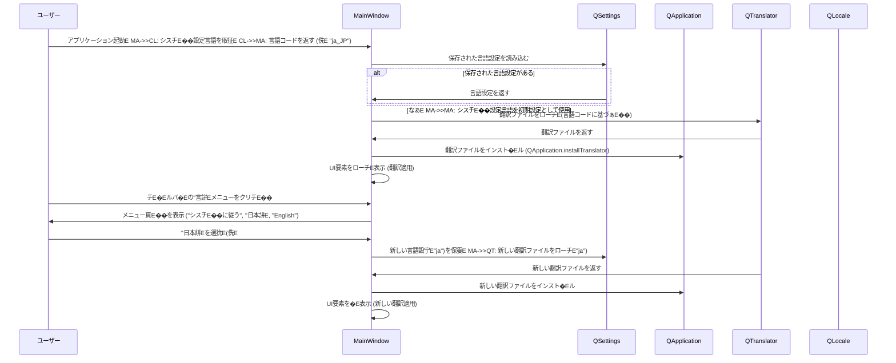

# チE��インドキュメンチE
## 概要E**目皁E*: こ�E機�Eは、Pyzree Game Launcher アプリケーションに国際化 (i18n) 機�Eを追加し、ユーザーインターフェース (UI) を日本語と英語�E両方で表示できるようにします。ユーザーはアプリケーション冁E��表示言語を刁E��替えることができ、アプリケーションはユーザーのシスチE��設定に応じてチE��ォルト言語を適用し、日本語およ�E英語以外�E言語設定�E場合�E英語にフォールバックします、E**ユーザー**: 日本語また�E英語を母国語とするユーザー、およ�EシスチE��言語が日本語また�E英語ではなぁE��ーザーが、より直感的にアプリケーションを利用できるようになります、E**影響**: アプリケーションのUIレイヤーに庁E��E��な変更が忁E��となり、すべての表示斁E���Eが翻訳メカニズムを通じて管琁E��れるようになります。これにより、封E��皁E��多言語対応が容易になります、E
### 目樁E- アプリケーションが日本語と英語�EUI表示に対応すること、E- ユーザーがアプリケーションの表示言語を動的に刁E��替えられること、E- 言語設定がアプリケーションの再起動後も永続化されること、E- シスチE��の言語設定に基づぁE��チE��ォルト言語�E適用と、未対応言語への英語フォールバックを実現すること、E
### 非目樁E- アプリケーションの起動時以外�E動的な言語�Eり替え機�Eの実裁E��侁E 実行中のゲーム冁E��の言語変更�E�、E- 日付、時刻、数値、E��貨などのロケール固有�Eフォーマット�E国際化�E�現在のアプリケーションには関連する表示がなぁE��めE��、E- 左右書き！ETL�E�言語への対応、E
## アーキチE��チャ

### 既存アーキチE��チャ刁E��
LitheLauncher Game Launcherは、PythonとPySide6で構築されたチE��クトップアプリケーションです。UI層はMainWindow、GameCardWidget、GameDetailDialogなどのウィジェチE��に刁E��されてぁE��す。現在のところ、国際化めE��語設定�Eメカニズムは絁E��込まれておらず、すべての表示斁E���Eはコード�Eにハ�EドコードされてぁE��す、E
### 高レベルアーキチE��チャ
国際化機�Eは、PySide6の翻訳シスチE��をアプリケーションレイヤーに統合することで実現されます。アプリケーション起動時にシスチE��言語設定を検�Eし、対応する翻訳ファイルをロードします。ユーザーはメニューから言語を刁E��替えることができ、その設定�E永続化されます、E
```mermaid
graph TD
    A[ユーザー] -->|起動| B[LitheLauncher Game Launcher (main.py)]
    B -->|シスチE��言語検�E| C[QLocale]
    C -->|言語設定をロード| D[QSettings]
    D -->|QTranslatorをローチEインスト�Eル| E[QApplication]
    E -->|UI表示| F[MainWindow]
    F -->|言語選択メニュー| A
    A -->|言語変更| F
    F -->|QSettingsに保孁E D
    F -->|UI再表示 (QTranslator適用)| E
```

**アーキチE��チャ統吁E*:
- **既存�Eパターン保持**: PySide6の標準的なUI構築パターンと、サービスレイヤー�E�EameServiceなど�E�から�EチE�Eタ取得パターンを保持します、E- **新しいコンポ�Eネント�E論理皁E��拠**:
    - `QTranslator`: Qtアプリケーションの翻訳機�Eのコアであり、`.qm`翻訳ファイルを管琁E�E適用します、E    - `QSettings`: ユーザー設定�E永続化に標準的に使用されるQtクラスであり、言語設定�E保存に適してぁE��す、E    - メニューバ�Eへの言語選択メニューの追加: ユーザーが言語を刁E��替えるための標準的なUIインタラクションを提供します、E- **技術アラインメンチE*: PySide6の提供する標準機�Eを利用するため、既存�EPySide6フレームワークとシームレスに統合されます、E- **スチE��リングコンプライアンス**: `structure.md`のチE��トディレクトリ冁E�E`conftest.py`と同様に、翻訳ファイルを`res/i18n`のようなリソースチE��レクトリに配置することで、�Eロジェクト構造の原則に準拠します。`tech.md`と`product.md`の原則にも合致します、E
### 技術スタチE��と設計上�E決宁E
**技術アラインメンチE*:
- `PySide6` の翻訳メカニズム (`QTranslator`, `lupdate`, `lrelease`) を導�Eし、既存�E `PySide6` 環墁E��一貫性を保ちます、E- ユーザー設定�E永続化には `PySide6.QtCore.QSettings` を利用します、E
**主要な設計上�E決宁E*:
- **決宁E*: Qt の標準翻訳シスチE�� (`QTranslator`, `lupdate`, `lrelease`) を採用し、文字�Eは `QObject.tr()` でマ�Eクします、E- **背景**: PySide6アプリケーションにおいて、UI要素の多言語対応を実現する最も効玁E��で堁E��な方法であるため。これにより、翻訳の抽出、更新、ロード�Eプロセスがツールチェーンによってサポ�Eトされます、E- **代替桁E*:
    - Python の `gettext` モジュールを使用する: Qt ウィジェチE��との統合が手動になり、`.ui` ファイル冁E�E斁E���Eを抽出するのが困難になる可能性があります、E    - 独自の辞書ベ�Eスの翻訳シスチE��を実裁E��めE 翻訳管琁E�E負拁E��増大し、Qt のライフサイクルとの統合が褁E��になります、E- **選択されたアプローチE*:
    - すべてのUI表示斁E���EめE`QObject.tr("斁E���E")` でマ�Eクします、E    - `lupdate` チE�Eルを使用してソースコードから翻訳対象斁E���Eを抽出し、`.ts` ファイルを生成します、E    - `.ts` ファイルを翻訳し、`lrelease` チE�Eルを使用してコンパイル済みの `.qm` ファイルを生成します、E    - アプリケーション起動時に `QTranslator` インスタンスを作�Eし、現在の言語設定に基づぁE��適刁E�� `.qm` ファイルをロードし、`QApplication.installTranslator()` で適用します、E- **琁E��**: Qt の豊富な国際化機�EとチE�Eルチェーンを活用することで、E��発の効玁E��とメンチE��ンス性を最大化できます、E- **トレードオチE*: `lupdate`/`lrelease` チE�Eルチェーンの学習と統合が忁E��になります。開発ワークフローに翻訳プロセスのスチE��プが追加されます、E
## シスチE��フロー

### 言語�Eり替えシーケンス



## 要求事頁E��レーサビリチE��
| 要求事頁E| 要求事頁E�E概要E              | コンポ�EネンチE                | インターフェース                          | フロー             |
|----------|------------------------------|--------------------------------|-------------------------------------------|--------------------|
| 1.1      | シスチE��設定言語に従う       | `MainWindow`, `QLocale`        | `QLocale.systemLanguage()`                | 言語�Eり替えシーケンス |
| 1.2      | 未対応言語への英語フォールバック | `MainWindow`                   | (冁E��ロジチE��)                            | 言語�Eり替えシーケンス |
| 1.3      | チE�Eルバ�Eに言語メニュー表示 | `MainWindow`, `QMenuBar`, `QMenu` | `QMenuBar.addMenu()`, `QMenu.addAction()` | 言語�Eり替えシーケンス |
| 1.4      | 言語選択肢の表示             | `MainWindow`, `QMenu`          | `QMenu.addAction()`                       | 言語�Eり替えシーケンス |
| 1.5      | 選択された言語設定�E適用     | `MainWindow`, `QTranslator`    | `QApplication.installTranslator()`        | 言語�Eり替えシーケンス |
| 1.6      | UIチE��スト�E翻訳チE�Eタ提侁E  | 翻訳ファイル (`.qm`)           | `QObject.tr()`                            | N/A                |
| 2.1      | 言語設定�E永続化             | `MainWindow`, `QSettings`      | `QSettings.setValue()`, `QSettings.value()` | 言語�Eり替えシーケンス |
| 2.2      | 保存された言語設定�E読み込み | `MainWindow`, `QSettings`      | `QSettings.value()`                       | 言語�Eり替えシーケンス |
| 3.1      | 斁E���EリチE��ルの翻訳管琁E    | UIコンポ�EネンチE              | `QObject.tr()`                            | N/A                |
| 3.2      | 新しいUI要素の翻訳追加       | 翻訳チE�Eルチェーン             | `lupdate`, `lrelease`                     | N/A                |

## コンポ�Eネントとインターフェース

### 国際化インフラストラクチャ

#### `QTranslator` (PySide6)

**責任と墁E��**
- **主要な責任**: アプリケーションの翻訳チE�Eタをロードし、UIチE��ストに適用すること、E- **ドメイン墁E��**: 国際化インフラストラクチャ、E- **チE�Eタ所有権**: `.qm` 翻訳ファイルを管琁E��、翻訳斁E���Eを提供します、E- **トランザクション墁E��**: N/A

**依存関俁E*
- **インバウンチE*: `QApplication` (インスト�Eル晁E、翻訳ファイル (`.qm`)、E- **アウトバウンチE*: UI要素への翻訳斁E���Eの提供、E- **外部**: N/A

**契紁E��義**
**サービスインターフェース**:
- `load(filename)`: 持E��された `.qm` ファイルをロードします、E- `isEmpty()`: 翻訳チE�EタがロードされてぁE��かどぁE��を返します、E- (`PySide6` の `lupdate`/`lrelease` チE�Eルチェーンによって生�E・管琁E��れます、E

#### `QSettings` (PySide6)

**責任と墁E��**
- **主要な責任**: アプリケーションの永続的な設定（言語設定を含む�E�を保存およ�Eロードすること、E- **ドメイン墁E��**: 設定管琁E��E- **チE�Eタ所有権**: アプリケーション設定データ、E- **トランザクション墁E��**: N/A

**依存関俁E*
- **インバウンチE*: `MainWindow` (言語設定�E保孁Eロード時)、E- **アウトバウンチE*: N/A
- **外部**: N/A

**契紁E��義**
**サービスインターフェース**:
- `setValue(key, value)`: 持E��されたキーで値を保存します、E- `value(key, defaultValue)`: 持E��されたキーの値を読み込みます、E- `remove(key)`: 持E��されたキーの設定を削除します、E
### UIコンポ�EネンチE
#### `MainWindow`

**責任と墁E��**
- **主要な責任**: 言語設定メニューを表示し、ユーザーの選択に応じて言語を刁E��替え、設定を永続化すること。アプリケーション起動時にチE��ォルト言語を適用すること、E- **ドメイン墁E��**: UIドメイン、E- **チE�Eタ所有権**: 言語設定�E選択状態、E- **トランザクション墁E��**: 言語�Eり替え�E琁E��E
**依存関俁E*
- **インバウンチE*: ユーザーからの入力、E- **アウトバウンチE*: `QLocale`, `QTranslator`, `QSettings`, `QApplication`、E- **外部**: N/A

**契紁E��義**
**サービスインターフェース**:
- `_create_language_menu()`: チE�Eルバ�Eに言語選択メニューを作�Eします、E- `_set_language(language_code)`: 持E��された言語コードに基づぁE��翻訳をロードし、E��用します、E- `_load_language_setting()`: 永続化された言語設定をロードし、E��用します、E- `_save_language_setting(language_code)`: 現在の言語設定を永続化します、E
## チE�EタモチE��

### 翻訳チE�EタモチE��
**概要E*: アプリケーション冁E�Eすべての翻訳可能な斁E���Eと、それに対応する日本語およ�E英語�E翻訳を管琁E��ます、E
**構造定義**:
- **ソース斁E���E**: コード�Eで `QObject.tr()` でマ�Eクされたオリジナルの斁E���E、E- **翻訳エントリ**: 吁E��ース斁E���Eに対応する、言語ごとの翻訳チE��スト、E
**形弁E*: Qt の翻訳ファイル形弁E(`.ts` / `.qm`) を使用します、E- `.ts` ファイル (Translation Source): 翻訳老E��編雁E��るため�EXMLベ�EスのチE��ストファイル、E- `.qm` ファイル (Qt Message): `lrelease` チE�Eルによって生�Eされるバイナリ形式�Eコンパイル済み翻訳ファイルで、アプリケーションがロードします、E
**保存場所**: 翻訳ファイルは `res/i18n` チE��レクトリに言語コードごとに配置します。（侁E `res/i18n/ja_JP.qm`, `res/i18n/en_US.qm`�E�、E
## エラーハンドリング

### エラー戦略
翻訳ファイルのロード失敗などのエラーが発生した場合、アプリケーションは現在の言語設定を維持し、ログにエラーを記録します。UIは翻訳されてぁE��ぁE�Eの斁E���Eで表示されるか、以前�E言語設定�Eままになります、E
### エラーカチE��リと応筁E- **翻訳ファイルが見つからなぁE*: 
    - **応筁E*: ログに警告を記録し、翻訳を適用せずに続行します（�Eの斁E���Eが表示されます）、E- **翻訳ファイルの破搁E*:
    - **応筁E*: ログにエラーを記録し、翻訳を適用せずに続行します、E
### 監要E翻訳関連のエラーはアプリケーションのログシスチE�� (`game_launcher_logger.py`) を通じて記録されます、E
## チE��ト戦略

### ユニットテスチE- **`MainWindow` の言語メニュー**:
    - 言語メニューが正しく作�Eされ、忁E��な言語選択肢�E�シスチE��に従う、日本語、English�E�が含まれてぁE��ことを検証します、E    - 吁E��語選択肢のクリチE��ぁE`_set_language` メソチE��を正しく呼び出すことを検証します、E- **言語設定�E保孁EローチE*:
    - `QSettings` をモチE��し、`_save_language_setting` が正しく値を保存すること、`_load_language_setting` が正しく値を読み込むことを検証します、E- **翻訳の適用**:
    - `QTranslator` と `QApplication.installTranslator()` をモチE��し、`_set_language` が適刁E��翻訳ファイルをロードし、インスト�Eルすることを検証します、E
### 統合テスチE- **アプリケーション起動時のチE��ォルト言語適用**:
    - シスチE��言語設定をモチE��し、アプリケーションが起動時に正しくチE��ォルト言語（また�E英語フォールバック�E�を適用することを検証します、E- **言語�Eり替え�EUI連携**:
    - 言語メニューから言語を選択するUI操作をシミュレートし、UI全体が正しく翻訳されることを検証します、E
### パフォーマンス/負荷 (適用夁E
国際化機�Eの導�Eはアプリケーションのパフォーマンスに大きな影響を与えなぁE��め、このフェーズではパフォーマンス/負荷チE��ト�E適用外とします、E
