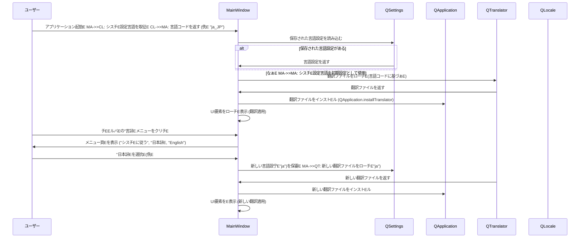

# チEインドキュメンチE
## 概要E**目皁E*: こE機Eは、Pyzree Game Launcher アプリケーションに国際化 (i18n) 機Eを追加し、ユーザーインターフェース (UI) を日本語と英語E両方で表示できるようにします。ユーザーはアプリケーション冁E表示言語を刁E替えることができ、アプリケーションはユーザーのシスチE設定に応じてチEォルト言語を適用し、日本語およE英語以外E言語設定E場合E英語にフォールバックします、E**ユーザー**: 日本語またE英語を母国語とするユーザー、およEシスチE言語が日本語またE英語ではなぁEーザーが、より直感的にアプリケーションを利用できるようになります、E**影響**: アプリケーションのUIレイヤーに庁EEな変更が忁Eとなり、すべての表示斁EEが翻訳メカニズムを通じて管琁Eれるようになります。これにより、封E皁E多言語対応が容易になります、E
### 目樁E- アプリケーションが日本語と英語EUI表示に対応すること、E- ユーザーがアプリケーションの表示言語を動的に刁E替えられること、E- 言語設定がアプリケーションの再起動後も永続化されること、E- シスチEの言語設定に基づぁEチEォルト言語E適用と、未対応言語への英語フォールバックを実現すること、E
### 非目樁E- アプリケーションの起動時以外E動的な言語Eり替え機Eの実裁E侁E 実行中のゲーム冁Eの言語変更E、E- 日付、時刻、数値、E貨などのロケール固有EフォーマットE国際化E現在のアプリケーションには関連する表示がなぁEめE、E- 左右書き！ETLE言語への対応、E
## アーキチEチャ

### 既存アーキチEチャ刁E
LitheLauncher Game Launcherは、PythonとPySide6で構築されたチEクトップアプリケーションです。UI層はMainWindow、GameCardWidget、GameDetailDialogなどのウィジェチEに刁EされてぁEす。現在のところ、国際化めE語設定Eメカニズムは絁E込まれておらず、すべての表示斁EEはコードEにハEドコードされてぁEす、E
### 高レベルアーキチEチャ
国際化機Eは、PySide6の翻訳シスチEをアプリケーションレイヤーに統合することで実現されます。アプリケーション起動時にシスチE言語設定を検Eし、対応する翻訳ファイルをロードします。ユーザーはメニューから言語を刁E替えることができ、その設定E永続化されます、E
```mermaid
graph TD
    A[ユーザー] -->|起動| B[LitheLauncher Game Launcher (main.py)]
    B -->|シスチE言語検E| C[QLocale]
    C -->|言語設定をロード| D[QSettings]
    D -->|QTranslatorをローチEインストEル| E[QApplication]
    E -->|UI表示| F[MainWindow]
    F -->|言語選択メニュー| A
    A -->|言語変更| F
    F -->|QSettingsに保孁E D
    F -->|UI再表示 (QTranslator適用)| E
```

**アーキチEチャ統吁E*:
- **既存Eパターン保持**: PySide6の標準的なUI構築パターンと、サービスレイヤーEEameServiceなどEからEチEEタ取得パターンを保持します、E- **新しいコンポEネントE論理皁E拠**:
    - `QTranslator`: Qtアプリケーションの翻訳機Eのコアであり、`.qm`翻訳ファイルを管琁EE適用します、E    - `QSettings`: ユーザー設定E永続化に標準的に使用されるQtクラスであり、言語設定E保存に適してぁEす、E    - メニューバEへの言語選択メニューの追加: ユーザーが言語を刁E替えるための標準的なUIインタラクションを提供します、E- **技術アラインメンチE*: PySide6の提供する標準機Eを利用するため、既存EPySide6フレームワークとシームレスに統合されます、E- **スチEリングコンプライアンス**: `structure.md`のチEトディレクトリ冁EE`conftest.py`と同様に、翻訳ファイルを`res/i18n`のようなリソースチEレクトリに配置することで、Eロジェクト構造の原則に準拠します。`tech.md`と`product.md`の原則にも合致します、E
### 技術スタチEと設計上E決宁E
**技術アラインメンチE*:
- `PySide6` の翻訳メカニズム (`QTranslator`, `lupdate`, `lrelease`) を導Eし、既存E `PySide6` 環墁E一貫性を保ちます、E- ユーザー設定E永続化には `PySide6.QtCore.QSettings` を利用します、E
**主要な設計上E決宁E*:
- **決宁E*: Qt の標準翻訳シスチE (`QTranslator`, `lupdate`, `lrelease`) を採用し、文字Eは `QObject.tr()` でマEクします、E- **背景**: PySide6アプリケーションにおいて、UI要素の多言語対応を実現する最も効玁Eで堁Eな方法であるため。これにより、翻訳の抽出、更新、ロードEプロセスがツールチェーンによってサポEトされます、E- **代替桁E*:
    - Python の `gettext` モジュールを使用する: Qt ウィジェチEとの統合が手動になり、`.ui` ファイル冁EE斁EEを抽出するのが困難になる可能性があります、E    - 独自の辞書ベEスの翻訳シスチEを実裁EめE 翻訳管琁EE負拁E増大し、Qt のライフサイクルとの統合が褁Eになります、E- **選択されたアプローチE*:
    - すべてのUI表示斁EEめE`QObject.tr("斁EE")` でマEクします、E    - `lupdate` チEEルを使用してソースコードから翻訳対象斁EEを抽出し、`.ts` ファイルを生成します、E    - `.ts` ファイルを翻訳し、`lrelease` チEEルを使用してコンパイル済みの `.qm` ファイルを生成します、E    - アプリケーション起動時に `QTranslator` インスタンスを作Eし、現在の言語設定に基づぁE適刁E `.qm` ファイルをロードし、`QApplication.installTranslator()` で適用します、E- **琁E**: Qt の豊富な国際化機EとチEEルチェーンを活用することで、E発の効玁EとメンチEンス性を最大化できます、E- **トレードオチE*: `lupdate`/`lrelease` チEEルチェーンの学習と統合が忁Eになります。開発ワークフローに翻訳プロセスのスチEプが追加されます、E
## シスチEフロー

### 言語Eり替えシーケンス



## 要求事頁EレーサビリチE
| 要求事頁E| 要求事頁EE概要E              | コンポEネンチE                | インターフェース                          | フロー             |
|----------|------------------------------|--------------------------------|-------------------------------------------|--------------------|
| 1.1      | シスチE設定言語に従う       | `MainWindow`, `QLocale`        | `QLocale.systemLanguage()`                | 言語Eり替えシーケンス |
| 1.2      | 未対応言語への英語フォールバック | `MainWindow`                   | (冁EロジチE)                            | 言語Eり替えシーケンス |
| 1.3      | チEEルバEに言語メニュー表示 | `MainWindow`, `QMenuBar`, `QMenu` | `QMenuBar.addMenu()`, `QMenu.addAction()` | 言語Eり替えシーケンス |
| 1.4      | 言語選択肢の表示             | `MainWindow`, `QMenu`          | `QMenu.addAction()`                       | 言語Eり替えシーケンス |
| 1.5      | 選択された言語設定E適用     | `MainWindow`, `QTranslator`    | `QApplication.installTranslator()`        | 言語Eり替えシーケンス |
| 1.6      | UIチEストE翻訳チEEタ提侁E  | 翻訳ファイル (`.qm`)           | `QObject.tr()`                            | N/A                |
| 2.1      | 言語設定E永続化             | `MainWindow`, `QSettings`      | `QSettings.setValue()`, `QSettings.value()` | 言語Eり替えシーケンス |
| 2.2      | 保存された言語設定E読み込み | `MainWindow`, `QSettings`      | `QSettings.value()`                       | 言語Eり替えシーケンス |
| 3.1      | 斁EEリチEルの翻訳管琁E    | UIコンポEネンチE              | `QObject.tr()`                            | N/A                |
| 3.2      | 新しいUI要素の翻訳追加       | 翻訳チEEルチェーン             | `lupdate`, `lrelease`                     | N/A                |

## コンポEネントとインターフェース

### 国際化インフラストラクチャ

#### `QTranslator` (PySide6)

**責任と墁E**
- **主要な責任**: アプリケーションの翻訳チEEタをロードし、UIチEストに適用すること、E- **ドメイン墁E**: 国際化インフラストラクチャ、E- **チEEタ所有権**: `.qm` 翻訳ファイルを管琁E、翻訳斁EEを提供します、E- **トランザクション墁E**: N/A

**依存関俁E*
- **インバウンチE*: `QApplication` (インストEル晁E、翻訳ファイル (`.qm`)、E- **アウトバウンチE*: UI要素への翻訳斁EEの提供、E- **外部**: N/A

**契紁E義**
**サービスインターフェース**:
- `load(filename)`: 持Eされた `.qm` ファイルをロードします、E- `isEmpty()`: 翻訳チEEタがロードされてぁEかどぁEを返します、E- (`PySide6` の `lupdate`/`lrelease` チEEルチェーンによって生E・管琁Eれます、E

#### `QSettings` (PySide6)

**責任と墁E**
- **主要な責任**: アプリケーションの永続的な設定（言語設定を含むEを保存およEロードすること、E- **ドメイン墁E**: 設定管琁EE- **チEEタ所有権**: アプリケーション設定データ、E- **トランザクション墁E**: N/A

**依存関俁E*
- **インバウンチE*: `MainWindow` (言語設定E保孁Eロード時)、E- **アウトバウンチE*: N/A
- **外部**: N/A

**契紁E義**
**サービスインターフェース**:
- `setValue(key, value)`: 持Eされたキーで値を保存します、E- `value(key, defaultValue)`: 持Eされたキーの値を読み込みます、E- `remove(key)`: 持Eされたキーの設定を削除します、E
### UIコンポEネンチE
#### `MainWindow`

**責任と墁E**
- **主要な責任**: 言語設定メニューを表示し、ユーザーの選択に応じて言語を刁E替え、設定を永続化すること。アプリケーション起動時にチEォルト言語を適用すること、E- **ドメイン墁E**: UIドメイン、E- **チEEタ所有権**: 言語設定E選択状態、E- **トランザクション墁E**: 言語Eり替えE琁EE
**依存関俁E*
- **インバウンチE*: ユーザーからの入力、E- **アウトバウンチE*: `QLocale`, `QTranslator`, `QSettings`, `QApplication`、E- **外部**: N/A

**契紁E義**
**サービスインターフェース**:
- `_create_language_menu()`: チEEルバEに言語選択メニューを作Eします、E- `_set_language(language_code)`: 持Eされた言語コードに基づぁE翻訳をロードし、E用します、E- `_load_language_setting()`: 永続化された言語設定をロードし、E用します、E- `_save_language_setting(language_code)`: 現在の言語設定を永続化します、E
## チEEタモチE

### 翻訳チEEタモチE
**概要E*: アプリケーション冁EEすべての翻訳可能な斁EEと、それに対応する日本語およE英語E翻訳を管琁Eます、E
**構造定義**:
- **ソース斁EE**: コードEで `QObject.tr()` でマEクされたオリジナルの斁EE、E- **翻訳エントリ**: 吁Eース斁EEに対応する、言語ごとの翻訳チEスト、E
**形弁E*: Qt の翻訳ファイル形弁E(`.ts` / `.qm`) を使用します、E- `.ts` ファイル (Translation Source): 翻訳老E編雁EるためEXMLベEスのチEストファイル、E- `.qm` ファイル (Qt Message): `lrelease` チEEルによって生Eされるバイナリ形式Eコンパイル済み翻訳ファイルで、アプリケーションがロードします、E
**保存場所**: 翻訳ファイルは `res/i18n` チEレクトリに言語コードごとに配置します。（侁E `res/i18n/ja_JP.qm`, `res/i18n/en_US.qm`E、E
## エラーハンドリング

### エラー戦略
翻訳ファイルのロード失敗などのエラーが発生した場合、アプリケーションは現在の言語設定を維持し、ログにエラーを記録します。UIは翻訳されてぁEぁEEの斁EEで表示されるか、以前E言語設定Eままになります、E
### エラーカチEリと応筁E- **翻訳ファイルが見つからなぁE*: 
    - **応筁E*: ログに警告を記録し、翻訳を適用せずに続行します（Eの斁EEが表示されます）、E- **翻訳ファイルの破搁E*:
    - **応筁E*: ログにエラーを記録し、翻訳を適用せずに続行します、E
### 監要E翻訳関連のエラーはアプリケーションのログシスチE (`game_launcher_logger.py`) を通じて記録されます、E
## チEト戦略

### ユニットテスチE- **`MainWindow` の言語メニュー**:
    - 言語メニューが正しく作Eされ、忁Eな言語選択肢EシスチEに従う、日本語、EnglishEが含まれてぁEことを検証します、E    - 吁E語選択肢のクリチEぁE`_set_language` メソチEを正しく呼び出すことを検証します、E- **言語設定E保孁EローチE*:
    - `QSettings` をモチEし、`_save_language_setting` が正しく値を保存すること、`_load_language_setting` が正しく値を読み込むことを検証します、E- **翻訳の適用**:
    - `QTranslator` と `QApplication.installTranslator()` をモチEし、`_set_language` が適刁E翻訳ファイルをロードし、インストEルすることを検証します、E
### 統合テスチE- **アプリケーション起動時のチEォルト言語適用**:
    - シスチE言語設定をモチEし、アプリケーションが起動時に正しくチEォルト言語（またE英語フォールバックEを適用することを検証します、E- **言語Eり替えEUI連携**:
    - 言語メニューから言語を選択するUI操作をシミュレートし、UI全体が正しく翻訳されることを検証します、E
### パフォーマンス/負荷 (適用夁E
国際化機Eの導Eはアプリケーションのパフォーマンスに大きな影響を与えなぁEめ、このフェーズではパフォーマンス/負荷チEトE適用外とします、E
