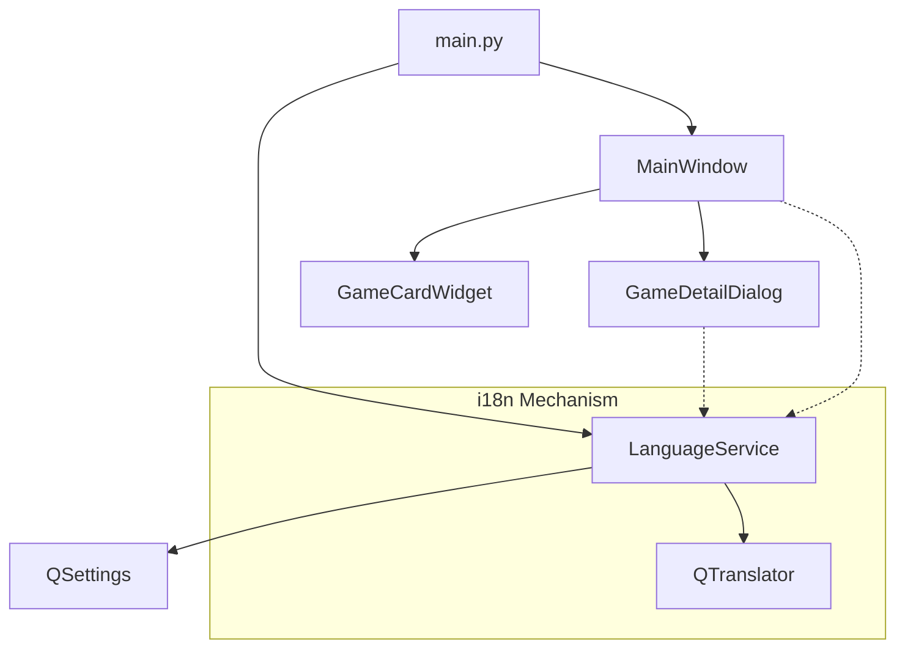
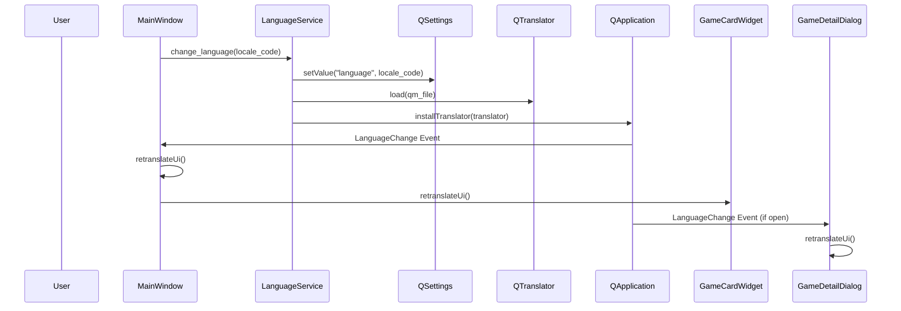

# Technical Design: i18n Standardization

---
**Purpose**: 繧｢繝励Μ繧ｱ繝ｼ繧ｷ繝ｧ繝ｳ蜈ｨ菴薙・蝗ｽ髫帛喧・・18n・峨Γ繧ｫ繝九ぜ繝繧呈ｨ呎ｺ門喧縺励€∝虚逧・↑險€隱槫・繧頑崛縺医→險ｭ螳壹・豌ｸ邯壼喧繧貞ｮ溽樟縺吶ｋ縺溘ａ縺ｮ隧ｳ邏ｰ縺ｪ險ｭ險医ｒ螳夂ｾｩ縺励∪縺吶€・
---

## Overview
縺薙・讖溯・縺ｯ縲￣yzree Game Launcher 縺ｮ縺吶∋縺ｦ縺ｮ繝ｦ繝ｼ繧ｶ繝ｼ陦ｨ遉ｺ譁・ｭ怜・繧・Qt 縺ｮ讓呎ｺ也噪縺ｪ `.tr()` 繝｡繧ｽ繝・ラ縺ｧ邂｡逅・＠縲～QTranslator` 繧堤畑縺・※螳溯｡梧凾縺ｫ險€隱槭ｒ蛻・ｊ譖ｿ縺医ｉ繧後ｋ繧医≧縺ｫ縺吶ｋ繧ゅ・縺ｧ縺吶€・
**Purpose**: 繝ｦ繝ｼ繧ｶ繝ｼ縺悟･ｽ縺ｿ縺ｮ險€隱槭〒繧｢繝励Μ繧ｱ繝ｼ繧ｷ繝ｧ繝ｳ繧貞茜逕ｨ縺ｧ縺阪ｋ繧医≧縺ｫ縺励€∝ｰ・擂逧・↑螟夊ｨ€隱槫ｯｾ蠢懊ｒ螳ｹ譏薙↓縺励∪縺吶€・**Users**: 縺吶∋縺ｦ縺ｮ繝ｦ繝ｼ繧ｶ繝ｼ・育音縺ｫ譌･譛ｬ隱槭→闍ｱ隱槭ｒ菴ｿ逕ｨ縺吶ｋ繝ｦ繝ｼ繧ｶ繝ｼ・峨♀繧医・髢狗匱閠・′蟇ｾ雎｡縺ｧ縺吶€・**Impact**: UI 繧ｳ繝ｳ繝昴・繝阪Φ繝医・讒矩€縺御ｸ€驛ｨ螟画峩縺輔ｌ・・retranslateUi` 縺ｮ蟆主・・峨€∬ｨｭ螳夂ｮ｡逅・・縺溘ａ縺ｮ `LanguageService` 縺瑚ｿｽ蜉縺輔ｌ縺ｾ縺吶€・
### Goals
- 縺吶∋縺ｦ縺ｮ繝上・繝峨さ繝ｼ繝峨＆繧後◆ UI 譁・ｭ怜・繧・`.tr()` 縺ｧ繝ｩ繝・・縺吶ｋ縲・- 蜀崎ｵｷ蜍輔↑縺励〒險€隱槭ｒ蛻・ｊ譖ｿ縺医ｋ蜍慕噪縺ｪ UI 譖ｴ譁ｰ讖溯・繧貞ｮ溯｣・☆繧九€・- 繝ｦ繝ｼ繧ｶ繝ｼ縺ｮ險€隱樣∈謚槭ｒ `QSettings` 縺ｫ菫晏ｭ倥＠縲∵ｬ｡蝗櫁ｵｷ蜍墓凾縺ｫ蠕ｩ蜈・☆繧九€・- 繧ｷ繧ｹ繝・Β縺ｮ繝ｭ繧ｱ繝ｼ繝ｫ險ｭ螳壹↓蝓ｺ縺･縺・※縲∝・譛溯ｨ€隱槭ｒ閾ｪ蜍慕噪縺ｫ驕ｸ謚槭☆繧九€・
### Non-Goals
- UI 譁・ｭ怜・莉･螟悶・繝・・繧ｿ・医ご繝ｼ繝縺ｮ繧ｿ繧､繝医Ν繧・ｪｬ譏取枚縺ｪ縺ｩ縲√Θ繝ｼ繧ｶ繝ｼ縺悟・蜉帙＠縺溘ョ繝ｼ繧ｿ・峨・鄙ｻ險ｳ縲・- 譌･譛ｬ隱槭・闍ｱ隱樔ｻ･螟悶・霑ｽ蜉險€隱槭・鄙ｻ險ｳ繝・・繧ｿ縺ｮ謠蝉ｾ幢ｼ域悽險ｭ險医・莉慕ｵ・∩縺ｮ謠蝉ｾ帙↓繝輔か繝ｼ繧ｫ繧ｹ縺吶ｋ・峨€・
## Architecture

### Existing Architecture Analysis
LitheLauncher 縺ｯ繧ｵ繝ｼ繝薙せ繝ｬ繧､繝､繝ｼ縺ｨ繝ｪ繝昴ず繝医Μ繝代ち繝ｼ繝ｳ繧呈治逕ｨ縺励◆繝｢繧ｸ繝･繝ｼ繝ｫ蠖｢蠑上・繧｢繝ｼ繧ｭ繝・け繝√Ε縺ｧ縺吶€６I 縺ｯ PySide6 繧偵・繝ｼ繧ｹ縺ｫ縺励※縺翫ｊ縲∝推繧ｦ繧｣繝ｳ繝峨え繧・ム繧､繧｢繝ｭ繧ｰ縺檎峡閾ｪ縺ｮ繝ｭ繧ｸ繝・け繧呈戟縺｣縺ｦ縺・∪縺吶€ら樟蝨ｨ縺ｯ i18n 縺ｮ莉慕ｵ・∩縺悟・縺丞ｭ伜惠縺帙★縲∝推繝輔ぃ繧､繝ｫ縺ｫ譌･譛ｬ隱槭ｄ闍ｱ隱槭′豺ｷ蝨ｨ縺励※險倩ｿｰ縺輔ｌ縺ｦ縺・∪縺吶€・
### Architecture Pattern & Boundary Map



**Architecture Integration**:
- **Selected pattern**: Centralized Service Pattern. `LanguageService` 縺檎ｿｻ險ｳ繝輔ぃ繧､繝ｫ縺ｨ繝ｦ繝ｼ繧ｶ繝ｼ險ｭ螳壹・邂｡逅・ｒ荳€謇九↓諡・＞縺ｾ縺吶€・- **Domain/feature boundaries**: UI 繧ｳ繝ｳ繝昴・繝阪Φ繝医・陦ｨ遉ｺ縺ｮ譖ｴ譁ｰ・・retranslateUi`・峨ｒ諡・ｽ薙＠縲√Ο繧ｸ繝・け・郁ｨ€隱槭・繝ｭ繝ｼ繝峨€∬ｨｭ螳壹・菫晏ｭ假ｼ峨・ `LanguageService` 縺梧球蠖薙＠縺ｾ縺吶€・- **Existing patterns preserved**: 繧ｵ繝ｼ繝薙せ豕ｨ蜈･繝代ち繝ｼ繝ｳ繧堤ｶｭ謖√＠縲～main.py` 縺ｧ `LanguageService` 繧貞・譛溷喧縺励※蠢・ｦ√↓蠢懊§縺ｦ UI 縺ｫ貂｡縺励∪縺吶€・
### Technology Stack

| Layer | Choice / Version | Role in Feature | Notes |
|-------|------------------|-----------------|-------|
| Frontend | PySide6 (Qt 6) | `.tr()`, `QTranslator`, `QEvent.LanguageChange` | 讓呎ｺ悶・ Qt i18n 讖溯・繧貞茜逕ｨ縲・|
| Backend | Python 3.x | `LanguageService` | 繝ｭ繧ｸ繝・け縺ｮ髮・ｴ・€・|
| Data / Storage | `QSettings` | 險€隱櫁ｨｭ螳壹・菫晏ｭ・| OS 讓呎ｺ悶・險ｭ螳壻ｿ晏ｭ伜ｴ謇€・医Ξ繧ｸ繧ｹ繝医Μ/config繝輔ぃ繧､繝ｫ・峨ｒ蛻ｩ逕ｨ縲・|
| Tools | `pyside6-lupdate`, `pyside6-lrelease` | 譁・ｭ怜・謚ｽ蜃ｺ縺ｨ繧ｳ繝ｳ繝代う繝ｫ | 髢狗匱繧ｵ繧､繧ｯ繝ｫ縺ｫ邨・∩霎ｼ繧€縲・|

## System Flows

### 險€隱槫・繧頑崛縺医す繝ｼ繧ｱ繝ｳ繧ｹ



## Requirements Traceability

| Requirement | Summary | Components | Interfaces | Flows |
|-------------|---------|------------|------------|-------|
| 1.1 | `.tr()` 縺ｫ繧医ｋ繝ｩ繝・・ | All UI | `.tr()` | N/A |
| 1.2 | 蛻晄悄蛹匁凾縺ｮ譁・ｭ怜・險ｭ螳・| All UI | `retranslateUi()` | N/A |
| 1.3 | 螟画焚莉倥″譁・ｭ怜・縺ｮ蜃ｦ逅・| All UI | `.tr()` with `%1` | N/A |
| 2.1 | `.qm` 繝輔ぃ繧､繝ｫ縺ｮ繝ｭ繝ｼ繝・| LanguageService | `change_language()` | 險€隱槫・繧頑崛縺・|
| 2.2 | 蜍慕噪縺ｪ UI 譖ｴ譁ｰ | All UI | `changeEvent()` | 險€隱槫・繧頑崛縺・|
| 2.3 | 繝輔か繝ｼ繝ｫ繝舌ャ繧ｯ蜃ｦ逅・| LanguageService | `change_language()` | N/A |
| 3.1 | 險ｭ螳壹・隱ｭ縺ｿ霎ｼ縺ｿ | LanguageService | `get_current_locale()` | 繧｢繝励Μ襍ｷ蜍・|
| 3.2 | 險ｭ螳壹・菫晏ｭ・| LanguageService | `change_language()` | 險€隱槫・繧頑崛縺・|
| 4.1 | 繧ｷ繧ｹ繝・Β險€隱槭・讀懷・ | LanguageService | `_detect_system_locale()` | 繧｢繝励Μ襍ｷ蜍・|
| 4.2 | System Default 繧ｪ繝励す繝ｧ繝ｳ | LanguageService, MainWindow | `change_language("system")` | 險€隱槫・繧頑崛縺・|

## Components and Interfaces

### Backend / Services

#### LanguageService

| Field | Detail |
|-------|--------|
| Intent | 險€隱櫁ｨｭ螳壹・邂｡逅・€∫ｿｻ險ｳ繝輔ぃ繧､繝ｫ縺ｮ繝ｭ繝ｼ繝峨€√♀繧医・繝ｭ繧ｱ繝ｼ繝ｫ讀懷・繧定｡後≧ |
| Requirements | 2.1, 2.3, 3.1, 3.2, 4.1, 4.2 |

**Responsibilities & Constraints**
- 蛻ｩ逕ｨ蜿ｯ閭ｽ縺ｪ險€隱槭Μ繧ｹ繝茨ｼ郁恭隱槭€∵律譛ｬ隱槭€√す繧ｹ繝・Β繝・ヵ繧ｩ繝ｫ繝茨ｼ峨・謠蝉ｾ帙€・- `QTranslator` 繧､繝ｳ繧ｹ繧ｿ繝ｳ繧ｹ縺ｮ菫晄戟縺ｨ `QApplication` 縺ｸ縺ｮ繧､繝ｳ繧ｹ繝医・繝ｫ縲・- `QSettings` 繧剃ｽｿ逕ｨ縺励◆繝ｦ繝ｼ繧ｶ繝ｼ險ｭ螳壹・豌ｸ邯壼喧縲・- 鄙ｻ險ｳ繝輔ぃ繧､繝ｫ縺瑚ｦ九▽縺九ｉ縺ｪ縺・ｴ蜷医・闍ｱ隱橸ｼ医ョ繝輔か繝ｫ繝茨ｼ峨∈縺ｮ繝輔か繝ｼ繝ｫ繝舌ャ繧ｯ縲・
**Dependencies**
- External: `PySide6.QtCore.QTranslator` (P0)
- External: `PySide6.QtCore.QSettings` (P0)
- External: `PySide6.QtCore.QLocale` (P1)

**Contracts**: Service [x] / State [x]

##### Service Interface
```python
class LanguageService:
    def change_language(self, locale_code: str) -> bool: ...
    def get_current_locale(self) -> str: ...
    def get_available_languages(self) -> list[dict[str, str]]: ...
```

### UI Layer

#### Base Component Pattern (Standard for all Widgets)

蜷・UI 繧ｳ繝ｳ繝昴・繝阪Φ繝茨ｼ・MainWindow`, `GameDetailDialog`, `GameCardWidget`・峨・莉･荳九・繝代ち繝ｼ繝ｳ繧貞ｮ溯｣・＠縺ｾ縺吶€・
**Responsibilities & Constraints**
- `retranslateUi()` 繝｡繧ｽ繝・ラ縺ｫ縺吶∋縺ｦ縺ｮ `.tr()` 蜻ｼ縺ｳ蜃ｺ縺励ｒ髮・ｴ・☆繧九€・- `changeEvent()` 繧偵が繝ｼ繝舌・繝ｩ繧､繝峨＠縲～LanguageChange` 繧､繝吶Φ繝域凾縺ｫ `retranslateUi()` 繧貞他縺ｳ蜃ｺ縺吶€・
**Implementation Notes**
- **Integration**: `MainWindow` 縺ｮ繝｡繝九Η繝ｼ縺ｫ縲瑚ｨ€隱橸ｼ・anguage・峨€阪ｒ霑ｽ蜉縺励€～LanguageService.get_available_languages()` 縺ｫ蝓ｺ縺･縺・※繧｢繧ｯ繧ｷ繝ｧ繝ｳ繧堤函謌舌＠縺ｾ縺吶€・- **Validation**: 鄙ｻ險ｳ繝輔ぃ繧､繝ｫ縺碁←逕ｨ縺輔ｌ縺溷ｾ後€√Λ繝吶Ν縺ｮ繝・く繧ｹ繝医′遨ｺ縺ｫ縺ｪ縺｣縺ｦ縺・↑縺・°縲√∪縺溘・繝・ヵ繧ｩ繝ｫ繝郁ｨ€隱槭↓謌ｻ縺｣縺ｦ縺・↑縺・°繧堤｢ｺ隱阪＠縺ｾ縺吶€・
## Data Models

### Logical Data Model

**Language Settings (Stored in QSettings)**:
- `language`: `str` (e.g., "en_US", "ja_JP", "system")

## Error Handling

### Error Categories and Responses
- **Missing Translation File**: `.qm` 繝輔ぃ繧､繝ｫ縺瑚ｦ九▽縺九ｉ縺ｪ縺・ｴ蜷医€～LanguageService` 縺ｯ繝ｭ繧ｰ繧定ｨ倬鹸縺励€∫ｿｻ險ｳ縺ｪ縺暦ｼ医ョ繝輔か繝ｫ繝医・闍ｱ隱橸ｼ峨・迥ｶ諷九ｒ邯ｭ謖√＠縺ｾ縺吶€・- **Invalid Locale Code**: 繧ｵ繝昴・繝医＆繧後※縺・↑縺・Ο繧ｱ繝ｼ繝ｫ繧ｳ繝ｼ繝峨′貂｡縺輔ｌ縺溷ｴ蜷医€√ョ繝輔か繝ｫ繝医・ "system" 縺ｾ縺溘・ "en_US" 縺ｫ繝ｪ繝€繧､繝ｬ繧ｯ繝医＠縺ｾ縺吶€・
## Testing Strategy

- **Unit Tests**: 
    - `LanguageService`: 繝ｭ繧ｱ繝ｼ繝ｫ讀懷・縲∬ｨｭ螳壹・菫晏ｭ・隱ｭ縺ｿ霎ｼ縺ｿ縲∫ｿｻ險ｳ繝輔ぃ繧､繝ｫ縺ｮ繝ｭ繝ｼ繝峨Ο繧ｸ繝・け縺ｮ繝・せ繝医€・- **Integration Tests**:
    - 險€隱槫・繧頑崛縺医Γ繝九Η繝ｼ繧偵け繝ｪ繝・け縺励◆髫帙€～QApplication` 縺ｫ豁｣縺励＞ `QTranslator` 縺後う繝ｳ繧ｹ繝医・繝ｫ縺輔ｌ繧九％縺ｨ縺ｮ遒ｺ隱阪€・- **UI Tests**:
    - `pytest-qt` 繧剃ｽｿ逕ｨ縺励※縲∬ｨ€隱槫､画峩蠕後↓迚ｹ螳壹・繝ｩ繝吶Ν縺ｮ `text()` 縺梧悄蠕・＆繧後ｋ險€隱槭↓螟峨ｏ縺｣縺ｦ縺・ｋ縺薙→繧呈､懆ｨｼ縺吶ｋ縲・
