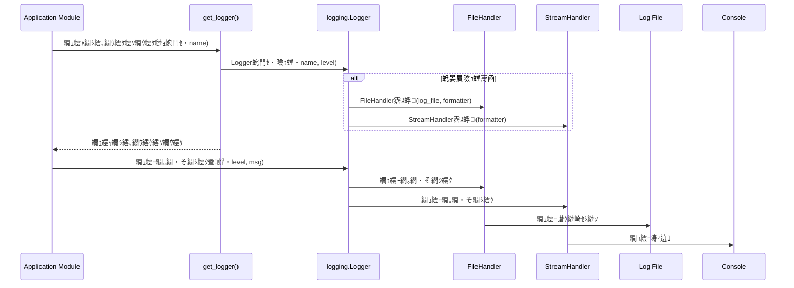

# 謚€陦楢ｨｭ險医ラ繧ｭ繝･繝｡繝ｳ繝・
## 讎りｦ・### 逶ｮ逧・縺薙・讖溯・縺ｯ縲√ご繝ｼ繝繝ｩ繝ｳ繝√Ε繝ｼ繧｢繝励Μ繧ｱ繝ｼ繧ｷ繝ｧ繝ｳ縺ｫ蝣・欧縺ｧ荳€雋ｫ諤ｧ縺ｮ縺ゅｋ繝ｭ繧ｮ繝ｳ繧ｰ讖溯・繧定ｿｽ蜉縺吶ｋ縺薙→繧堤岼逧・→縺励∪縺吶€ゅい繝励Μ繧ｱ繝ｼ繧ｷ繝ｧ繝ｳ縺ｮ蜍穂ｽ懃憾豕√ｒ隧ｳ邏ｰ縺九▽讓呎ｺ門喧縺輔ｌ縺溷ｽ｢蠑上〒繝ｭ繧ｰ繝輔ぃ繧､繝ｫ縺ｨ繧ｳ繝槭Φ繝峨Λ繧､繝ｳ・医さ繝ｳ繧ｽ繝ｼ繝ｫ・峨・荳｡譁ｹ縺ｫ蜃ｺ蜉帙☆繧九％縺ｨ縺ｧ縲√ョ繝舌ャ繧ｰ縲√ヨ繝ｩ繝悶Ν繧ｷ繝･繝ｼ繝・ぅ繝ｳ繧ｰ縲√♀繧医・驕狗畑逶｣隕悶・蜉ｹ邇・喧繧貞峙繧翫∪縺吶€・
### 繝ｦ繝ｼ繧ｶ繝ｼ
髢狗匱閠・€・°逕ｨ諡・ｽ楢€・€・
### 蠖ｱ髻ｿ
繧｢繝励Μ繧ｱ繝ｼ繧ｷ繝ｧ繝ｳ蜈ｨ菴薙・繝ｭ繧ｰ蜃ｺ蜉帙′Python讓呎ｺ悶・`logging`繝｢繧ｸ繝･繝ｼ繝ｫ縺ｫ繧医▲縺ｦ荳€蜈・喧縺輔ｌ縲∵ｨ呎ｺ門喧縺輔ｌ縺ｾ縺吶€よ里蟄倥・`get_logger`髢｢謨ｰ・・src/game_launcher_logger.py`蜀・ｼ峨′諡｡蠑ｵ縺輔ｌ縲∝推繝｢繧ｸ繝･繝ｼ繝ｫ縺ｧ逶ｴ謗･`print()`譁・ｒ菴ｿ逕ｨ縺励※縺・ｋ邂・園縺ｯ譁ｰ縺励＞繝ｭ繧ｮ繝ｳ繧ｰ繧ｷ繧ｹ繝・Β縺ｫ遘ｻ陦後＆繧後∪縺吶€・
### 繧ｴ繝ｼ繝ｫ
- 繧｢繝励Μ繧ｱ繝ｼ繧ｷ繝ｧ繝ｳ縺ｮ縺吶∋縺ｦ縺ｮ繝ｭ繧ｰ蜃ｺ蜉帙′繝ｭ繧ｮ繝ｳ繧ｰ繧ｷ繧ｹ繝・Β繧帝€壹§縺ｦ陦後ｏ繧後ｋ縺薙→縲・- 繝ｭ繧ｰ縺瑚ｨｭ螳壹＆繧後◆繝ｭ繧ｰ繝輔ぃ繧､繝ｫ縺ｫ譖ｸ縺崎ｾｼ縺ｾ繧後ｋ縺薙→縲・- 繝ｭ繧ｰ縺後さ繝槭Φ繝峨Λ繧､繝ｳ・域ｨ呎ｺ門・蜉・讓呎ｺ悶お繝ｩ繝ｼ蜃ｺ蜉幢ｼ峨↓陦ｨ遉ｺ縺輔ｌ繧九％縺ｨ縲・- 繝ｭ繧ｰ繝ｬ繝吶Ν・・EBUG, INFO, WARNING, ERROR, CRITICAL・峨↓蠢懊§縺ｦ蜃ｺ蜉帙′蛻ｶ蠕｡縺輔ｌ繧九％縺ｨ縲・- 繝ｭ繧ｰ繝｡繝・そ繝ｼ繧ｸ縺梧欠螳壹＆繧後◆繝輔か繝ｼ繝槭ャ繝医〒蜃ｺ蜉帙＆繧後ｋ縺薙→縲・
### 髱槭ざ繝ｼ繝ｫ
- 繝ｭ繧ｰ縺ｮ繝ｭ繝ｼ繝・・繧ｷ繝ｧ繝ｳ讖溯・繧・し繧､繧ｺ蛻ｶ髯舌€∝悸邵ｮ縺ｪ縺ｩ縺ｮ鬮伜ｺｦ縺ｪ繝ｭ繧ｰ邂｡逅・ｩ溯・縺ｯ譛ｬ讖溯・縺ｮ繧ｹ繧ｳ繝ｼ繝怜､悶→縺励∪縺吶€・- 螟夜Κ縺ｮ繝ｭ繧ｮ繝ｳ繧ｰ繧ｵ繝ｼ繝薙せ・井ｾ・ Sentry, ELK Stack縺ｪ縺ｩ・峨→縺ｮ邨ｱ蜷医・譛ｬ讖溯・縺ｮ繧ｹ繧ｳ繝ｼ繝怜､悶→縺励∪縺吶€・
## 繧｢繝ｼ繧ｭ繝・け繝√Ε

### 譌｢蟄倥い繝ｼ繧ｭ繝・け繝√Ε蛻・梵
迴ｾ蝨ｨ縺ｮ繧｢繝励Μ繧ｱ繝ｼ繧ｷ繝ｧ繝ｳ縺ｯPython讓呎ｺ悶・`logging`繝｢繧ｸ繝･繝ｼ繝ｫ繧剃ｽｿ逕ｨ縺励※縺・∪縺吶′縲～src/game_launcher_logger.py`縺ｮ`get_logger`髢｢謨ｰ繧帝€壹§縺ｦ蝓ｺ譛ｬ逧・↑`FileHandler`縺ｮ縺ｿ縺瑚ｨｭ螳壹＆繧後※縺翫ｊ縲√さ繝ｳ繧ｽ繝ｼ繝ｫ繝上Φ繝峨Λ縺ｯ繧ｳ繝｡繝ｳ繝医い繧ｦ繝医＆繧後※縺・∪縺吶€ゅ∪縺溘€～LauncherService`縺ｪ縺ｩ荳€驛ｨ縺ｮ繝｢繧ｸ繝･繝ｼ繝ｫ縺ｧ縺ｯ`print()`譁・′逶ｴ謗･菴ｿ逕ｨ縺輔ｌ縺ｦ縺翫ｊ縲√Ο繧ｮ繝ｳ繧ｰ縺ｮ荳€雋ｫ諤ｧ縺ｫ谺縺代ｋ迥ｶ諷九〒縺吶€Ａmain.py`縺後い繝励Μ繧ｱ繝ｼ繧ｷ繝ｧ繝ｳ縺ｮ繧ｨ繝ｳ繝医Μ繝昴う繝ｳ繝医〒繝ｭ繧ｬ繝ｼ繧貞・譛溷喧縺励※縺・∪縺吶€・
### 鬮倥Ξ繝吶Ν繧｢繝ｼ繧ｭ繝・け繝√Ε
譛ｬ讖溯・縺ｧ縺ｯ縲￣ython讓呎ｺ悶・`logging`繝｢繧ｸ繝･繝ｼ繝ｫ繧貞渕逶､縺ｨ縺励€～src/game_launcher_logger.py`繧偵い繝励Μ繧ｱ繝ｼ繧ｷ繝ｧ繝ｳ蜈ｨ菴薙・繝ｭ繧ｮ繝ｳ繧ｰ險ｭ螳壹ｒ荳€蜈・喧縺吶ｋ繝上ヶ縺ｨ縺励※讖溯・縺輔○縺ｾ縺吶€Ａget_logger`髢｢謨ｰ繧呈僑蠑ｵ縺励€√Ο繧ｰ繝輔ぃ繧､繝ｫ縺ｨ繧ｳ繝ｳ繧ｽ繝ｼ繝ｫ縺ｸ縺ｮ蜃ｺ蜉帙ｒ蜷梧凾縺ｫ繧ｵ繝昴・繝医☆繧九ｈ縺・↓縺励∪縺吶€ょ推繧｢繝励Μ繧ｱ繝ｼ繧ｷ繝ｧ繝ｳ繝｢繧ｸ繝･繝ｼ繝ｫ縺ｯ縲√％縺ｮ蜈ｱ騾壹・`get_logger`髢｢謨ｰ繧剃ｽｿ逕ｨ縺励※繝ｭ繧ｬ繝ｼ繧､繝ｳ繧ｹ繧ｿ繝ｳ繧ｹ繧貞叙蠕励＠縲√Ο繧ｰ繝｡繝・そ繝ｼ繧ｸ繧貞・蜉帙＠縺ｾ縺吶€・
```mermaid
graph TD
    AppModule[Application Module (e.g., MainWindow, LauncherService)] -- log.info("Message") --> Logger[logging.Logger]
    Logger -- 繝ｭ繧ｰ繝ｬ繝吶Ν繝輔ぅ繝ｫ繧ｿ --> Formatter[logging.Formatter]
    Formatter -- 繝輔か繝ｼ繝槭ャ繝域ｸ医∩繝ｭ繧ｰ --> FileHandler[logging.FileHandler]
    Formatter -- 繝輔か繝ｼ繝槭ャ繝域ｸ医∩繝ｭ繧ｰ --> StreamHandler[logging.StreamHandler]
    FileHandler -- 繝輔ぃ繧､繝ｫ譖ｸ縺崎ｾｼ縺ｿ --> LogFile[game_launcher.log]
    StreamHandler -- 讓呎ｺ門・蜉・--> Console[Console Output]
```

### 謚€陦薙せ繧ｿ繝・け縺ｨ險ｭ險域ｱｺ螳・
- **謚€陦薙せ繧ｿ繝・け**: Python讓呎ｺ悶・`logging`繝｢繧ｸ繝･繝ｼ繝ｫ縲よ里蟄倥・謚€陦薙せ繧ｿ繝・け繧呈怙螟ｧ髯舌↓豢ｻ逕ｨ縺励€∵眠縺溘↑萓晏ｭ倬未菫ゅ・蟆主・縺励∪縺帙ｓ縲・
#### 荳ｻ隕∬ｨｭ險域ｱｺ螳・ 繝ｭ繧ｮ繝ｳ繧ｰ險ｭ螳壹・荳€蜈・喧縺ｨ繧ｳ繝ｳ繧ｽ繝ｼ繝ｫ蜃ｺ蜉帙・譛牙柑蛹・- **豎ｺ螳・*: `src/game_launcher_logger.py`縺ｮ`get_logger`髢｢謨ｰ繧呈僑蠑ｵ縺励€√い繝励Μ繧ｱ繝ｼ繧ｷ繝ｧ繝ｳ蜈ｨ菴薙〒荳€雋ｫ縺励◆繝ｭ繧ｮ繝ｳ繧ｰ險ｭ螳夲ｼ医ヵ繧｡繧､繝ｫ蜃ｺ蜉帙→繧ｳ繝ｳ繧ｽ繝ｼ繝ｫ蜃ｺ蜉幢ｼ峨ｒ謠蝉ｾ帙☆繧九€・- **閭梧勹**: 隍・焚縺ｮ繝ｭ繧ｰ蜃ｺ蜉帛・・医ヵ繧｡繧､繝ｫ縲√さ繝ｳ繧ｽ繝ｼ繝ｫ・峨ｒ蜉ｹ邇・噪縺ｫ邂｡逅・＠縲√い繝励Μ繧ｱ繝ｼ繧ｷ繝ｧ繝ｳ縺ｮ繝ｩ繧､繝輔し繧､繧ｯ繝ｫ蜈ｨ菴薙〒邨ｱ荳€縺輔ｌ縺溘Ο繧ｰ繝輔か繝ｼ繝槭ャ繝医→繝ｬ繝吶Ν繧帝←逕ｨ縺吶ｋ縺溘ａ縲ら樟蝨ｨ縲√さ繝ｳ繧ｽ繝ｼ繝ｫ蜃ｺ蜉帙・繧ｳ繝｡繝ｳ繝医い繧ｦ繝医＆繧後※縺翫ｊ縲∽ｻ悶・繝｢繧ｸ繝･繝ｼ繝ｫ縺ｧ縺ｯ`print()`縺御ｽｿ繧上ｌ縺ｦ縺・∪縺吶€・- **莉｣譖ｿ譯・*:
    1. 蜷・Δ繧ｸ繝･繝ｼ繝ｫ縺ｧ蛟句挨縺ｫ繝ｭ繧ｬ繝ｼ縺ｨ繝上Φ繝峨Λ繧定ｨｭ螳壹☆繧九€・    2. 螟夜Κ繝ｩ繧､繝悶Λ繝ｪ・井ｾ・ `loguru`・峨ｒ蟆主・縺吶ｋ縲・- **驕ｸ謚槭＆繧後◆繧｢繝励Ο繝ｼ繝・*: 譌｢蟄倥・`src/game_launcher_logger.py`蜀・・`get_logger`髢｢謨ｰ繧剃ｿｮ豁｣縺励€～FileHandler`縺ｫ蜉縺医※`StreamHandler`・医さ繝ｳ繧ｽ繝ｼ繝ｫ蜃ｺ蜉帷畑・峨ｒ繝・ヵ繧ｩ繝ｫ繝医〒譛牙柑縺ｫ縺吶ｋ縲ゅ％繧後↓繧医ｊ縲～main.py`縺九ｉ`get_logger`繧貞他縺ｳ蜃ｺ縺吶□縺代〒縲∫ｵｱ荳€縺輔ｌ縺溘Ο繧ｮ繝ｳ繧ｰ險ｭ螳壹′驕ｩ逕ｨ縺輔ｌ繧九ｈ縺・↓縺吶ｋ縲・- **逅・罰**: Python讓呎ｺ悶・`logging`繝｢繧ｸ繝･繝ｼ繝ｫ縺ｯ蠑ｷ蜉帙〒縺ゅｊ縲∫樟蝨ｨ縺ｮ隕∽ｻｶ繧呈ｺ€縺溘☆縺溘ａ縺ｫ蜊∝・縺ｪ讖溯・繧呈戟縺｣縺ｦ縺・∪縺吶€ょ､夜Κ繝ｩ繧､繝悶Λ繝ｪ縺ｮ蟆主・縺ｯ荳崎ｦ√〒縺ゅｊ縲∵里蟄倥・繧ｳ繝ｼ繝峨・繝ｼ繧ｹ縺ｸ縺ｮ螟画峩繧よ怙蟆城剞縺ｫ謚代∴繧峨ｌ縺ｾ縺吶€る寔荳ｭ邂｡逅・＆繧後◆險ｭ螳壹↓繧医ｊ縲√Ο繧ｮ繝ｳ繧ｰ繝昴Μ繧ｷ繝ｼ縺ｮ螟画峩縺悟ｮｹ譏薙↓縺ｪ繧翫∪縺吶€・- **繝医Ξ繝ｼ繝峨が繝・*: 縺ｪ縺励€・
## 繧ｷ繧ｹ繝・Β繝輔Ο繝ｼ

### 繝ｭ繧ｮ繝ｳ繧ｰ繝輔Ο繝ｼ



## 隕∵ｱゆｺ矩・・繝医Ξ繝ｼ繧ｵ繝薙Μ繝・ぅ

| 隕∵ｱゆｺ矩・D | 隕∵ｱゆｺ矩・・隕∫ｴ・| 繧ｳ繝ｳ繝昴・繝阪Φ繝・| 繧､繝ｳ繧ｿ繝ｼ繝輔ぉ繝ｼ繧ｹ | 繝輔Ο繝ｼ |
|---|---|---|---|---|
| 1.1 | DEBUG, INFO, WARNING, ERROR, CRITICAL 縺ｮ蜷・Ξ繝吶Ν縺ｧ繝ｭ繧ｰ繝｡繝・そ繝ｼ繧ｸ繧堤函謌・| `logging`繝｢繧ｸ繝･繝ｼ繝ｫ | `logger.debug()`, `logger.info()`, `logger.warning()`, `logger.error()`, `logger.critical()` | 繝ｭ繧ｮ繝ｳ繧ｰ繝輔Ο繝ｼ |
| 1.2 | 險ｭ螳壹＆繧後◆繝輔か繝ｼ繝槭ャ繝医〒繝ｭ繧ｰ繝｡繝・そ繝ｼ繧ｸ繧貞・蜉・| `logging.Formatter` | `logging.Formatter` | 繝ｭ繧ｮ繝ｳ繧ｰ繝輔Ο繝ｼ |
| 1.3 | 繝ｭ繧ｮ繝ｳ繧ｰ繝ｬ繝吶Ν縺栗NFO縺ｫ險ｭ螳壹＆繧後※縺・ｋ蝣ｴ蜷・INFO繝ｬ繝吶Ν莉･荳翫・繝｡繝・そ繝ｼ繧ｸ繧貞・逅・| `logging.Logger` | `logger.setLevel()` | 繝ｭ繧ｮ繝ｳ繧ｰ繝輔Ο繝ｼ |
| 2.1 | 謖・ｮ壹＆繧後◆繝ｭ繧ｰ繝輔ぃ繧､繝ｫ縺ｫ繝ｭ繧ｰ繝｡繝・そ繝ｼ繧ｸ繧定ｿｽ險・| `logging.FileHandler` | `logging.FileHandler` | 繝ｭ繧ｮ繝ｳ繧ｰ繝輔Ο繝ｼ |
| 2.2 | 繝ｭ繧ｰ繝輔ぃ繧､繝ｫ縺ｸ縺ｮ譖ｸ縺崎ｾｼ縺ｿ縺ｫ螟ｱ謨励＠縺溷ｴ蜷・繧ｳ繝ｳ繧ｽ繝ｼ繝ｫ縺ｫ繧ｨ繝ｩ繝ｼ繧貞ｱ蜻・| `logging.FileHandler` | 繧ｨ繝ｩ繝ｼ繝上Φ繝峨Μ繝ｳ繧ｰ | 繝ｭ繧ｮ繝ｳ繧ｰ繝輔Ο繝ｼ |
| 3.1 | 繧ｳ繝槭Φ繝峨Λ繧､繝ｳ・域ｨ呎ｺ門・蜉・讓呎ｺ悶お繝ｩ繝ｼ蜃ｺ蜉幢ｼ峨↓繝ｭ繧ｰ繝｡繝・そ繝ｼ繧ｸ繧貞・蜉・| `logging.StreamHandler` | `logging.StreamHandler` | 繝ｭ繧ｮ繝ｳ繧ｰ繝輔Ο繝ｼ |
| 3.2 | 繧ｳ繝槭Φ繝峨Λ繧､繝ｳ縺ｸ縺ｮ蜃ｺ蜉帙′險ｭ螳壹＆繧後※縺・ｋ蝣ｴ蜷・驕ｩ蛻・↑繧ｹ繝医Μ繝ｼ繝縺ｫ蜃ｺ蜉・| `logging.StreamHandler` | `logging.StreamHandler` | 繝ｭ繧ｮ繝ｳ繧ｰ繝輔Ο繝ｼ |
| 4.1 | 繧ｿ繧､繝繧ｹ繧ｿ繝ｳ繝励€√Ο繧ｰ繝ｬ繝吶Ν縲√Δ繧ｸ繝･繝ｼ繝ｫ蜷阪€√Γ繝・そ繝ｼ繧ｸ譛ｬ譁・ｒ蜷ｫ繧€繝輔か繝ｼ繝槭ャ繝医ｒ菴ｿ逕ｨ | `logging.Formatter` | `logging.Formatter` | 繝ｭ繧ｮ繝ｳ繧ｰ繝輔Ο繝ｼ |
| 4.2 | 繝ｭ繧ｰ繝｡繝・そ繝ｼ繧ｸ縺ｫ萓句､匁ュ蝣ｱ縺悟性縺ｾ繧後ｋ蝣ｴ蜷・繧ｹ繧ｿ繝・け繝医Ξ繝ｼ繧ｹ繧貞性繧√※蜃ｺ蜉・| `logging.Formatter` | `logging.Formatter` | 繝ｭ繧ｮ繝ｳ繧ｰ繝輔Ο繝ｼ |
| 5.1 | 譌｢蟄倥・`get_logger`髢｢謨ｰ繧堤ｽｮ縺肴鋤縺医ｋ | `src/game_launcher_logger.py`, `main.py` | `get_logger()` | 繝ｭ繧ｮ繝ｳ繧ｰ繝輔Ο繝ｼ |
| 5.2 | 譌｢蟄倥・繝ｭ繧ｰ蜃ｺ蜉帷ｮ・園縺梧眠縺励＞繝ｭ繧ｮ繝ｳ繧ｰ繧ｷ繧ｹ繝・Β繧剃ｽｿ逕ｨ縺吶ｋ繧医≧縺ｫ譖ｴ譁ｰ縺輔ｌ繧句ｴ蜷・繝ｭ繧ｮ繝ｳ繧ｰ繧ｷ繧ｹ繝・Β縺ｯ驕ｩ蛻・↓繝ｭ繧ｰ繝｡繝・そ繝ｼ繧ｸ繧貞・逅・| 蜷・Δ繧ｸ繝･繝ｼ繝ｫ (`main.py`, `LauncherService`縺ｪ縺ｩ) | `logger.info()`, `logger.error()`縺ｪ縺ｩ | 繝ｭ繧ｮ繝ｳ繧ｰ繝輔Ο繝ｼ |

## 繧ｳ繝ｳ繝昴・繝阪Φ繝医→繧､繝ｳ繧ｿ繝ｼ繝輔ぉ繝ｼ繧ｹ

### 繝ｭ繧ｮ繝ｳ繧ｰ險ｭ螳壼ｱ､

#### `src/game_launcher_logger.py`
- **荳ｻ隕∬ｲｬ莉ｻ**: 繧｢繝励Μ繧ｱ繝ｼ繧ｷ繝ｧ繝ｳ蜈ｨ菴薙〒菴ｿ逕ｨ縺輔ｌ繧九Ο繧ｬ繝ｼ繧､繝ｳ繧ｹ繧ｿ繝ｳ繧ｹ繧定ｨｭ螳壹♀繧医・謠蝉ｾ帙☆繧九€ゅヵ繧｡繧､繝ｫ繝上Φ繝峨Λ縺ｨ繧ｹ繝医Μ繝ｼ繝繝上Φ繝峨Λ繧貞・譛溷喧縺励€√Ο繧ｰ繝ｬ繝吶Ν縺ｨ繝輔か繝ｼ繝槭ャ繝医ｒ驕ｩ逕ｨ縺吶ｋ縲ゅΟ繧ｰ縺ｮ驥崎､・ｒ髦ｲ縺舌◆繧√↓縲√ワ繝ｳ繝峨Λ縺梧里縺ｫ險ｭ螳壹＆繧後※縺・ｋ縺九ｒ遒ｺ隱阪☆繧九€・- **繝峨Γ繧､繝ｳ蠅・阜**: 繝ｭ繧ｮ繝ｳ繧ｰ繧ｷ繧ｹ繝・Β縺ｮ蛻晄悄險ｭ螳壹→繝ｭ繧ｬ繝ｼ繧､繝ｳ繧ｹ繧ｿ繝ｳ繧ｹ縺ｮ蜿門ｾ励€・- **繝・・繧ｿ謇€譛画ｨｩ**: 縺ｪ縺励€・- **萓晏ｭ倬未菫・*:
    - **繧｢繧ｦ繝医ヰ繧ｦ繝ｳ繝・*: `logging`繝｢繧ｸ繝･繝ｼ繝ｫ縲～os`繝｢繧ｸ繝･繝ｼ繝ｫ縲・- **螂醍ｴ・ｮ夂ｾｩ**:
    - `get_logger(name: str, log_file: str, level=logging.INFO, console_output=True) -> logging.Logger`:
        - **繝代Λ繝｡繝ｼ繧ｿ**:
            - `name`: 繝ｭ繧ｬ繝ｼ縺ｮ蜷榊燕・磯€壼ｸｸ縺ｯ`__name__`・峨€・            - `log_file`: 繝ｭ繧ｰ繝輔ぃ繧､繝ｫ縺ｮ繝代せ縲・            - `level`: 繝ｭ繧ｰ繝ｬ繝吶Ν・医ョ繝輔か繝ｫ繝医・`logging.INFO`・峨€・            - `console_output`: 繧ｳ繝ｳ繧ｽ繝ｼ繝ｫ縺ｸ縺ｮ蜃ｺ蜉帙ｒ譛牙柑縺ｫ縺吶ｋ縺具ｼ医ョ繝輔か繝ｫ繝医・`True`・峨€・        - **謌ｻ繧雁€､**: 險ｭ螳壽ｸ医∩縺ｮ`logging.Logger`繧､繝ｳ繧ｹ繧ｿ繝ｳ繧ｹ縲・        - **莠句燕譚｡莉ｶ**: 縺ｪ縺励€・        - **莠句ｾ梧擅莉ｶ**: `name`繧呈戟縺､繝ｭ繧ｬ繝ｼ縺悟・譛溷喧縺輔ｌ縲～FileHandler`縺ｨ蠢・ｦ√↓蠢懊§縺ｦ`StreamHandler`縺瑚ｿｽ蜉縺輔ｌ縲∵欠螳壹＆繧後◆繝ｬ繝吶Ν縺ｨ繝輔か繝ｼ繝槭ャ繝医′險ｭ螳壹＆繧後ｋ縲・        - **荳榊､画擅莉ｶ**: 蜷・Ο繧ｬ繝ｼ蜷阪↓蟇ｾ縺励※繝上Φ繝峨Λ縺碁㍾隍・＠縺ｦ霑ｽ蜉縺輔ｌ繧九％縺ｨ縺ｯ縺ｪ縺・€・
### 繧｢繝励Μ繧ｱ繝ｼ繧ｷ繝ｧ繝ｳ繧ｨ繝ｳ繝医Μ繝昴う繝ｳ繝・
#### `main.py`
- **荳ｻ隕∬ｲｬ莉ｻ**: 繧｢繝励Μ繧ｱ繝ｼ繧ｷ繝ｧ繝ｳ縺ｮ襍ｷ蜍墓凾縺ｫ繝ｭ繧ｮ繝ｳ繧ｰ繧ｷ繧ｹ繝・Β繧貞・譛溷喧縺励€√い繝励Μ繧ｱ繝ｼ繧ｷ繝ｧ繝ｳ蜈ｨ菴薙・繝ｭ繧ｰ繝｡繝・そ繝ｼ繧ｸ縺ｮ蜃ｺ蜉帙ｒ髢句ｧ九☆繧九€・- **萓晏ｭ倬未菫・*: `src/game_launcher_logger.py`縲・- **螟画峩轤ｹ**:
    - `get_logger`縺ｮ蜻ｼ縺ｳ蜃ｺ縺励ｒ譖ｴ譁ｰ縺励€～console_output=True`繧定ｨｭ螳壹〒縺阪ｋ繧医≧縺ｫ縺吶ｋ縲・    - 襍ｷ蜍墓凾縺ｮ`logger.info("Game Launcher application started.")`繧堤ｶｭ謖√☆繧九€・
### 蜷・い繝励Μ繧ｱ繝ｼ繧ｷ繝ｧ繝ｳ繝｢繧ｸ繝･繝ｼ繝ｫ (萓・ `src/game_service.py`, `src/launcher_service.py`, `src/main_window.py`, `src/game_repository.py`, `src/remote_storage_service.py`, `src/database.py`)

- **荳ｻ隕∬ｲｬ莉ｻ**: 驕ｩ蛻・↑繝ｭ繧ｬ繝ｼ繧､繝ｳ繧ｹ繧ｿ繝ｳ繧ｹ繧貞叙蠕励＠縲√い繝励Μ繧ｱ繝ｼ繧ｷ繝ｧ繝ｳ縺ｮ繧､繝吶Φ繝医€√お繝ｩ繝ｼ縲√ョ繝舌ャ繧ｰ諠・ｱ繧偵Ο繧ｰ繝ｬ繝吶Ν縺ｫ蠢懊§縺溘Γ繧ｽ繝・ラ・井ｾ・ `logger.info()`, `logger.error()`・峨ｒ菴ｿ逕ｨ縺励※蜃ｺ蜉帙☆繧九€・- **萓晏ｭ倬未菫・*: `src/game_launcher_logger.py`縲・- **螟画峩轤ｹ**:
    - 繝｢繧ｸ繝･繝ｼ繝ｫ蜀・〒`get_logger(__name__, ...)`繧貞他縺ｳ蜃ｺ縺励※繝ｭ繧ｬ繝ｼ繧､繝ｳ繧ｹ繧ｿ繝ｳ繧ｹ繧貞叙蠕励☆繧九€・    - 譌｢蟄倥・`print()`譁・ｄ`sys.stderr.write()`縺ｪ縺ｩ繧偵€∝ｯｾ蠢懊☆繧義logger`繝｡繧ｽ繝・ラ蜻ｼ縺ｳ蜃ｺ縺励↓鄂ｮ縺肴鋤縺医ｋ縲・    - 萓句､也匱逕滓凾縺ｫ縺ｯ`logger.exception()`繧剃ｽｿ逕ｨ縺励€√せ繧ｿ繝・け繝医Ξ繝ｼ繧ｹ繧偵Ο繧ｰ縺ｫ蜷ｫ繧√ｋ縲・
## 繧ｨ繝ｩ繝ｼ繝上Φ繝峨Μ繝ｳ繧ｰ

### 繧ｨ繝ｩ繝ｼ謌ｦ逡･
繝ｭ繧ｮ繝ｳ繧ｰ繧ｷ繧ｹ繝・Β閾ｪ菴薙′繧ｨ繝ｩ繝ｼ繧堤匱逕溘＆縺帙◆蝣ｴ蜷茨ｼ井ｾ・ 繝ｭ繧ｰ繝輔ぃ繧､繝ｫ縺ｸ縺ｮ譖ｸ縺崎ｾｼ縺ｿ讓ｩ髯舌′縺ｪ縺・ｴ蜷茨ｼ峨€￣ython縺ｮ`logging`繝｢繧ｸ繝･繝ｼ繝ｫ縺ｯ繝・ヵ繧ｩ繝ｫ繝医〒縺昴・繧ｨ繝ｩ繝ｼ繧蛋sys.stderr`縺ｫ蜃ｺ蜉帙＠縺ｾ縺吶€ゅ％繧後↓繧医ｊ縲√Ο繧ｮ繝ｳ繧ｰ繧ｷ繧ｹ繝・Β縺ｮ繧ｨ繝ｩ繝ｼ縺後い繝励Μ繧ｱ繝ｼ繧ｷ繝ｧ繝ｳ縺ｮ繧ｯ繝ｩ繝・す繝･縺ｫ逶ｴ邨舌☆繧九％縺ｨ繧帝∩縺代▽縺､縲・幕逋ｺ閠・ｄ驕狗畑諡・ｽ楢€・↓蝠城｡後ｒ騾夂衍縺励∪縺吶€・
### 繧ｨ繝ｩ繝ｼ繧ｫ繝・ざ繝ｪ縺ｨ蠢懃ｭ・- **繝ｭ繧ｮ繝ｳ繧ｰ繧ｷ繧ｹ繝・Β蜀・Κ繧ｨ繝ｩ繝ｼ**: `FileHandler`縺後ヵ繧｡繧､繝ｫ縺ｸ縺ｮ譖ｸ縺崎ｾｼ縺ｿ縺ｫ螟ｱ謨励＠縺溷ｴ蜷医↑縺ｩ縲Ａsys.stderr`縺ｫ繧ｨ繝ｩ繝ｼ繝｡繝・そ繝ｼ繧ｸ繧貞・蜉帙＠縲・€壼ｸｸ縺ｮ繧｢繝励Μ繧ｱ繝ｼ繧ｷ繝ｧ繝ｳ繝輔Ο繝ｼ縺ｯ邯咏ｶ壹☆繧九€・- **繧｢繝励Μ繧ｱ繝ｼ繧ｷ繝ｧ繝ｳ繝ｭ繧ｸ繝・け繧ｨ繝ｩ繝ｼ**: 蜷・Δ繧ｸ繝･繝ｼ繝ｫ縺ｧ逋ｺ逕溘＠縺滉ｾ句､悶・`logger.exception()`縺ｧ謐墓拷繝ｻ險倬鹸縺輔ｌ縲√せ繧ｿ繝・け繝医Ξ繝ｼ繧ｹ繧貞性繧€隧ｳ邏ｰ縺ｪ諠・ｱ縺後Ο繧ｰ繝輔ぃ繧､繝ｫ縺ｨ繧ｳ繝ｳ繧ｽ繝ｼ繝ｫ縺ｫ蜃ｺ蜉帙＆繧後ｋ縲・
## 繝・せ繝域姶逡･

### 蜊倅ｽ薙ユ繧ｹ繝・(Unit Tests)
- **`src/game_launcher_logger.py`**:
    - `get_logger`髢｢謨ｰ縺檎焚縺ｪ繧義name`縺ｫ蟇ｾ縺励※逡ｰ縺ｪ繧九Ο繧ｬ繝ｼ繧､繝ｳ繧ｹ繧ｿ繝ｳ繧ｹ繧定ｿ斐☆縺薙→繧呈､懆ｨｼ縺吶ｋ縲・    - `get_logger`髢｢謨ｰ縺形FileHandler`縺ｨ`StreamHandler`繧呈ｭ｣縺励￥險ｭ螳壹＠縺ｦ縺・ｋ縺薙→繧呈､懆ｨｼ縺吶ｋ縲・    - `get_logger`髢｢謨ｰ縺後Ο繧ｰ繝ｬ繝吶Ν・井ｾ・ `INFO`・峨ｒ險ｭ螳壹＠縺溷ｴ蜷医↓縲√◎繧御ｻ･荳九・繝ｬ繝吶Ν・井ｾ・ `DEBUG`・峨・繝｡繝・そ繝ｼ繧ｸ縺後ヵ繧｣繝ｫ繧ｿ繝ｪ繝ｳ繧ｰ縺輔ｌ繧九％縺ｨ繧呈､懆ｨｼ縺吶ｋ縲・    - 繝輔か繝ｼ繝槭ャ繧ｿ縺後ち繧､繝繧ｹ繧ｿ繝ｳ繝励€√Ξ繝吶Ν縲∝錐蜑阪€√Γ繝・そ繝ｼ繧ｸ繧貞性繧€縺薙→繧呈､懆ｨｼ縺吶ｋ縲・    - `console_output=False`縺梧ｭ｣縺励￥`StreamHandler`繧堤┌蜉ｹ縺ｫ縺吶ｋ縺薙→繧呈､懆ｨｼ縺吶ｋ縲・    - 繝ｭ繧ｰ繝輔ぃ繧､繝ｫ縺ｸ縺ｮ譖ｸ縺崎ｾｼ縺ｿ螟ｱ謨玲凾縺ｫ繧ｨ繝ｩ繝ｼ縺碁←蛻・↓蝣ｱ蜻翫＆繧後ｋ縺薙→繧偵Δ繝・け繧剃ｽｿ逕ｨ縺励※讀懆ｨｼ縺吶ｋ縲・
### 邨仙粋繝・せ繝・(Integration Tests)
- **`main.py`**:
    - 繧｢繝励Μ繧ｱ繝ｼ繧ｷ繝ｧ繝ｳ襍ｷ蜍墓凾縺ｫ縲∵欠螳壹＆繧後◆繝ｭ繧ｰ繝輔ぃ繧､繝ｫ縺御ｽ懈・縺輔ｌ縲∝・譛溘・`"Game Launcher application started."`繝｡繝・そ繝ｼ繧ｸ縺瑚ｨ倬鹸縺輔ｌ繧九％縺ｨ繧堤｢ｺ隱阪☆繧九€・    - 繧ｳ繝槭Φ繝峨Λ繧､繝ｳ螳溯｡梧凾縺ｫ縲√さ繝ｳ繧ｽ繝ｼ繝ｫ縺ｫ繧ゅΟ繧ｰ繝｡繝・そ繝ｼ繧ｸ縺悟・蜉帙＆繧後ｋ縺薙→繧堤｢ｺ隱阪☆繧九€・- **蜷・い繝励Μ繧ｱ繝ｼ繧ｷ繝ｧ繝ｳ繝｢繧ｸ繝･繝ｼ繝ｫ**:
    - 譌｢蟄倥・`print()`譁・ｄ繧ｨ繝ｩ繝ｼ蜃ｺ蜉帙′`logger`蜻ｼ縺ｳ蜃ｺ縺励↓鄂ｮ縺肴鋤縺医ｉ繧後◆蠕後ｂ縲∵悄蠕・＆繧後ｋ繝ｭ繧ｰ繝｡繝・そ繝ｼ繧ｸ縺後Ο繧ｰ繝輔ぃ繧､繝ｫ縺翫ｈ縺ｳ繧ｳ繝ｳ繧ｽ繝ｼ繝ｫ縺ｫ蜃ｺ蜉帙＆繧後ｋ縺薙→繧堤｢ｺ隱阪☆繧九€・    - 萓句､也匱逕滓凾縺ｫ`logger.exception()`縺後せ繧ｿ繝・け繝医Ξ繝ｼ繧ｹ繧貞性繧€繝ｭ繧ｰ繧呈ｭ｣縺励￥蜃ｺ蜉帙☆繧九％縺ｨ繧堤｢ｺ隱阪☆繧九€・
## 繝代ヵ繧ｩ繝ｼ繝槭Φ繧ｹ縺ｨ繧ｹ繧ｱ繝ｼ繝ｩ繝薙Μ繝・ぅ
- Python讓呎ｺ悶・`logging`繝｢繧ｸ繝･繝ｼ繝ｫ縺ｯ縲∝､壹￥縺ｮ繧｢繝励Μ繧ｱ繝ｼ繧ｷ繝ｧ繝ｳ縺ｧ蜊∝・縺ｪ繝代ヵ繧ｩ繝ｼ繝槭Φ繧ｹ繧呈署萓帙＠縺ｾ縺吶€・- 繝ｭ繧ｰ繝ｬ繝吶Ν縺ｮ隱ｿ謨ｴ縺ｫ繧医ｊ縲∵悽逡ｪ迺ｰ蠅・〒縺ｯ蜀鈴聞縺ｪ繝・ヰ繝・げ繝ｭ繧ｰ蜃ｺ蜉帙ｒ謚大宛縺励€√ヱ繝輔か繝ｼ繝槭Φ繧ｹ縺ｸ縺ｮ蠖ｱ髻ｿ繧呈怙蟆城剞縺ｫ謚代∴繧九％縺ｨ縺後〒縺阪∪縺吶€・- 繝ｭ繧ｰ縺ｮ繝ｭ繝ｼ繝・・繧ｷ繝ｧ繝ｳ讖溯・縺ｯ譛ｬ讖溯・縺ｮ繧ｹ繧ｳ繝ｼ繝怜､悶〒縺吶′縲∝ｰ・擂逧・↓蠢・ｦ√↓縺ｪ縺｣縺溷ｴ蜷医・`logging.handlers.RotatingFileHandler`縺ｪ縺ｩ縺ｮ蟆主・繧呈､懆ｨ弱〒縺阪∪縺吶€・
