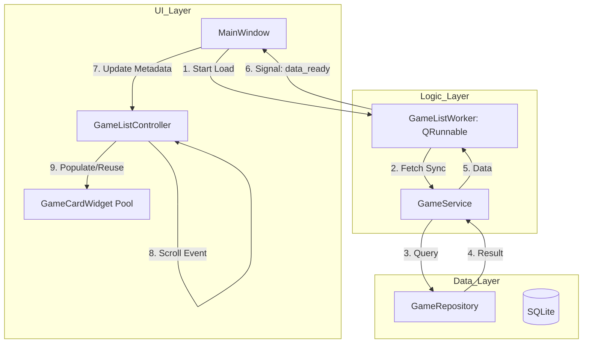
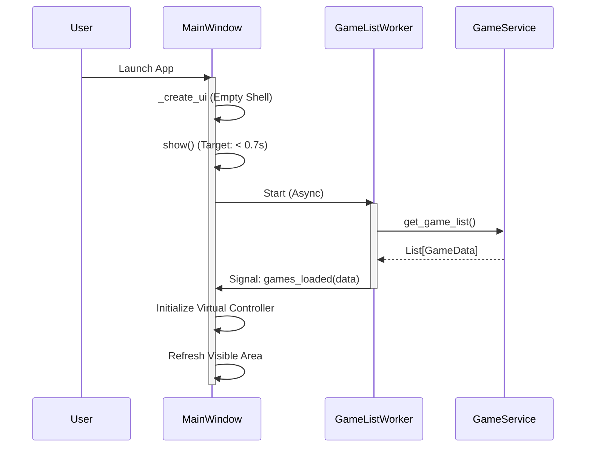

# Technical Design: List Virtualization and Async Startup

## Overview
**Purpose**: 大量（1000件以上）のゲームが登録されている場合でも、0.7秒以内の起動と、メモリ消費を抑えた滑らかなスクロールを実現します。
**Users**: 大規模なゲームライブラリを持つパワーユーザー。
**Impact**: `MainWindow` の起動ロジックを同期から非同期へ変更し、`GameCardWidget` の生成をオンデマンド（仮想化）に変更します。

### Goals
- 起動から UI 操作可能までの時間を 0.7s 未満にする (1.1)
- 1000件以上のデータがあってもスクロール時に 60fps を維持する (2.3)
- 大量データ時のメモリ消費量を、表示されているウィジェット数分 + メタデータに抑える (2.1)

### Non-Goals
- `QListView` への完全な移行（既存のウィジェット資産を活用するため）
- ゲーム詳細ダイアログの高速化（今回はメインリストに集中）

## Architecture

### Existing Architecture Analysis
- 現状は `MainWindow._load_games` が全ての `GameCardWidget` を一括生成し、`FlowLayout` に丸投げしています。
- これを、データ取得（Service）→ 管理（Controller）→ 表示（View）のフローへ整理します。

### Architecture Pattern & Boundary Map


### Technology Stack

| Layer | Choice / Version | Role in Feature | Notes |
|-------|------------------|-----------------|-------|
| Frontend | PySide6 | UI Framework | 既存スタックを継続 |
| Threading | QThreadPool / QRunnable | Async Data Fetch | `ImageLoader` と同様のパターン |
| Logic | Custom Controller | Virtualization Logic | スクロール位置とインデックスの管理 |

## System Flows

### Async Startup Flow


## Requirements Traceability

| Requirement | Summary | Components | Interfaces | Flows |
|-------------|---------|------------|------------|-------|
| 1.1 | 0.7s 以内の起動 | MainWindow, GameListWorker | async signal | Async Startup Flow |
| 1.2 | 非同期データロード | GameListWorker, GameService | QRunnable | Async Startup Flow |
| 2.1 | 表示範囲のみウィジェット生成 | GameListController | set_visible_range | - |
| 2.2 | ウィジェットの再利用 | GameListController, WidgetPool | update_data() | - |
| 3.1 | 非同期画像処理 | ImageManager, ImageLoader | established | Existing |

## Components and Interfaces

### UI / View Layer

#### GameListController
| Field | Detail |
|-------|--------|
| Intent | スクロールエリア内の表示位置を計算し、ウィジェットの配置と再利用を管理する |
| Requirements | 2.1, 2.2, 2.3 |

**Responsibilities & Constraints**
- スクロール位置の変化（`valueChanged`）を監視し、表示インデックスを算出する。
- 画面外に出たウィジェットを「プール」に戻し、新しく画面内に入るアイテムに再割り当てする。
- ウィンドウリサイズ時に、1行あたりのアイテム数を再計算し、全体の仮想高さを更新する。

**Contracts**: State [x] / Event [x]
- `update_view()`: 現在のスクロール位置に基づいてウィジェットを再配置。
- `data_changed(new_data)`: 全メタデータを更新し、ビューをリセット。

#### MainWindow (Extends)
| Field | Detail |
|-------|--------|
| Intent | 起動時に Worker を開始し、Controller へイベントを委譲する |
| Requirements | 1.1, 1.2, 1.3, 1.4 |

**Implementation Notes**
- `_load_games` を非同期化。
- `QScrollArea` のスクロールバーに `GameListController` のスロットを接続。

### Logic Layer

#### GameListWorker (QRunnable)
| Field | Detail |
|-------|--------|
| Intent | バックグラウンドで全ゲームデータを DB から取得する |
| Requirements | 1.2 |

##### Service Interface
```python
class GameListWorker(QRunnable):
    signals = WorkerSignals() # data_loaded(list)
    def run(self):
        # fetches data from GameService
```

## Data Models

### Domain Model
- **GameMetadataCache**: メモリ上に保持する全ゲームの軽量なメタデータ（ID, Title, ImagePath 等）。
- **WidgetPool**: 現在使用中の `GameCardWidget` と、未使用（非表示）のウィジェットのキュー。

## Error Handling

### Error Strategy
- **DB ロード失敗**: 空のリストを表示し、ステータスバーにエラーを表示する。
- **画像デコード失敗**: `ImageLoader` の既存エラーハンドリング（プレースホルダー表示）を継続。

## Testing Strategy
- **Unit Tests**:
  - `GameListController`: スクロール位置から正しいインデックス範囲が計算されるかの検証。
  - `GameListWorker`: バックグラウンドでのデータ取得とシグナル発火。
- **Performance Tests**:
  - 1000件データ投入時の `MainWindow.show()` 完了までの時間計測（0.7s 未満）。
  - スクロール時の CPU 使用率とフレームレート。

## Performance & Scalability
- **Target**: 1000件時、スクロール中のメインスレッド占有時間を 16ms (60fps) 以下にする。
- **Optimization**: 画像の読み込みは、表示が確定してから 100ms 程度のディレイを設ける（高速スクロール時の無駄な I/O 削減）。
