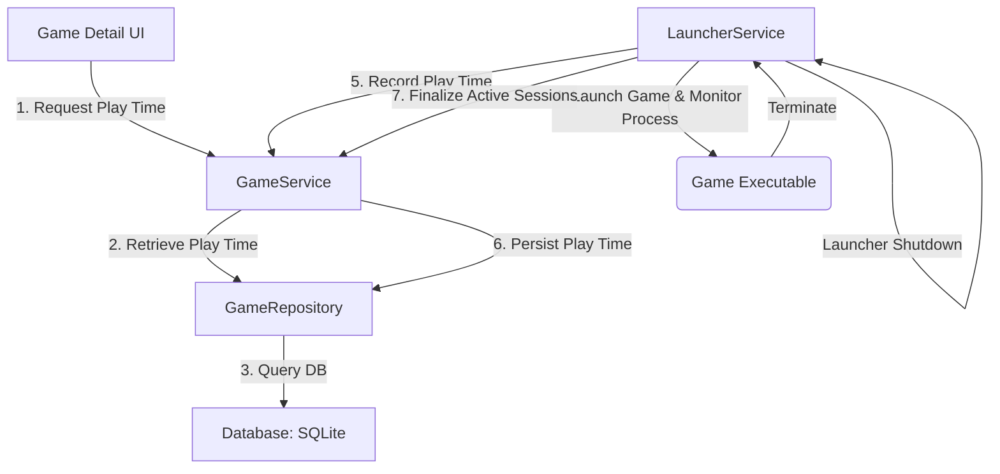
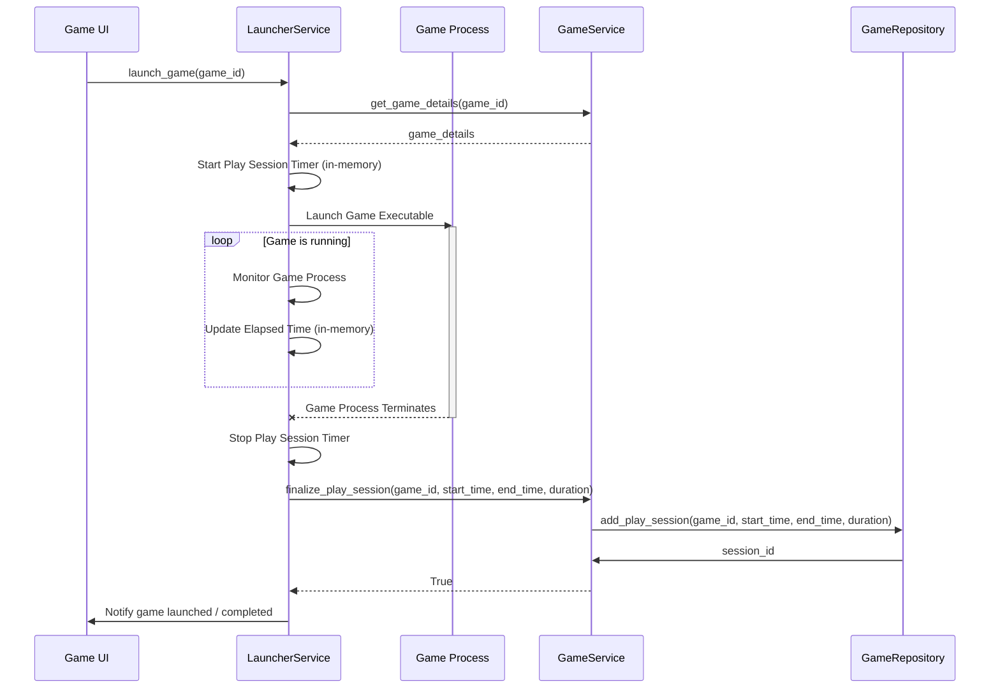
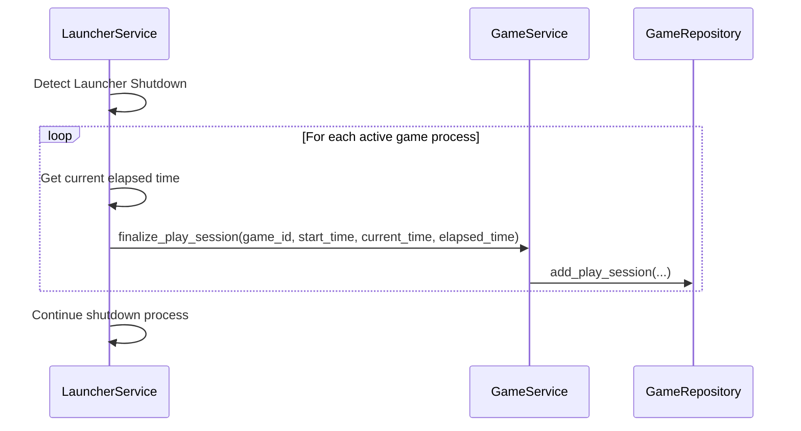
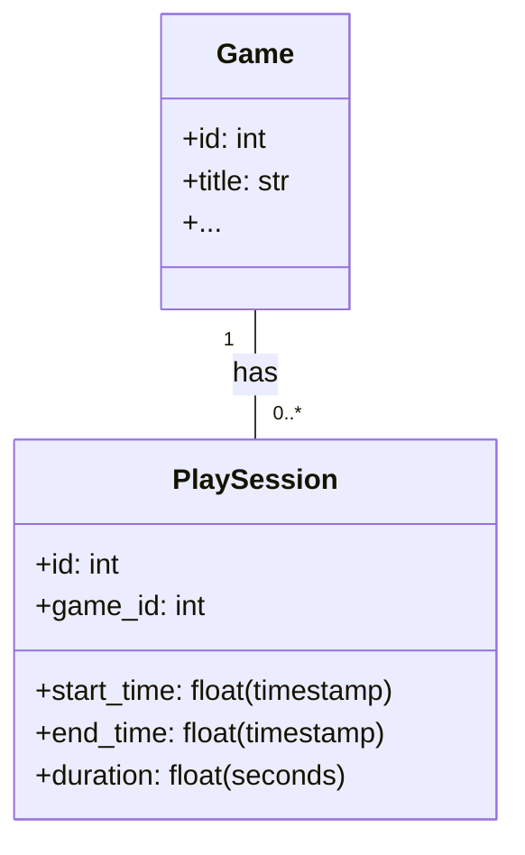

# Design Document: Play Time Tracker

---
**Purpose**: 繧ｲ繝ｼ繝縺ｮ繝励Ξ繧､譎る俣繧呈ｭ｣遒ｺ縺ｫ險域ｸｬ縺励€√Θ繝ｼ繧ｶ繝ｼ縺後◎縺ｮ繝・・繧ｿ繧貞ｮｹ譏薙↓蜿ら・繝ｻ邂｡逅・〒縺阪ｋ繧医≧縺ｫ縺吶ｋ縲・**Users**: 繧ｲ繝ｼ繝繝ｩ繝ｳ繝√Ε繝ｼ繧貞茜逕ｨ縺吶ｋ縺吶∋縺ｦ縺ｮ繧ｲ繝ｼ繝槭・縺ｯ縲∬・蛻・・繧ｲ繝ｼ繝豢ｻ蜍輔ｒ邨ｱ險育噪縺ｫ謚頑升縺ｧ縺阪ｋ繧医≧縺ｫ縺ｪ繧九€・**Impact**: 譌｢蟄倥・繧ｲ繝ｼ繝襍ｷ蜍輔ヵ繝ｭ繝ｼ縲√ョ繝ｼ繧ｿ繝｢繝・Ν縲√♀繧医・繧ｲ繝ｼ繝隧ｳ邏ｰ陦ｨ遉ｺ UI 縺ｫ螟画峩縺悟刈繧上ｋ縲・---

## Overview
縺薙・讖溯・縺ｯ縲￣yzree Game Launcher 縺ｫ繧ｲ繝ｼ繝縺ｮ繝励Ξ繧､譎る俣霑ｽ霍｡讖溯・繧定ｿｽ蜉縺励∪縺吶€ゅご繝ｼ繝縺ｮ襍ｷ蜍輔°繧臥ｵゆｺ・∪縺ｧ縺ｮ譎る俣繧定・蜍慕噪縺ｫ險域ｸｬ縺励€∝推繧ｲ繝ｼ繝縺ｮ邱上・繝ｬ繧､譎る俣縺翫ｈ縺ｳ繧ｻ繝・す繝ｧ繝ｳ螻･豁ｴ縺ｨ縺励※豌ｸ邯壼喧縺励∪縺吶€ゅΘ繝ｼ繧ｶ繝ｼ縺ｯ繧ｲ繝ｼ繝隧ｳ邏ｰ逕ｻ髱｢縺九ｉ繝励Ξ繧､譎る俣邨ｱ險医ｒ遒ｺ隱阪〒縺阪ｋ繧医≧縺ｫ縺ｪ繧翫∪縺吶€・
### Goals
- 繧ｲ繝ｼ繝縺ｮ繝励Ξ繧､譎る俣繧定・蜍慕噪縺九▽豁｣遒ｺ縺ｫ險域ｸｬ縺吶ｋ縲・- 險域ｸｬ縺輔ｌ縺溘・繝ｬ繧､譎る俣繝・・繧ｿ繧貞ｮ牙・縺ｫ菫晏ｭ倥・邂｡逅・☆繧九€・- 繝ｦ繝ｼ繧ｶ繝ｼ縺後ご繝ｼ繝隧ｳ邏ｰ逕ｻ髱｢縺ｧ繝励Ξ繧､譎る俣繧貞ｮｹ譏薙↓遒ｺ隱阪〒縺阪ｋ UI 繧呈署萓帙☆繧九€・- 繝励Ξ繧､譎る俣險域ｸｬ縺翫ｈ縺ｳ菫晏ｭ倅ｸｭ縺ｮ繧ｨ繝ｩ繝ｼ縺ｫ蟇ｾ縺励※蝣・欧縺ｪ繧ｷ繧ｹ繝・Β繧呈署萓帙☆繧九€・
### Non-Goals
- 繝励Ξ繧､譎る俣繝・・繧ｿ縺ｫ蝓ｺ縺･縺城ｫ伜ｺｦ縺ｪ蛻・梵讖溯・・井ｾ具ｼ壽凾髢灘ｸｯ蛻･邨ｱ險医€√ご繝ｼ繝繧ｸ繝｣繝ｳ繝ｫ蛻･邨ｱ險茨ｼ峨€・- 隍・焚繧ｲ繝ｼ繝縺ｮ蜷梧凾繝励Ξ繧､譎る俣縺ｮ霑ｽ霍｡縲・- 繝励Ξ繧､譎る俣繝・・繧ｿ縺ｮ繧ｨ繧ｯ繧ｹ繝昴・繝域ｩ溯・縲・
## Architecture

### Existing Architecture Analysis
- `LauncherService`: 繧ｲ繝ｼ繝縺ｮ襍ｷ蜍輔→邨ゆｺ・・繝ｩ繧､繝輔し繧､繧ｯ繝ｫ繧堤ｮ｡逅・＠縺ｦ縺翫ｊ縲√・繝ｬ繧､譎る俣險域ｸｬ縺ｮ髢句ｧ九・邨ゆｺ・ヨ繝ｪ繧ｬ繝ｼ縺ｨ縺励※驕ｩ蛻・〒縺吶€Ａsubprocess.Popen` 繧貞茜逕ｨ縺励※螟夜Κ繝励Ο繧ｻ繧ｹ繧堤ｮ｡逅・＠縺ｦ縺・ｋ縺溘ａ縲√ご繝ｼ繝繝励Ο繧ｻ繧ｹ縺ｮ逶｣隕悶′蜿ｯ閭ｽ縺ｧ縺吶€・- `GameService` / `GameRepository`: 繧ｲ繝ｼ繝繝・・繧ｿ縺ｮ邂｡逅・→豌ｸ邯壼喧繧呈球蠖薙＠縺ｦ縺翫ｊ縲√・繝ｬ繧､譎る俣繝・・繧ｿ繧偵ご繝ｼ繝縺ｫ髢｢騾｣莉倥￠縺ｦ菫晏ｭ倥☆繧九・縺ｫ驕ｩ縺励※縺・∪縺吶€よ里蟄倥・繝・・繧ｿ繝吶・繧ｹ繧ｹ繧ｭ繝ｼ繝槭↓譁ｰ縺励＞繝・・繝悶Ν繧定ｿｽ蜉縺吶ｋ蠖｢縺ｨ縺ｪ繧翫∪縺吶€・- `database.py`: 繧ｳ繝ｼ繝峨ヵ繧｡繝ｼ繧ｹ繝医・繧､繧ｰ繝ｬ繝ｼ繧ｷ繝ｧ繝ｳ繧偵し繝昴・繝医＠縺ｦ縺翫ｊ縲√・繝ｬ繧､譎る俣繝・・繧ｿ繧呈ｼ邏阪☆繧九ユ繝ｼ繝悶Ν縺ｮ霑ｽ蜉縺ｨ邂｡逅・′螳ｹ譏薙〒縺吶€・- `game_detail_dialog.py`: 繧ｲ繝ｼ繝縺ｮ隧ｳ邏ｰ諠・ｱ繧定｡ｨ遉ｺ縺吶ｋ UI 縺ｧ縺ゅｊ縲√・繝ｬ繧､譎る俣陦ｨ遉ｺ縺ｮ諡｡蠑ｵ繝昴う繝ｳ繝医→縺ｪ繧翫∪縺吶€・
### Architecture Pattern & Boundary Map
繝励Ξ繧､譎る俣霑ｽ霍｡讖溯・縺ｯ縲∵里蟄倥・繧ｵ繝ｼ繝薙せ螻､ (`LauncherService`, `GameService`) 縺ｨ繝・・繧ｿ螻､ (`GameRepository`, `database`) 繧呈僑蠑ｵ縺吶ｋ縺薙→縺ｧ螳溽樟縺輔ｌ縺ｾ縺吶€・


**Architecture Integration**:
- Selected pattern: 譌｢蟄倥・繧ｵ繝ｼ繝薙せ螻､縺翫ｈ縺ｳ繝・・繧ｿ螻､縺ｸ縺ｮ諡｡蠑ｵ (`Extension`)縲・- Domain/feature boundaries: `LauncherService` 縺後・繝ｬ繧､譎る俣縺ｮ險域ｸｬ縺ｨ繧ｻ繝・す繝ｧ繝ｳ邂｡逅・ｒ諡・ｽ薙＠縲～GameService` 縺ｨ `GameRepository` 縺後・繝ｬ繧､譎る俣縺ｮ豌ｸ邯壼喧縺ｨ蜿門ｾ励ｒ諡・ｽ薙＠縺ｾ縺吶€６I 縺ｯ `GameService` 繧剃ｻ九＠縺ｦ繝・・繧ｿ繧定｡ｨ遉ｺ縺励∪縺吶€・- Existing patterns preserved: Service-Repository 繝代ち繝ｼ繝ｳ縲，allback 繝代ち繝ｼ繝ｳ・医せ繝・・繧ｿ繧ｹ騾夂衍・峨€√さ繝ｼ繝峨ヵ繧｡繝ｼ繧ｹ繝医・繧､繧ｰ繝ｬ繝ｼ繧ｷ繝ｧ繝ｳ縲・- New components rationale: 繝励Ξ繧､譎る俣繝・・繧ｿ繧呈ｼ邏阪☆繧区眠縺励＞繝・・繧ｿ繝｢繝・Ν縺翫ｈ縺ｳ縺昴・邂｡逅・Ο繧ｸ繝・け縲・- Steering compliance: 繝励Ο繧ｸ繧ｧ繧ｯ繝医・繝｢繧ｸ繝･繝ｼ繝ｫ諤ｧ縲・未蠢・・蛻・屬縲ゝDD 蜴溷援縺ｫ貅匁侠縺励∪縺吶€・
### Technology Stack

| Layer | Choice / Version | Role in Feature | Notes |
|-------|------------------|-----------------|-------|
| Frontend / UI | PySide6 | `GameDetailDialog` 縺ｸ縺ｮ繝励Ξ繧､譎る俣陦ｨ遉ｺ隕∫ｴ縺ｮ霑ｽ蜉 | 譌｢蟄・UI 繧ｳ繝ｳ繝昴・繝阪Φ繝医・諡｡蠑ｵ |
| Backend / Services | Python 3.x | `LauncherService` 縺ｧ縺ｮ繧ｲ繝ｼ繝繝励Ο繧ｻ繧ｹ逶｣隕悶→譎る俣險域ｸｬ縲～GameService` 縺ｧ縺ｮ繝励Ξ繧､譎る俣繝・・繧ｿ邂｡逅・| `subprocess` 繝｢繧ｸ繝･繝ｼ繝ｫ縺ｫ繧医ｋ繝励Ο繧ｻ繧ｹ逶｣隕・|
| Data / Storage | SQLite (via `src/database.py`) | 繝励Ξ繧､譎る俣繝・・繧ｿ繧呈ｼ邏阪☆繧区眠繝・・繝悶Ν縺ｮ螳夂ｾｩ縺ｨ邂｡逅・| 譌｢蟄倥・繧ｳ繝ｼ繝峨ヵ繧｡繝ｼ繧ｹ繝医・繧､繧ｰ繝ｬ繝ｼ繧ｷ繝ｧ繝ｳ繧呈ｴｻ逕ｨ |
| Infrastructure / Runtime | OS Process Monitoring | `subprocess` 繧貞茜逕ｨ縺励◆繧ｲ繝ｼ繝繝励Ο繧ｻ繧ｹ縺ｮ繝ｩ繧､繝輔し繧､繧ｯ繝ｫ逶｣隕・| |

## System Flows

### 1. 繝励Ξ繧､譎る俣險域ｸｬ繝輔Ο繝ｼ (繧ｲ繝ｼ繝襍ｷ蜍輔€懃ｵゆｺ・

**Flow-level decisions**:
- `LauncherService` 縺ｯ縲√ご繝ｼ繝繝励Ο繧ｻ繧ｹ縺ｮ髢句ｧ九→邨ゆｺ・ｒ讀懃衍縺励€√Γ繝｢繝ｪ蜀・〒繝励Ξ繧､譎る俣繧ｿ繧､繝槭・繧堤ｮ｡逅・＠縺ｾ縺吶€・- 繧ｿ繧､繝槭・縺ｮ髢句ｧ九・邨ゆｺ・・縲√◎繧後◇繧後ご繝ｼ繝襍ｷ蜍墓凾縺ｨ繧ｲ繝ｼ繝繝励Ο繧ｻ繧ｹ邨ゆｺ・凾縺ｫ陦後ｏ繧後∪縺吶€・- 繝励Ξ繧､譎る俣縺ｯ `GameService` 繧剃ｻ九＠縺ｦ豌ｸ邯壼喧縺輔ｌ縺ｾ縺吶€・
### 2. 繝ｩ繝ｳ繝√Ε繝ｼ邨ゆｺ・凾縺ｮ繧｢繧ｯ繝・ぅ繝悶そ繝・す繝ｧ繝ｳ蜃ｦ逅・ヵ繝ｭ繝ｼ

**Flow-level decisions**:
- 繝ｩ繝ｳ繝√Ε繝ｼ縺後す繝｣繝・ヨ繝€繧ｦ繝ｳ縺輔ｌ繧矩圀縲√い繧ｯ繝・ぅ繝悶↑繧ｲ繝ｼ繝繧ｻ繝・す繝ｧ繝ｳ縺後≠繧後・縲∝ｼｷ蛻ｶ逧・↓邨ゆｺ・凾蛻ｻ繧堤樟蝨ｨ譎ょ綾縺ｨ縺励※繝励Ξ繧､譎る俣繧定ｨ倬鹸縺励∪縺吶€ゅ％繧後↓繧医ｊ縲√ョ繝ｼ繧ｿ謳榊､ｱ繧帝亟縺弱∪縺吶€・
## Requirements Traceability

| Requirement | Summary | Components | Interfaces | Flows |
|-------------|---------|------------|------------|-------|
| 1.1 | 繧ｲ繝ｼ繝襍ｷ蜍墓凾縺ｮ繧ｿ繧､繝槭・髢句ｧ・| LauncherService | `launch_game` | 繝励Ξ繧､譎る俣險域ｸｬ繝輔Ο繝ｼ |
| 1.2 | 繧ｲ繝ｼ繝螳溯｡御ｸｭ縺ｮ譎る俣險倬鹸 | LauncherService | `launch_game` (蜀・Κ蜃ｦ逅・ | 繝励Ξ繧､譎る俣險域ｸｬ繝輔Ο繝ｼ |
| 1.3 | 繧ｲ繝ｼ繝邨ゆｺ・凾縺ｮ繧ｿ繧､繝槭・蛛懈ｭ｢繝ｻ險倬鹸 | LauncherService, GameService, GameRepository | `launch_game`, `finalize_play_session`, `add_play_session` | 繝励Ξ繧､譎る俣險域ｸｬ繝輔Ο繝ｼ |
| 1.4 | 繝ｩ繝ｳ繝√Ε繝ｼ邨ゆｺ・凾縺ｮ繧ｻ繝・す繝ｧ繝ｳ邨ゆｺ・| LauncherService, GameService, GameRepository | `finalize_play_session`, `add_play_session` | 繝ｩ繝ｳ繝√Ε繝ｼ邨ゆｺ・凾繧｢繧ｯ繝・ぅ繝悶そ繝・す繝ｧ繝ｳ蜃ｦ逅・ヵ繝ｭ繝ｼ |
| 2.1 | 繝励Ξ繧､譎る俣縺ｮ豌ｸ邯壼喧 | GameService, GameRepository | `finalize_play_session`, `add_play_session` | 繝励Ξ繧､譎る俣險域ｸｬ繝輔Ο繝ｼ |
| 2.2 | 蜷郁ｨ医・繝ｬ繧､譎る俣縺ｮ蜿門ｾ・| GameService, GameRepository | `get_total_play_time` | |
| 2.3 | 繧ｻ繝・す繝ｧ繝ｳ螻･豁ｴ縺ｮ蜿門ｾ・| GameService, GameRepository | `get_play_session_history` | |
| 2.4 | 繧ｲ繝ｼ繝蜑企勁譎ゅ・繝・・繧ｿ蜑企勁 | GameService, GameRepository | `delete_game_data` | |
| 3.1 | 隧ｳ邏ｰ逕ｻ髱｢縺ｧ縺ｮ繝励Ξ繧､譎る俣陦ｨ遉ｺ | UI (GameDetailDialog), GameService | `get_total_play_time` | |
| 3.2 | 莠ｺ髢薙′隱ｭ縺ｿ繧・☆縺・ｽ｢蠑上〒縺ｮ陦ｨ遉ｺ | UI (GameDetailDialog) | (UI 蜀・Κ蜃ｦ逅・ | |
| 4.1 | 險域ｸｬ繧ｨ繝ｩ繝ｼ縺ｮ繝ｭ繧ｰ險倬鹸 | LauncherService | (蜀・Κ蜃ｦ逅・ | |
| 4.2 | 豌ｸ邯壼喧繧ｨ繝ｩ繝ｼ縺ｮ繝ｭ繧ｰ險倬鹸繝ｻ騾夂衍 | GameService | `finalize_play_session` | |
| 4.3 | UI 縺ｮ隱､陦ｨ遉ｺ髦ｲ豁｢ | UI (GameDetailDialog) | (UI 蜀・Κ蜃ｦ逅・ | |

## Components and Interfaces

### Service Layer

#### LauncherService

| Field | Detail |
|-------|--------|
| Intent | 繧ｲ繝ｼ繝縺ｮ襍ｷ蜍輔€∫屮隕悶€√・繝ｬ繧､譎る俣險域ｸｬ縺ｮ髢句ｧ九・邨ゆｺ・ｒ諡・ｽ・|
| Requirements | 1.1, 1.2, 1.3, 1.4, 4.1 |

**Responsibilities & Constraints**
- 繧ｲ繝ｼ繝繝励Ο繧ｻ繧ｹ縺ｮ襍ｷ蜍輔→邨ゆｺ・ｒ逶｣隕悶☆繧九€・- 襍ｷ蜍穂ｸｭ縺ｮ繧ｲ繝ｼ繝縺ｮ繝励Ξ繧､譎る俣繧定ｨ域ｸｬ縺吶ｋ繧ｿ繧､繝槭・繧堤ｮ｡逅・☆繧九€・- 繝ｩ繝ｳ繝√Ε繝ｼ繧ｷ繝｣繝・ヨ繝€繧ｦ繝ｳ譎ゅ↓繧｢繧ｯ繝・ぅ繝悶↑繝励Ξ繧､繧ｻ繝・す繝ｧ繝ｳ繧帝←蛻・↓邨ゆｺ・＆縺帙ｋ縲・
**Dependencies**
- Outbound: `GameService` 窶・繝励Ξ繧､譎る俣繝・・繧ｿ縺ｮ豌ｸ邯壼喧繧剃ｾ晞ｼ (P0)

**Contracts**: Service [x]

##### Service Interface
```python
class LauncherService:
    # 譌｢蟄倥Γ繧ｽ繝・ラ
    def launch_game(self, game_id: int) -> bool:
        """
        繧ｲ繝ｼ繝繧定ｵｷ蜍輔＠縲√◎縺ｮ繝励Ο繧ｻ繧ｹ繧堤屮隕悶＠縺ｪ縺後ｉ繝励Ξ繧､譎る俣縺ｮ險域ｸｬ繧帝幕蟋九☆繧九€・        繧ｲ繝ｼ繝繝励Ο繧ｻ繧ｹ邨ゆｺ・凾縺ｫ繝励Ξ繧､譎る俣繧堤｢ｺ螳壹＠縲；ameService縺ｫ豌ｸ邯壼喧繧剃ｾ晞ｼ縺吶ｋ縲・        繝ｩ繝ｳ繝√Ε繝ｼ邨ゆｺ・凾縺ｫ繧ゅい繧ｯ繝・ぅ繝悶↑繝励Ξ繧､繧ｻ繝・す繝ｧ繝ｳ繧堤ｵゆｺ・☆繧九Ο繧ｸ繝・け繧貞性繧€縲・        """
    
    # 譁ｰ隕上う繝吶Φ繝医ワ繝ｳ繝峨Λ・医∪縺溘・譌｢蟄倥す繝｣繝・ヨ繝€繧ｦ繝ｳ繝輔ャ繧ｯ縺ｸ縺ｮ諡｡蠑ｵ・・    def _on_launcher_shutdown(self):
        """
        繝ｩ繝ｳ繝√Ε繝ｼ邨ゆｺ・凾縺ｫ蜻ｼ縺ｳ蜃ｺ縺輔ｌ縲∝・縺ｦ縺ｮ繧｢繧ｯ繝・ぅ繝悶↑繝励Ξ繧､繧ｻ繝・す繝ｧ繝ｳ繧堤｢ｺ螳壹☆繧九€・        """
```
- Preconditions: `game_id` 縺ｯ譛牙柑縺ｪ繧ｲ繝ｼ繝繧呈欠縺吶％縺ｨ縲・- Postconditions: 繧ｲ繝ｼ繝縺瑚ｵｷ蜍輔＆繧後ｋ縺薙→縲ゅ・繝ｬ繧､譎る俣縺瑚ｨ倬鹸縺輔ｌ繧九％縺ｨ縲・- Invariants: 險倬鹸縺輔ｌ繧九・繝ｬ繧､譎る俣縺ｯ豁｣縺ｮ蛟､縺ｧ縺ゅｋ縺薙→縲・
#### GameService

| Field | Detail |
|-------|--------|
| Intent | 繝励Ξ繧､譎る俣繝・・繧ｿ縺ｮ邂｡逅・€∵ｰｸ邯壼喧縲√♀繧医・蜿門ｾ励う繝ｳ繧ｿ繝ｼ繝輔ぉ繝ｼ繧ｹ繧呈署萓・|
| Requirements | 2.1, 2.2, 2.3, 2.4, 4.2, 4.3 |

**Responsibilities & Constraints**
- `LauncherService` 縺九ｉ蜿励￠蜿悶▲縺溘・繝ｬ繧､繧ｻ繝・す繝ｧ繝ｳ繝・・繧ｿ繧・`GameRepository` 繧剃ｻ九＠縺ｦ豌ｸ邯壼喧縺吶ｋ縲・- 繧ｲ繝ｼ繝縺斐→縺ｮ蜷郁ｨ医・繝ｬ繧､譎る俣縺翫ｈ縺ｳ繧ｻ繝・す繝ｧ繝ｳ螻･豁ｴ繧呈署萓帙☆繧九€・- 繧ｲ繝ｼ繝蜑企勁譎ゅ↓髢｢騾｣縺吶ｋ繝励Ξ繧､譎る俣繝・・繧ｿ繧ょ炎髯､縺吶ｋ縲・
**Dependencies**
- Outbound: `GameRepository` 窶・繝励Ξ繧､譎る俣繝・・繧ｿ縺ｮ CRUD 謫堺ｽ懊ｒ萓晞ｼ (P0)

**Contracts**: Service [x]

##### Service Interface
```python
class GameService:
    # 譌｢蟄倥Γ繧ｽ繝・ラ
    def delete_game_data(self, game_id: int):
        """繧ｲ繝ｼ繝繝・・繧ｿ縺ｨ縺昴・髢｢騾｣繝・・繧ｿ繧貞炎髯､縺吶ｋ縲・""
        # ... 譌｢蟄倥・螳溯｣・↓繝励Ξ繧､譎る俣繝・・繧ｿ縺ｮ蜑企勁繧定ｿｽ蜉 ...

    # 譁ｰ隕上Γ繧ｽ繝・ラ
    def finalize_play_session(self, game_id: int, start_time: float, end_time: float, duration: float):
        """
        繝励Ξ繧､繧ｻ繝・す繝ｧ繝ｳ縺ｮ繝・・繧ｿ繧堤｢ｺ螳壹＠縲∵ｰｸ邯壼喧縺吶ｋ縲・        duration縺ｯ遘貞腰菴阪€・        """

    def get_total_play_time(self, game_id: int) -> float:
        """
        謖・ｮ壹＆繧後◆繧ｲ繝ｼ繝縺ｮ蜷郁ｨ医・繝ｬ繧､譎る俣繧堤ｧ貞腰菴阪〒霑斐☆縲・        """

    def get_play_session_history(self, game_id: int) -> list[dict]:
        """
        謖・ｮ壹＆繧後◆繧ｲ繝ｼ繝縺ｮ繝励Ξ繧､繧ｻ繝・す繝ｧ繝ｳ螻･豁ｴ繧定ｿ斐☆縲・        蜷・ｾ樊嶌縺ｯ start_time, end_time, duration 繧貞性繧€縲・        """
```
- Preconditions: `game_id` 縺ｯ譛牙柑縺ｪ繧ｲ繝ｼ繝繧呈欠縺吶％縺ｨ縲Ａstart_time < end_time` 縺九▽ `duration >= 0` 縺ｧ縺ゅｋ縺薙→縲・- Postconditions: 繝励Ξ繧､繧ｻ繝・す繝ｧ繝ｳ繝・・繧ｿ縺御ｿ晏ｭ倥＆繧後ｋ縺薙→縲・- Invariants: 繝励Ξ繧､譎る俣縺ｯ蟶ｸ縺ｫ髱櫁ｲ縺ｧ縺ゅｋ縺薙→縲・
### Data Access Layer

#### GameRepository

| Field | Detail |
|-------|--------|
| Intent | 繝励Ξ繧､譎る俣繝・・繧ｿ縺ｮ繝・・繧ｿ繝吶・繧ｹ繧｢繧ｯ繧ｻ繧ｹ繧呈球蠖・|
| Requirements | 2.1, 2.2, 2.3, 2.4 |

**Responsibilities & Constraints**
- 繝励Ξ繧､譎る俣繝・・繧ｿ繧呈ｼ邏阪☆繧九ョ繝ｼ繧ｿ繝吶・繧ｹ繝・・繝悶Ν縺ｮ繧ｹ繧ｭ繝ｼ繝槫ｮ夂ｾｩ縺ｨ邂｡逅・€・- 繝励Ξ繧､繧ｻ繝・す繝ｧ繝ｳ繝・・繧ｿ縺ｮ霑ｽ蜉縲∝叙蠕励€∝炎髯､縺ｮ SQL 謫堺ｽ懊€・
**Dependencies**
- External: SQLite Database (P0)

**Contracts**: Service [x]

##### Service Interface
```python
class GameRepository:
    # 譁ｰ隕上Γ繧ｽ繝・ラ
    def add_play_session(self, game_id: int, start_time: float, end_time: float, duration: float) -> int:
        """
        譁ｰ縺励＞繝励Ξ繧､繧ｻ繝・す繝ｧ繝ｳ繧偵ョ繝ｼ繧ｿ繝吶・繧ｹ縺ｫ菫晏ｭ倥＠縲√◎縺ｮID繧定ｿ斐☆縲・        """

    def get_total_play_time_for_game(self, game_id: int) -> float:
        """
        謖・ｮ壹＆繧後◆繧ｲ繝ｼ繝縺ｮ蜷郁ｨ医・繝ｬ繧､譎る俣繧偵ョ繝ｼ繧ｿ繝吶・繧ｹ縺九ｉ蜿門ｾ励☆繧九€・        """

    def get_play_session_history_for_game(self, game_id: int) -> list[dict]:
        """
        謖・ｮ壹＆繧後◆繧ｲ繝ｼ繝縺ｮ繝励Ξ繧､繧ｻ繝・す繝ｧ繝ｳ螻･豁ｴ繧偵ョ繝ｼ繧ｿ繝吶・繧ｹ縺九ｉ蜿門ｾ励☆繧九€・        """

    def delete_play_time_data_for_game(self, game_id: int):
        """
        謖・ｮ壹＆繧後◆繧ｲ繝ｼ繝縺ｫ髢｢騾｣縺吶ｋ蜈ｨ縺ｦ縺ｮ繝励Ξ繧､譎る俣繝・・繧ｿ繧貞炎髯､縺吶ｋ縲・        """
```
- Preconditions: `game_id` 縺ｯ譌｢蟄倥・繧ｲ繝ｼ繝繧呈欠縺吶％縺ｨ縲・- Postconditions: 繝・・繧ｿ繝吶・繧ｹ縺ｫ繝励Ξ繧､繧ｻ繝・す繝ｧ繝ｳ縺瑚ｿｽ蜉縺輔ｌ繧九€√∪縺溘・繝・・繧ｿ縺悟叙蠕励・蜑企勁縺輔ｌ繧九€・
## Data Models

### Domain Model



**Structure Definition**:
- `PlaySession` 繝・・繝悶Ν繧呈眠縺溘↓霑ｽ蜉縺励€～Game` 繝・・繝悶Ν縺ｨ `game_id` 縺ｧ髢｢騾｣莉倥￠縺ｾ縺吶€・- `game_id` 縺ｯ `Game` 繝・・繝悶Ν縺ｸ縺ｮ螟夜Κ繧ｭ繝ｼ縺ｨ縺ｪ繧翫∪縺吶€・- `start_time` 縺ｨ `end_time` 縺ｯ Unix 繧ｿ繧､繝繧ｹ繧ｿ繝ｳ繝暦ｼ・loat・峨→縺励※險倬鹸縺励∪縺吶€・- `duration` 縺ｯ遘貞腰菴搾ｼ・loat・峨〒險倬鹸縺励∪縺吶€・
### Physical Data Model

**For Relational Databases**:
- `play_sessions` 繝・・繝悶Ν:
    - `id INTEGER PRIMARY KEY AUTOINCREMENT`
    - `game_id INTEGER NOT NULL`
    - `start_time REAL NOT NULL`
    - `end_time REAL NOT NULL`
    - `duration REAL NOT NULL`
    - `FOREIGN KEY (game_id) REFERENCES games (id) ON DELETE CASCADE`
    - `ON DELETE CASCADE` 縺ｫ繧医ｊ縲～games` 繝・・繝悶Ν縺九ｉ繧ｲ繝ｼ繝縺悟炎髯､縺輔ｌ縺滄圀縺ｫ縲・未騾｣縺吶ｋ `play_sessions` 繧ｨ繝ｳ繝医Μ繧り・蜍慕噪縺ｫ蜑企勁縺輔ｌ縺ｾ縺吶€・
## Error Handling

### Error Strategy
- 繝励Ξ繧､譎る俣險域ｸｬ荳ｭ縺ｫ繝励Ο繧ｻ繧ｹ逶｣隕悶′螟ｱ謨励＠縺溷ｴ蜷医ｄ縲√ョ繝ｼ繧ｿ繝吶・繧ｹ縺ｸ縺ｮ豌ｸ邯壼喧縺ｫ螟ｱ謨励＠縺溷ｴ蜷医・縲～LauncherService` 縺翫ｈ縺ｳ `GameService` 蜀・Κ縺ｧ繝ｭ繧ｰ繧定ｨ倬鹸縺励€√Θ繝ｼ繧ｶ繝ｼ縺ｫ縺ｯ驕ｩ蛻・↑繧ｨ繝ｩ繝ｼ繝｡繝・そ繝ｼ繧ｸ繧定｡ｨ遉ｺ縺励∪縺吶€り・蜻ｽ逧・↑繧ｨ繝ｩ繝ｼ縺ｧ縺ｯ縺ｪ縺・◆繧√€√ご繝ｼ繝縺ｮ襍ｷ蜍戊・菴薙・荳ｭ譁ｭ縺励∪縺帙ｓ縺後€√・繝ｬ繧､譎る俣縺ｮ險倬鹸縺ｯ陦後ｏ繧後∪縺帙ｓ縲・- `SaveDataSyncError` 縺ｮ繧医≧縺ｫ繧ｲ繝ｼ繝襍ｷ蜍輔ｒ荳ｭ譁ｭ縺吶ｋ譌｢蟄倥・ `Exception` 繧ｯ繝ｩ繧ｹ繧呈ｵ∫畑縺吶ｋ縺九€～PlayTimeTrackingError` 縺ｮ繧医≧縺ｪ蟆ら畑縺ｮ `Exception` 繧貞ｮ夂ｾｩ縺吶ｋ縺薙→繧呈､懆ｨ弱＠縺ｾ縺吶€・
### Error Categories and Responses
- **險域ｸｬ繧ｨ繝ｩ繝ｼ**: 繧ｲ繝ｼ繝繝励Ο繧ｻ繧ｹ逶｣隕悶・螟ｱ謨・-> 繝ｭ繧ｰ險倬鹸 (`LauncherService`)縲・- **豌ｸ邯壼喧繧ｨ繝ｩ繝ｼ**: 繝・・繧ｿ繝吶・繧ｹ縺ｸ縺ｮ譖ｸ縺崎ｾｼ縺ｿ螟ｱ謨・-> 繝ｭ繧ｰ險倬鹸 (`GameService` 縺九ｉ `GameRepository`)縲∝ｿ・ｦ√↓蠢懊§縺ｦ繝ｦ繝ｼ繧ｶ繝ｼ縺ｸ縺ｮ髱槫酔譛滄€夂衍縲・
## Testing Strategy

### Unit Tests
- `LauncherService` (`tests/test_launcher_service.py`):
    - 繧ｲ繝ｼ繝襍ｷ蜍墓凾縺ｫ繧ｿ繧､繝槭・縺碁幕蟋九＆繧後ｋ縺薙→縲・    - 繧ｲ繝ｼ繝繝励Ο繧ｻ繧ｹ邨ゆｺ・凾縺ｫ繧ｿ繧､繝槭・縺悟●豁｢縺励€～GameService.finalize_play_session` 縺碁←蛻・↑蠑墓焚縺ｧ蜻ｼ縺ｳ蜃ｺ縺輔ｌ繧九％縺ｨ縲・    - 繝ｩ繝ｳ繝√Ε繝ｼ邨ゆｺ・う繝吶Φ繝茨ｼ医Δ繝・け・画凾縺ｫ繧｢繧ｯ繝・ぅ繝悶↑繧ｻ繝・す繝ｧ繝ｳ縺檎ｵゆｺ・・逅・＆繧後ｋ縺薙→縲・- `GameService` (`tests/test_game_service.py`):
    - `finalize_play_session` 縺・`GameRepository.add_play_session` 繧貞他縺ｳ蜃ｺ縺吶％縺ｨ縲・    - `get_total_play_time` 縺梧ｭ｣縺励￥蜷郁ｨ域凾髢薙ｒ霑斐☆縺薙→縲・    - `get_play_session_history` 縺梧ｭ｣縺励＞螻･豁ｴ繧定ｿ斐☆縺薙→縲・    - `delete_game_data` 縺後・繝ｬ繧､譎る俣繝・・繧ｿ繧ょ炎髯､縺吶ｋ縺薙→縲・- `GameRepository` (`tests/test_game_repository.py`):
    - `add_play_session` 縺後ョ繝ｼ繧ｿ繝吶・繧ｹ縺ｫ繝・・繧ｿ繧定ｿｽ蜉縺吶ｋ縺薙→縲・    - `get_total_play_time_for_game` 縺梧ｭ｣縺励＞蜷郁ｨ亥€､繧定ｿ斐☆縺薙→縲・    - `get_play_session_history_for_game` 縺梧ｭ｣縺励＞螻･豁ｴ繧定ｿ斐☆縺薙→縲・    - `delete_play_time_data_for_game` 縺後ョ繝ｼ繧ｿ繧貞炎髯､縺吶ｋ縺薙→縲・
### Integration Tests
- `tests/test_integration_launch_workflow.py` 縺ｾ縺溘・譁ｰ隕丈ｽ懈・:
    - 螳滄圀縺ｮ繧ｲ繝ｼ繝襍ｷ蜍輔°繧臥ｵゆｺ・∪縺ｧ縺ｮ繝輔Ο繝ｼ縺ｧ縲√・繝ｬ繧､譎る俣縺梧ｭ｣縺励￥險域ｸｬ繝ｻ菫晏ｭ倥・陦ｨ遉ｺ縺輔ｌ繧九％縺ｨ繧堤｢ｺ隱阪☆繧九€・    - 繝ｩ繝ｳ繝√Ε繝ｼ縺ｮ蠑ｷ蛻ｶ邨ゆｺ・ｼ医Δ繝・け・画凾縺ｮ繝励Ξ繧､譎る俣菫晏ｭ倥ｒ遒ｺ隱阪☆繧九€・- `tests/test_game_detail_dialog.py`:
    - `GameDetailDialog` 縺・`GameService` 縺九ｉ繝励Ξ繧､譎る俣繧貞叙蠕励＠縲ゞI 縺ｫ豁｣縺励￥陦ｨ遉ｺ縺吶ｋ縺薙→繧堤｢ｺ隱阪☆繧九€・
