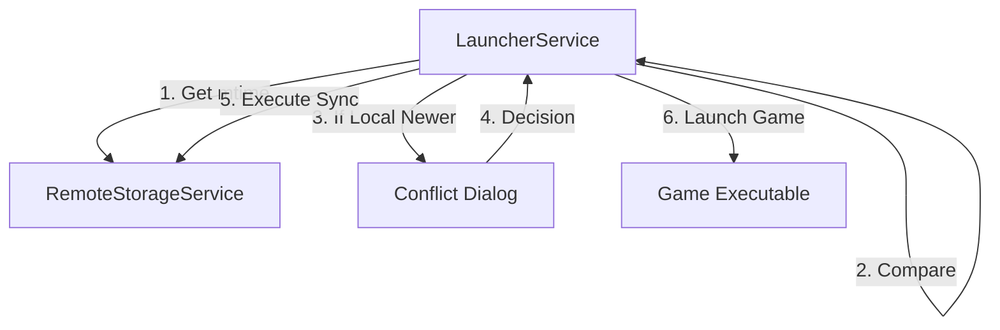
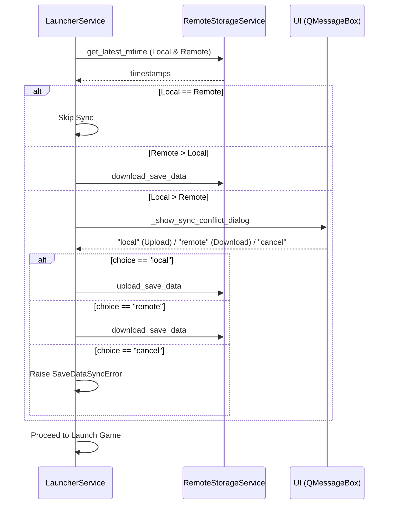

# Design Document: save-data-sync-conflict-resolution

## Overview
縺薙・讖溯・縺ｯ縲√そ繝ｼ繝悶ョ繝ｼ繧ｿ蜷梧悄譎ゅ↓繝ｭ繝ｼ繧ｫ繝ｫ繝・・繧ｿ縺後Μ繝｢繝ｼ繝医ョ繝ｼ繧ｿ繧医ｊ譁ｰ縺励＞蝣ｴ蜷医↓繝ｦ繝ｼ繧ｶ繝ｼ縺ｫ遒ｺ隱阪ｒ豎ゅａ縲√ョ繝ｼ繧ｿ縺ｮ諢丞峙縺励↑縺・ｸ頑嶌縺阪ｒ髦ｲ豁｢縺励∪縺吶€・
**Users**: 繧ｻ繝ｼ繝悶ョ繝ｼ繧ｿ蜷梧悄讖溯・繧呈怏蜉ｹ縺ｫ縺励※縺・ｋ繝ｦ繝ｼ繧ｶ繝ｼ縺後€∬､・焚縺ｮ遶ｯ譛ｫ縺ｧ繝励Ξ繧､縺吶ｋ髫帙ｄ縲√が繝輔Λ繧､繝ｳ縺ｧ繝励Ξ繧､縺励◆蠕後↓繧ｪ繝ｳ繝ｩ繧､繝ｳ縺ｫ縺ｪ縺｣縺滄圀縺ｮ繝ｯ繝ｼ繧ｯ繝輔Ο繝ｼ縺ｧ蛻ｩ逕ｨ縺励∪縺吶€・
**Impact**: 譌｢蟄倥・縲後Ο繝ｼ繧ｫ繝ｫ縺梧眠縺励＞蝣ｴ蜷医・閾ｪ蜍輔い繝・・繝ｭ繝ｼ繝峨€阪→縺・≧謖吝虚繧貞､画峩縺励€√Θ繝ｼ繧ｶ繝ｼ縺ｮ驕ｸ謚橸ｼ医い繝・・繝ｭ繝ｼ繝峨€√ム繧ｦ繝ｳ繝ｭ繝ｼ繝峨€√∪縺溘・荳ｭ譁ｭ・峨ｒ謖溘・繧医≧縺ｫ縺励∪縺吶€・
### Goals
- 繝ｭ繝ｼ繧ｫ繝ｫ繝・・繧ｿ縺梧眠縺励＞蝣ｴ蜷医↓繝ｦ繝ｼ繧ｶ繝ｼ縺ｮ諢丞峙繧堤｢ｺ隱阪☆繧九€・- 繝ｦ繝ｼ繧ｶ繝ｼ縺ｮ驕ｸ謚槭↓蝓ｺ縺･縺・※繧｢繝・・繝ｭ繝ｼ繝峨∪縺溘・繝€繧ｦ繝ｳ繝ｭ繝ｼ繝峨ｒ豁｣縺励￥螳溯｡後☆繧九€・- 蜷梧悄繧ｨ繝ｩ繝ｼ縺檎匱逕溘＠縺溷ｴ蜷医↓縺ｯ螳牙・縺ｫ繧ｲ繝ｼ繝襍ｷ蜍輔ｒ荳ｭ譁ｭ縺吶ｋ縲・
### Non-Goals
- 蜷梧悄繧｢繝ｫ繧ｴ繝ｪ繧ｺ繝閾ｪ菴難ｼ医ち繧､繝繧ｹ繧ｿ繝ｳ繝玲ｯ碑ｼ・ｼ峨・螟ｧ蟷・↑螟画峩縲・- 險ｭ螳夂判髱｢縺ｧ縺ｮ縲悟ｸｸ縺ｫ繝ｭ繝ｼ繧ｫ繝ｫ蜆ｪ蜈医€阪→縺・▲縺溯・蜍戊ｧ｣豎ｺ繧ｪ繝励す繝ｧ繝ｳ縺ｮ霑ｽ蜉縲・
## Architecture

### Existing Architecture Analysis
- **`LauncherService`**: 蜷梧悄繝ｭ繧ｸ繝・け縺ｮ繧ｪ繝ｼ繧ｱ繧ｹ繝医Ξ繝ｼ繧ｷ繝ｧ繝ｳ繧呈球蠖薙€Ａsmart` 蜷梧悄繝｢繝ｼ繝峨〒譁ｰ譌ｧ蛻､螳壹ｒ陦後▲縺ｦ縺・ｋ縲・- **`_show_sync_conflict_dialog`**: `QMessageBox` 繧剃ｽｿ逕ｨ縺励◆繝｢繝ｼ繝€繝ｫ繝€繧､繧｢繝ｭ繧ｰ縲ら樟蝨ｨ縺ｯ譛ｪ譚･譌･莉俶､懃衍譎ゅ・縺ｿ菴ｿ逕ｨ縺輔ｌ縺ｦ縺・ｋ縲・
### Architecture Pattern & Boundary Map
譌｢蟄倥・ `LauncherService` 蜀・・繝ｭ繧ｸ繝・け諡｡蠑ｵ縺ｨ縺励※螳溯｣・＠縺ｾ縺吶€・


### Technology Stack

| Layer | Choice / Version | Role in Feature | Notes |
|-------|------------------|-----------------|-------|
| Frontend / UI | PySide6 | `QMessageBox` 縺ｫ繧医ｋ遒ｺ隱阪ム繧､繧｢繝ｭ繧ｰ | 譌｢蟄倥・ `_show_sync_conflict_dialog` 繧剃ｽｿ逕ｨ |
| Backend / Services | Python 3.x | `LauncherService` 縺ｧ縺ｮ譚｡莉ｶ蛻・ｲ舌→蜷梧悄螳溯｡・| 譌｢蟄倥し繝ｼ繝薙せ縺ｮ諡｡蠑ｵ |

## System Flows

### 蜷梧悄遶ｶ蜷郁ｧ｣豎ｺ繝輔Ο繝ｼ


## Requirements Traceability

| Requirement | Summary | Components | Interfaces | Flows |
|-------------|---------|------------|------------|-------|
| 1.1 | 繧ｿ繧､繝繧ｹ繧ｿ繝ｳ繝玲ｯ碑ｼ・| LauncherService | `sync_save_data` | 蜷梧悄遶ｶ蜷郁ｧ｣豎ｺ繝輔Ο繝ｼ |
| 1.2 | 遶ｶ蜷育憾諷九・繝槭・繧ｯ | LauncherService | `sync_save_data` | 蜷梧悄遶ｶ蜷郁ｧ｣豎ｺ繝輔Ο繝ｼ |
| 1.3 | 荳€閾ｴ譎ゅ・繧ｹ繧ｭ繝・・ | LauncherService | `sync_save_data` | 蜷梧悄遶ｶ蜷郁ｧ｣豎ｺ繝輔Ο繝ｼ |
| 2.1 | 遒ｺ隱阪ム繧､繧｢繝ｭ繧ｰ陦ｨ遉ｺ | LauncherService | `_show_sync_conflict_dialog` | 蜷梧悄遶ｶ蜷郁ｧ｣豎ｺ繝輔Ο繝ｼ |
| 2.2 | 繧ｲ繝ｼ繝襍ｷ蜍募ｾ・ｩ・| LauncherService | `sync_save_data` | 蜷梧悄遶ｶ蜷郁ｧ｣豎ｺ繝輔Ο繝ｼ |
| 2.3 | 繧｢繝・・繝ｭ繝ｼ繝蛾∈謚・| LauncherService | `sync_save_data` | 蜷梧悄遶ｶ蜷郁ｧ｣豎ｺ繝輔Ο繝ｼ |
| 2.4 | 繝€繧ｦ繝ｳ繝ｭ繝ｼ繝・繧ｭ繝｣繝ｳ繧ｻ繝ｫ驕ｸ謚・| LauncherService | `sync_save_data` | 蜷梧悄遶ｶ蜷郁ｧ｣豎ｺ繝輔Ο繝ｼ |
| 3.1 | 繧｢繝・・繝ｭ繝ｼ繝牙ｮ溯｡・| LauncherService | `sync_save_data` | 蜷梧悄遶ｶ蜷郁ｧ｣豎ｺ繝輔Ο繝ｼ |
| 3.2 | 繝€繧ｦ繝ｳ繝ｭ繝ｼ繝牙ｮ溯｡・| LauncherService | `sync_save_data` | 蜷梧悄遶ｶ蜷郁ｧ｣豎ｺ繝輔Ο繝ｼ |
| 3.3 | 繧ｨ繝ｩ繝ｼ譎ゅ・荳ｭ譁ｭ | LauncherService | `sync_save_data` | 蜷梧悄遶ｶ蜷郁ｧ｣豎ｺ繝輔Ο繝ｼ |
| 3.4 | 螳御ｺ・ｾ後・邯夊｡・| LauncherService | `launch_game` | 蜷梧悄遶ｶ蜷郁ｧ｣豎ｺ繝輔Ο繝ｼ |

## Components and Interfaces

| Component | Domain/Layer | Intent | Req Coverage | Key Dependencies | Contracts |
|-----------|--------------|--------|--------------|------------------|-----------|
| LauncherService | Service | 蜷梧悄繝ｭ繧ｸ繝・け縺ｮ蛻ｶ蠕｡ | 1.1 - 3.4 | RemoteStorageService | Service |

### Service Layer

#### LauncherService

**Responsibilities & Constraints**
- 繝ｭ繝ｼ繧ｫ繝ｫ縺ｨ繝ｪ繝｢繝ｼ繝医・繧ｿ繧､繝繧ｹ繧ｿ繝ｳ繝励ｒ豈碑ｼ・＠縲∫ｫｶ蜷医ｒ讀懃衍縺吶ｋ縲・- 遶ｶ蜷育匱逕滓凾縺ｫ繝ｦ繝ｼ繧ｶ繝ｼ縺ｫ莉句・繧呈ｱゅａ繧九€・- 繝ｦ繝ｼ繧ｶ繝ｼ縺ｮ驕ｸ謚槭↓蠢懊§縺ｦ縲・←蛻・↑蜷梧悄繧｢繧ｯ繧ｷ繝ｧ繝ｳ繧・`RemoteStorageService` 縺ｫ萓晞ｼ縺吶ｋ縲・
##### Service Interface
```python
class LauncherService:
    def sync_save_data(self, game_id: int, direction: str) -> bool:
        """
        direction="smart" 縺ｮ蝣ｴ蜷医・繝ｭ繧ｸ繝・け繧呈僑蠑ｵ縲・        繝ｭ繝ｼ繧ｫ繝ｫ縺梧眠縺励＞蝣ｴ蜷医€＼show_sync_conflict_dialog 繧貞他縺ｳ蜃ｺ縺吶€・        """

    def _show_sync_conflict_dialog(self, game_title: str, local_mtime: float, remote_mtime: float) -> str:
        """
        QMessageBox 繧定｡ｨ遉ｺ縺励€・local", "remote", "cancel" 縺ｮ縺・★繧後°繧定ｿ斐☆縲・        繝｡繝・そ繝ｼ繧ｸ譁・ｨ€繧偵€後Ο繝ｼ繧ｫ繝ｫ縺梧眠縺励＞縲榊ｴ蜷医↓蟇ｾ蠢懊＆縺帙ｋ縲・        """
```

**Implementation Notes**
- **Integration**: `sync_save_data` 縺ｮ `smart` 蛻・ｲ仙・縺ｫ縺ゅｋ `elif remote_mtime > local_mtime:` 莉･髯阪・繝ｭ繧ｸ繝・け繧剃ｿｮ豁｣縺励€～local_mtime > remote_mtime` 縺ｮ蝣ｴ蜷医ｂ繝€繧､繧｢繝ｭ繧ｰ繧定｡ｨ遉ｺ縺吶ｋ繧医≧縺ｫ縺励∪縺吶€・- **Validation**: 繧ｿ繧､繝繧ｹ繧ｿ繝ｳ繝励′ 0 (繝・・繧ｿ縺ｪ縺・ 縺ｮ蝣ｴ蜷医・謖吝虚繧堤ｶｭ謖・ｼ育樟蝨ｨ縺ｯ `remote_mtime > local_mtime` 縺ｨ蛻､螳壹＆繧後ム繧ｦ繝ｳ繝ｭ繝ｼ繝峨＆繧後ｋ縺ｯ縺夲ｼ峨€・- **Risks**: `QMessageBox` 縺ｯ繝｢繝ｼ繝€繝ｫ縺ｪ縺溘ａ縲∝他縺ｳ蜃ｺ縺励せ繝ｬ繝・ラ縺ｫ豕ｨ諢上′蠢・ｦ√〒縺吶′縲∵里蟄倥・螳溯｣・ｒ豬∫畑縺吶ｋ縺溘ａ縲∫樟蝨ｨ縺ｮ蜍穂ｽ懃腸蠅・ｒ蜑肴署縺ｨ縺励∪縺吶€・
## Error Handling

### Error Strategy
- 蜷梧悄荳ｭ縺ｫ萓句､悶′逋ｺ逕溘＠縺溷ｴ蜷医・ `SaveDataSyncError` 繧帝€∝・縺励€√ご繝ｼ繝襍ｷ蜍輔ヵ繝ｭ繝ｼ繧貞●豁｢縺励∪縺吶€・- 繝ｦ繝ｼ繧ｶ繝ｼ縺後ム繧､繧｢繝ｭ繧ｰ縺ｧ縲後く繝｣繝ｳ繧ｻ繝ｫ縲阪ｒ驕ｸ謚槭＠縺溷ｴ蜷医・縲√お繝ｩ繝ｼ謇ｱ縺・↓縺帙★・医∪縺溘・迚ｹ螳壹・謌ｻ繧雁€､縺ｧ・芽ｵｷ蜍輔ｒ荳ｭ譁ｭ縺励∪縺吶€・
## Testing Strategy

### Unit Tests
- `LauncherService.sync_save_data` 縺ｮ繝・せ繝・(`tests/test_launcher_service.py`):
    - 繝ｭ繝ｼ繧ｫ繝ｫ縺梧眠縺励＞蝣ｴ蜷医↓ `_show_sync_conflict_dialog` 縺悟他縺ｰ繧後ｋ縺薙→縺ｮ讀懆ｨｼ縲・    - 繝€繧､繧｢繝ｭ繧ｰ縺ｧ "local" 繧帝∈繧薙□蝣ｴ蜷医↓ `upload_save_data` 縺悟他縺ｰ繧後ｋ縺薙→縲・    - 繝€繧､繧｢繝ｭ繧ｰ縺ｧ "remote" 繧帝∈繧薙□蝣ｴ蜷医↓ `download_save_data` 縺悟他縺ｰ繧後ｋ縺薙→縲・    - 繝€繧､繧｢繝ｭ繧ｰ縺ｧ "cancel" 繧帝∈繧薙□蝣ｴ蜷医↓ `False` 縺瑚ｿ斐ｊ縲√ご繝ｼ繝縺瑚ｵｷ蜍輔＆繧後↑縺・％縺ｨ縲・
### Integration Tests
- `tests/test_integration_save_data_sync.py`:
    - 螳滄圀縺ｮ襍ｷ蜍輔ヵ繝ｭ繝ｼ繧帝€壹§縺ｦ縲∫ｫｶ蜷医ム繧､繧｢繝ｭ繧ｰ縺瑚｡ｨ遉ｺ縺輔ｌ縲・∈謚槭↓蠢懊§縺ｦ蜷梧悄縺瑚｡後ｏ繧後ｋ縺薙→繧堤｢ｺ隱阪€・
