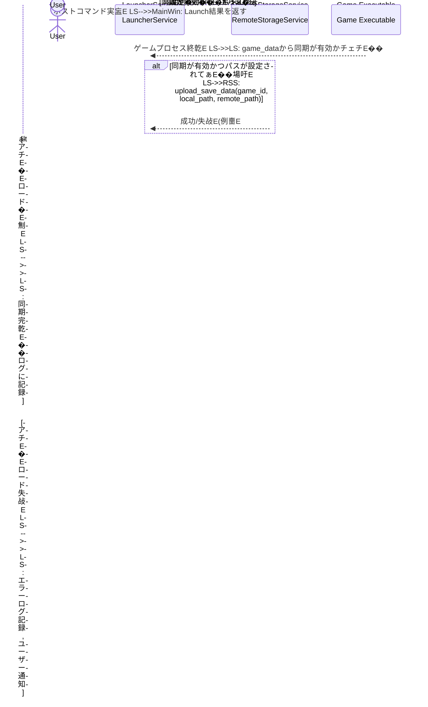

# Design Document

---
**Purpose**: LitheLauncher Game Launcherのセーブデータ同期機�Eの技術設計を定義し、要件の実裁E��おける一貫性を確保します、E
**Approach**:
- 要件を技術コンポ�Eネントとインターフェースにマッピングします、E- 既存�EアーキチE��チャパターンとプロジェクト�EスチE��リングガイドラインに準拠します、E- 軽度な調査結果を設計�E決定に統合します、E---

## Overview
**Purpose**: こ�E機�Eは、Pyzree Game Launcherのユーザーがゲームのセーブデータをリモートストレージと同期することを可能にします。これにより、データのバックアチE�Eと異なるデバイス間でのゲーム進行状況へのアクセスが容易になります、E**Users**: PCゲーマ�Eは、ゲームのセーブデータを保護し、異なるPC間でゲームを�Eレイする際に進行状況を共有するためにこ�E機�Eを利用します、E**Impact**: `GameDetailDialog` のUI、`Game` チE�EタモチE��、`GameService`、`LauncherService` が変更され、新たに `RemoteStorageService` が導�Eされます、E
### Goals
- ゲームごとにセーブデータ同期の有効/無効設定と、ローカル/リモートパスの設定機�Eを提供する、E- ゲーム起動前にリモートから最新のセーブデータを�E動ダウンロードする、E- ゲーム終亁E��にローカルのセーブデータをリモートへ自動アチE�Eロードする、E- 同期処琁E��のエラーを適刁E��処琁E��、ユーザーに通知する、E
### Non-Goals
- 高度なセーブデータ競合解決メカニズム�E�例：バージョン管琁E��ユーザーによる選択）。�E期バージョンでは「最後に書き込んだも�Eが勝つ」戦略を採用します、E- 任意�Eクラウドストレージプロバイダへの対応。�E期段階では、汎用皁E��ファイル転送�Eロトコル�E�例：FTP、S3互換API�E�また�Eローカルフォルダ同期を想定し、抽象化されたインターフェースを提供します、E- 同期処琁E�E非同期実行。�E期実裁E��は、ゲーム起動�E終亁E�EクリチE��カルパス上での同期はブロチE��ング処琁E��します、E
## Architecture

### Existing Architecture Analysis
-   **現在のアーキチE��チャパターンと制紁E*: Service Layer, Repository Pattern。UI (PySide6) -> `GameService` -> `GameRepository` -> SQLite DB。`LauncherService` がゲーム起動�E琁E��拁E��、E-   **既存�Eドメイン墁E��**: `GameService` はビジネスロジチE��、`LauncherService` はゲーム起動ロジチE��、`game_detail_dialog.py` はUIプレゼンチE�Eション。`RemoteStorageService`は現在モチE��、E-   **統合�EインチE*: `GameDetailDialog` と `GameService`、`GameService` と `GameRepository`、`LauncherService` と `RemoteStorageService`、E-   **技術的負債**: なし、E
### Architecture Pattern & Boundary Map
```mermaid
graph TD
    UI[GameDetailDialog (PySide6)] --> GS[GameService]
    GS --> GR[GameRepository]
    LS[LauncherService] --> GS
    LS --> RSS[RemoteStorageService]
    LS --> OS[Operating System (subprocess)]
    GR --> DB[(SQLite Database)]
    RSS --> RemoteStorage[(Remote Storage)]

    subgraph "LitheLauncher Application Boundary"
        UI
        GS
        GR
        LS
        DB
        RSS
        OS
        RemoteStorage
    end

    style UI fill:#bbf,stroke:#33c,stroke-width:2px;
    style GS fill:#bfb,stroke:#3c3,stroke-width:2px;
    style GR fill:#fbb,stroke:#c33,stroke-width:2px;
    style LS fill:#fbf,stroke:#c3c,stroke-width:2px;
    style DB fill:#eee,stroke:#999,stroke-width:2px;
    style RSS fill:#ffc,stroke:#cc3,stroke-width:2px;
    style OS fill:#eef,stroke:#99c,stroke-width:2px;
    style RemoteStorage fill:#ccf,stroke:#99c,stroke-width:2px;
```
**Architecture Integration**:
-   **Selected pattern**: ハイブリチE��アプローチ。既存�EService Layer, Repository Patternを維持しつつ、`RemoteStorageService`とぁE��新しいサービスを導�E・統合します、E-   **Domain/feature boundaries**:
    *   `GameDetailDialog` は、ユーザーからの同期設定�E入力を受け取り、`GameService` に渡します、E    *   `GameService` は、ゲームメタチE�Eタの一部として同期設定を永続化します、E    *   `LauncherService` は、ゲーム起動前と終亁E��に `RemoteStorageService` を呼び出してセーブデータ同期を調整します、E    *   `RemoteStorageService` は、E��択されたリモートストレージへのセーブデータのアチE�EローチEダウンロード�E実際の処琁E��実行します、E-   **Existing patterns preserved**: Service Layer, Repository Pattern, モジュラーチE��イン、E-   **New components rationale**: `RemoteStorageService` は、リモートストレージとの具体的な通信ロジチE��をカプセル化し、`LauncherService` からの疎結合を維持するために忁E��です、E-   **Steering compliance**: モジュラーチE��インと責務�E刁E��原則を維持し、既存�EチE�Eタ管琁E��よ�Eサービス層のパターンに準拠します、E
### Technology Stack

| Layer | Choice / Version | Role in Feature | Notes |
|-------|------------------|-----------------|-------|
| Frontend / UI | PySide6 | セーブデータ同期設定�E入力UI (`QCheckBox`, `QLineEdit`, `QPushButton`) | `GameDetailDialog` の拡張 |
| Backend / Services | Python 3.x | 同期設定�E管琁E��同期�E琁E�E調整、リモートストレージとのI/O | `GameService`, `LauncherService`, `RemoteStorageService` の拡張/新規導�E |
| Data / Storage | SQLite (via `src/database.py`) | ゲームメタチE�Eタ (`sync_enabled`, `save_folder`, `remote_sync_path`) の永続化 | `Game` チE�Eブルに新しいカラムを追加済み |
| Utilities | `shutil`, `pathlib` | ローカルファイルシスチE��操佁E(コピ�E、削除、ディレクトリ作�E) | Python標準ライブラリ。OS非依存性を提供、E|
| Remote Storage Protocol | 未宁E(抽象匁E | 実際のチE�Eタ転送�Eロトコル (FTP, S3 APIなど) | `RemoteStorageService` 冁E��実裁E��抽象化。開発時に決定、E|

## System Flows

### ゲーム起動時のセーブデータダウンロードフロー
```mermaid
sequenceDiagram
    actor User
    participant MainWin as MainWindow
    participant LS as LauncherService
    participant GS as GameService
    participant GR as GameRepository
    participant RSS as RemoteStorageService
    participant GameProcess as Game Executable

    User->>MainWin: ゲームを起勁E(GameCard double-click)
    MainWin->>LS: launch_game(game_id)
    LS->>GS: get_game_details(game_id)
    GS->>GR: get_game(game_id)
    GR-->>GS: game_data (同期設定含む)
    GS-->>LS: game_data
    LS->>LS: 同期が有効かチェチE��
    alt 同期が有効かつパスが設定されてぁE��場吁E        LS->>RSS: download_save_data(game_id, remote_path, local_path)
        RSS-->>LS: 成功/失敁E(例夁E
        alt ダウンロード�E劁E            LS->>LS: ゲーム実行コマンドを構篁E            LS->>GameProcess: ゲームを実衁E(subprocess.Popen)
            GameProcess-->>LS: ゲームプロセス終亁E            LS->>LS: ゲーム終亁E��同期�Eトリガーへ
        else ダウンロード失敁E            LS->>LS: エラーログ記録, ユーザー通知
            LS-->>MainWin: Launch失敁E(例夁E
    else 同期が無効また�Eパスが未設定�E場吁E        LS->>LS: ゲーム実行コマンドを構篁E        LS->>GameProcess: ゲームを実衁E(subprocess.Popen)
        GameProcess-->>LS: ゲームプロセス終亁E        LS->>LS: ゲーム終亁E��同期�Eトリガーへ (ただし同期�E行わなぁE
    end
    LS-->>MainWin: Launch結果
```
**フローレベルの決宁E*: `LauncherService` はゲーム起動�Eハブとして機�Eし、セーブデータ同期のプリプロセスとポスト�Eロセスを調整します。ダウンロード�E琁E�Eゲームの実行前にブロチE��ングで行われ、データ整合性を確保します、E
### ゲーム終亁E���EセーブデータアチE�Eロードフロー

**フローレベルの決宁E*: ゲームプロセス終亁E��、`LauncherService` がセーブデータ同期が有効な場合にのみアチE�Eロード�E琁E��トリガーします。この処琁E��ブロチE��ングで行われます、E
## Requirements Traceability

| Requirement | Summary | Components | Interfaces | Flows |
|-------------|---------|------------|------------|-------|
| 1.1 | 同期設定UI表示 | `GameDetailDialog` | UI | ゲーム起動時のセーブデータダウンロードフロー |
| 1.2 | 同期有効化でリモートパス有効匁E| `GameDetailDialog` | UI | - |
| 1.3 | 設定�E永続化 | `GameDetailDialog`, `GameService`, `GameRepository` | Service, Repository | ゲーム起動時のセーブデータダウンロードフロー |
| 1.4 | 既存設定�E表示 | `GameDetailDialog`, `GameService` | UI, Service | ゲーム起動時のセーブデータダウンロードフロー |
| 1.5 | 空リモートパスでの保存拒否 | `GameDetailDialog`, `GameService` | UI, Service | _save_game (UI側でのバリチE�Eション) |
| 2.1 | 起動前のダウンローチE| `LauncherService`, `RemoteStorageService` | Service | ゲーム起動時のセーブデータダウンロードフロー |
| 2.2 | ダウンロードエラーログ/通知 | `LauncherService` | Service | ゲーム起動時のセーブデータダウンロードフロー |
| 2.3 | ダウンロード�E功でゲーム実衁E| `LauncherService` | Service | ゲーム起動時のセーブデータダウンロードフロー |
| 2.4 | ダウンロード時のパス確誁E| `LauncherService` | Service | ゲーム起動時のセーブデータダウンロードフロー |
| 3.1 | 終亁E���EアチE�EローチE| `LauncherService`, `RemoteStorageService` | Service | ゲーム終亁E���EセーブデータアチE�Eロードフロー |
| 3.2 | アチE�Eロードエラーログ/通知 | `LauncherService` | Service | ゲーム終亁E���EセーブデータアチE�Eロードフロー |
| 3.3 | アチE�Eロード�E功でログ記録 | `LauncherService` | Service | ゲーム終亁E���EセーブデータアチE�Eロードフロー |
| 4.1 | 例外発生時の詳細ログ | `LauncherService`, `RemoteStorageService` | Service | 全ての同期フロー |
| 4.2 | エラー発生時のメチE��ージボックス | `LauncherService`, `MainWindow` | UI, Service | 全ての同期フロー |
| 4.3 | 同期エラーでも起勁E終亁E��衁E| `LauncherService` | Service | 全ての同期フロー |

## Components and Interfaces

### Service Layer

#### RemoteStorageService

| Field | Detail |
|---|---|
| Intent | リモートストレージとのセーブデータ転送を抽象匁E|
| Requirements | 2.1, 2.2, 3.1, 3.2, 4.1 |
| Owner / Reviewers | 開発チ�Eム |

**Responsibilities & Constraints**
- リモートストレージからのチE�Eタダウンロード�E琁E- リモートストレージへのチE�EタアチE�Eロード�E琁E- ネットワークエラー、認証エラー、ファイルI/Oエラーのハンドリング
- 特定�Eリモートストレージ実裁E��ら独立したインターフェースを提供すめE
**Dependencies**
- Inbound: `LauncherService`  Eセーブデータ同期の要汁E(P0)
- External: 選択されたリモートストレージAPI/ライブラリ  E実際のチE�Eタ転送E(P0)

**Contracts**: Service [x]

##### Service Interface
```python
from pathlib import Path
from typing import Optional

class RemoteStorageService:
    def download_save_data(self, game_id: int, remote_path: str, local_path: Path):
        """
        リモートストレージからローカルパスへセーブデータをダウンロードします、E        ダウンロードが成功した場合�ENoneを、失敗した場合�E例外を発生させます、E        """
        pass

    def upload_save_data(self, game_id: int, local_path: Path, remote_path: str):
        """
        ローカルパスからリモートストレージへセーブデータをアチE�Eロードします、E        アチE�Eロードが成功した場合�ENoneを、失敗した場合�E例外を発生させます、E        """
        pass
```
- Preconditions: `remote_path` と `local_path` は有効なパスである。`game_id` は存在するゲームのIDである、E- Postconditions: ダウンロード�E功後、ローカルパスにチE�Eタが存在する。アチE�Eロード�E功後、リモートパスにチE�Eタが存在する、E- Invariants: チE�Eタ転送中にセーブデータが破損しなぁE��と、E
**Implementation Notes**
- **Integration**: `LauncherService` から呼び出されます、E- **Validation**: 転送中のファイル整合性�E�例：サイズ、変更時刻�E�を確認し、ダウンローチEアチE�Eロード�E成否を判断します、E- **Risks**: リモートストレージの可用性、ネチE��ワークの安定性。これらの問題を適刁E��処琁E��るため�Eリトライ機構やタイムアウト設定が忁E��となる場合があります、E
#### GameService

| Field | Detail |
|---|---|
| Intent | ゲームのビジネスロジチE��を管琁E��、セーブデータ同期設定を含むゲームメタチE�Eタを永続化する、E|
| Requirements | 1.3 |

**Responsibilities & Constraints**
- `GameRepository` を介して、ゲームの `sync_enabled`, `save_folder`, `remote_sync_path` を保存�E取得する、E- `GameDetailDialog` から受け取った同期設定を `Game` モチE��にマッピングし、永続化処琁E��調整する、E
**Dependencies**
- Outbound: `GameRepository`  EゲームチE�Eタの永続化 (P0)

**Contracts**: Service [x]

##### Service Interface
```python
from typing import Dict, Any, Optional
from pathlib import Path

class GameService:
    # ... 既存メソチE�� ...
    def register_game(self, game_data: Dict[str, Any], temp_image_path: Path | None = None) -> Dict[str, Any]:
        """新規ゲームを登録し、同期設定を保存する、E""
        pass
    
    def update_game_details(self, game_id: int, updates: Dict[str, Any], temp_image_path: Path | None = None) -> Dict[str, Any]:
        """既存ゲームを更新し、同期設定を更新する、E""
        pass
```
- Preconditions: `game_data` は有効なゲーム惁E��を含む。`updates` には同期設定が含まれる場合がある、E- Postconditions: ゲームが登録・更新され、同期設定が適刁E��保存される、E
**Implementation Notes**
- **Integration**: `register_game` および `update_game_details` メソチE��で `sync_enabled`, `save_folder`, `remote_sync_path` を�E琁E��るよぁE��拡張、E- **Validation**: 主なバリチE�EションはUI層 (`GameDetailDialog`) で行われ、`GameService` ではチE�Eタの永続化を保証します、E
#### LauncherService

| Field | Detail |
|---|---|
| Intent | ゲームの実行ファイル起動を調整し、セーブデータ同期処琁E��トリガーする、E|
| Requirements | 2.1, 2.2, 2.3, 2.4, 3.1, 3.2, 3.3, 4.1, 4.2, 4.3 |

**Responsibilities & Constraints**
- ゲーム起動前、起動中の実行ファイルパス検証、起動後�Eプロセス監視、終亁E��コマンド実行、E- ゲーム起動前に `RemoteStorageService` を呼び出し、セーブデータのダウンロードをトリガーする、E- ゲームプロセス終亁E��に `RemoteStorageService` を呼び出し、セーブデータのアチE�Eロードをトリガーする、E- 同期処琁E��のエラーを捕捉し、ロギングと `MainWindow` への通知を行う、E
**Dependencies**
- Inbound: `MainWindow`  Eゲーム起動要汁E(P0)
- Outbound: `GameService`  Eゲーム詳細の取征E(P0)
- Outbound: `RemoteStorageService`  EセーブデータのダウンローチEアチE�EローチE(P0)
- External: `subprocess` (Python標溁E  Eゲームプロセスの管琁E(P0)

**Contracts**: Service [x]

##### Service Interface
```python
from pathlib import Path

class LauncherService:
    # ... 既存メソチE�� ...
    def launch_game(self, game_id: int) -> bool:
        """
        持E��されたゲームIDのゲームを起動し、起動前後にセーブデータ同期を実行します、E        成功した場合�ETrueを、失敗した場合�E例外を発生させます、E        """
        pass
```
- Preconditions: `game_id` は存在するゲームのIDである、E- Postconditions: ゲームが起動される、また�E同期処琁E��実行される、E- Invariants: ゲームの実行前にダウンロード、終亁E��にアチE�Eロード�E頁E��が保証される、E
**Implementation Notes**
- **Integration**: 既存�E `launch_game` メソチE��に同期ロジチE��を追加します。`RemoteStorageService` と `GameService` のインスタンスにアクセスできる忁E��があります、E- **Validation**: 同期設定が有効かつパスが正しい場合にのみ同期処琁E��実行します、E- **Risks**: 同期処琁E��ブロチE��ングのため、同期に時間がかかるとユーザー体験に影響を与える可能性があります。封E��皁E��は非同期化を検討、E
### UI Layer

#### GameDetailDialog

| Field | Detail |
|---|---|
| Intent | ゲーム詳細の表示、編雁E��セーブデータ同期設定�E入劁E|
| Requirements | 1.1, 1.2, 1.3, 1.4, 1.5, 4.2 |

**Responsibilities & Constraints**
- セーブデータ同期の有効/無効を�Eり替えるチェチE��ボックス (`QCheckBox`) をUIに追加、E- ローカルセーブフォルダとリモート同期パスを�E力すめE`QLineEdit` および参�EボタンをUIに追加、E- 既存ゲームの編雁E��には、保存された同期設定をUIに表示、E- ユーザーが�E力した同期設定を `GameService` に渡す、E- リモート同期パスが空の場合、保存時に警告を表示し拒否する、E- `GameService` への画像パス処琁E��老E�Eして、`get_game_data` の戻り値として `temp_image_path` も返す、E
**Dependencies**
- Outbound: `GameService`  EゲームチE�Eタの取得�E保孁E(P0)
- Outbound: `ImageManager`  E画像管琁E(P0)
- Outbound: `LauncherService`  Eコマンドライン設定�EバリチE�Eション (P0)

**Contracts**: State [x]

##### State Management
-   **State model**:
    *   `sync_enabled: bool`�E�セーブデータ同期の有効/無効、E    *   `save_folder: str`�E�ローカルセーブフォルダパス、E    *   `remote_sync_path: str`�E�リモート同期パス、E-   **Persistence & consistency**: ダイアログインスタンスの生存期間中のみチE�Eタを保持し、保存時に `GameService` を通じて永続化、E
**Implementation Notes**
- **Integration**: `GameDetailDialog` のUIに新しいUI要素を追加。`_update_ui_from_game_data` および `get_game_data` メソチE��を更新、E- **Validation**: リモート同期パスが設定されてぁE��かどぁE��の基本皁E��UIバリチE�Eションを追加、E- **Risks**: UI要素の追加によるレイアウト�E褁E��化、E
## Data Models

### Logical Data Model

**Structure Definition**:
- `Game` エンチE��チE��に新しい属性を追加、E    *   `sync_enabled`: INTEGER (SQLiteではBOOLEANの代わりに整数を使用), NOT NULL, DEFAULT 0 (無効)
    *   `save_folder`: TEXT, NULLABLE (チE��ォルト�E空斁E���E)
    *   `remote_sync_path`: TEXT, NULLABLE (チE��ォルト�E空斁E���E)

**Consistency & Integrity**:
- `sync_enabled` ぁE`1` (true) の場合、`save_folder` および `remote_sync_path` が空でなぁE��と。これ�EUIバリチE�Eションとサービス層のチェチE��で保証されます、E
## Error Handling

### Error Strategy
- `RemoteStorageService` で発生した同期エラーは `SaveDataSyncError` 例外として捕捉され、`LauncherService` に伝播されます、E- `LauncherService` は `SaveDataSyncError` を捕捉し、エラーをログに記録し、`MainWindow` を介してユーザーに通知します、E- `MainWindow` は、ユーザーフレンドリーなメチE��ージボックスを表示し、同期エラーが発生してもゲームの起勁E終亁E��ローを継続します（要件4.3�E�、E- リモート同期パスが空のままで同期を有効にして保存しようとした場合、`GameDetailDialog` はエラーメチE��ージを表示し保存を拒否します（要件1.5�E�、E
### Error Categories and Responses
- **セーブデータ同期エラー (`SaveDataSyncError`)**:
    *   **原因**: ネットワーク接続�E問題、リモートストレージへのアクセスエラー、ファイルI/Oエラー、認証エラーなど、E    *   **対忁E*: `LauncherService` でエラーをログに記録。`MainWindow` でユーザーにメチE��ージボックスを表示�E�「セーブデータ同期に失敗しました」）。ゲームの起勁E終亁E�Eロセスは継続、E- **入力バリチE�Eションエラー**:
    *   **原因**: 同期が有効なのにリモート同期パスが空、E    *   **対忁E*: `GameDetailDialog` で警告メチE��ージを表示し、保存をブロチE��、E
## Testing Strategy

### Unit Tests
-   **`RemoteStorageService`**: `download_save_data` および `upload_save_data` メソチE��の成功/失敗シナリオ、ファイルI/O、ネチE��ワークエラーハンドリング、E-   **`GameService`**: `sync_enabled`, `save_folder`, `remote_sync_path` を含むゲームチE�Eタの保存と取得、E-   **`LauncherService`**: ゲーム起動前後�E同期トリガー、`RemoteStorageService` との連携、エラー伝播、ゲーム起動継続ロジチE��、E-   **`GameDetailDialog`**: 同期設定UI要素の表示、データバインチE��ング、リモートパスの有効匁E無効化、保存時のバリチE�EションメチE��ージ表示、E
### Integration Tests
-   `GameDetailDialog` から `GameService` を経由した同期設定�E保存と読み込みフロー、E-   `GameDetailDialog` から `LauncherService` を経由した同期設定付きゲームの起動と終亁E���E同期フロー、E-   同期中のエラー�E�ダウンローチEアチE�Eロード失敗）発生時のUI通知と、ゲーム起勁E終亁E�E継続性、E
### E2E/UI Tests
-   ユーザーがゲーム詳細画面でセーブデータ同期を有効にし、パスを設定して保存し、ゲームを起動�E終亁E��た際に、セーブデータが適刁E��同期されること、E-   不正な同期設定（例：空のリモートパス�E�を入力した際に、UIが警告を表示し、E��刁E��ユーザーフィードバチE��が提供されること�
