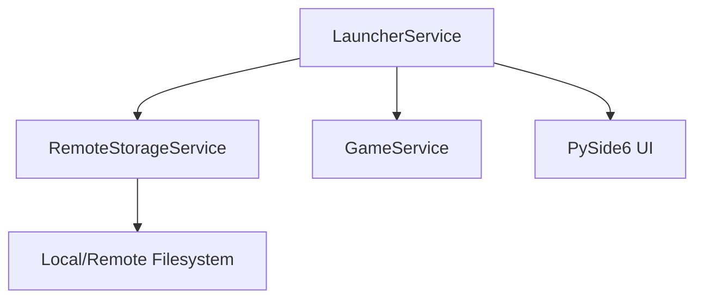
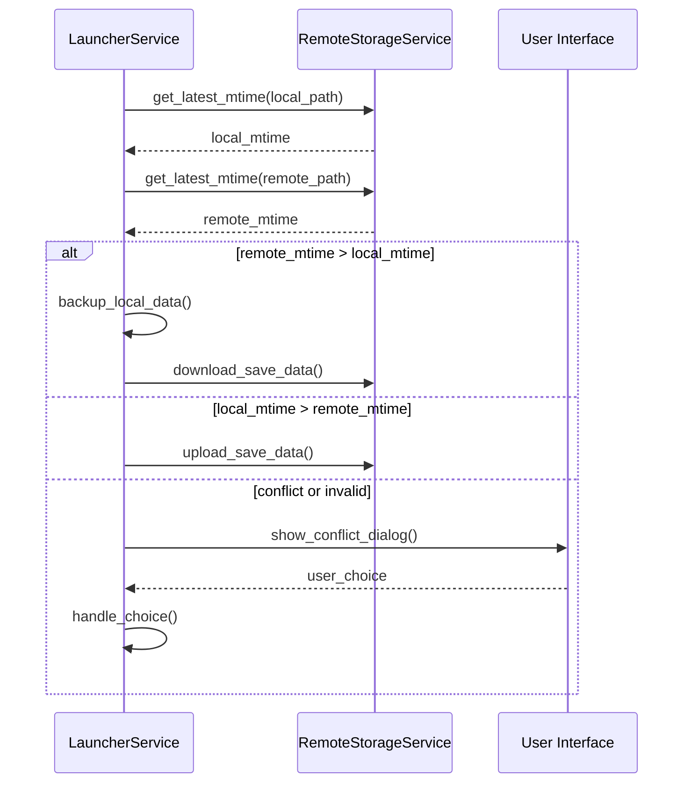

# Design Document: Smart Save Data Sync

## Overview
縺薙・讖溯・縺ｯ縲￣yzree Game Launcher 縺ｫ縺翫＞縺ｦ縲√そ繝ｼ繝悶ョ繝ｼ繧ｿ縺ｮ縲御ｸ€譁ｹ蜷代・蠑ｷ蛻ｶ蜷梧悄縲阪ｒ縲後ち繧､繝繧ｹ繧ｿ繝ｳ繝玲ｯ碑ｼ・↓蝓ｺ縺･縺上せ繝槭・繝医↑蜷梧悄縲阪↓繧｢繝・・繧ｰ繝ｬ繝ｼ繝峨☆繧九ｂ縺ｮ縺ｧ縺吶€・
**Purpose**: 繝ｦ繝ｼ繧ｶ繝ｼ縺瑚､・焚縺ｮ繝・ヰ繧､繧ｹ縺ｧ繝励Ξ繧､縺吶ｋ髫帙€∝ｸｸ縺ｫ譛€譁ｰ縺ｮ騾ｲ陦檎憾豕√′驕ｩ逕ｨ縺輔ｌ繧九％縺ｨ繧剃ｿ晁ｨｼ縺励€∝商縺・ョ繝ｼ繧ｿ縺ｧ譁ｰ縺励＞繝・・繧ｿ繧定ｪ､縺｣縺ｦ荳頑嶌縺阪☆繧九Μ繧ｹ繧ｯ繧呈怙蟆城剞縺ｫ謚代∴縺ｾ縺吶€・**Users**: 隍・焚縺ｮPC縺ｧ繧ｻ繝ｼ繝悶ョ繝ｼ繧ｿ繧貞酔譛溘＠縺ｦ繝励Ξ繧､縺吶ｋ繝ｦ繝ｼ繧ｶ繝ｼ縲・
### Goals
- 襍ｷ蜍墓凾縺ｫ繝ｭ繝ｼ繧ｫ繝ｫ縺ｨ繝ｪ繝｢繝ｼ繝医・繧ｻ繝ｼ繝悶ョ繝ｼ繧ｿ繧呈ｯ碑ｼ・＠縲∵眠縺励＞譁ｹ繧定・蜍墓治逕ｨ縺吶ｋ縲・- 繝ｭ繝ｼ繧ｫ繝ｫ縺ｮ譁ｹ縺梧眠縺励＞蝣ｴ蜷医・繝ｪ繝｢繝ｼ繝医∈繧｢繝・・繝ｭ繝ｼ繝峨＠縲√Μ繝｢繝ｼ繝医・譁ｹ縺梧眠縺励＞蝣ｴ蜷医・繝ｭ繝ｼ繧ｫ繝ｫ縺ｸ繝€繧ｦ繝ｳ繝ｭ繝ｼ繝峨☆繧九€・- 繧ｿ繧､繝繧ｹ繧ｿ繝ｳ繝励・荳肴紛蜷医ｄ遶ｶ蜷医′逋ｺ逕溘＠縺滄圀縺ｫ繝ｦ繝ｼ繧ｶ繝ｼ縺ｫ騾夂衍縺励€・∈謚櫁い繧呈署遉ｺ縺吶ｋ縲・
### Non-Goals
- 繧ｻ繝ｼ繝悶ョ繝ｼ繧ｿ蜀・・蟾ｮ蛻・・繝ｼ繧ｸ・医ョ繧｣繝ｬ繧ｯ繝医Μ蜊倅ｽ阪∪縺溘・繝輔ぃ繧､繝ｫ蜊倅ｽ阪〒縺ｮ蜈ｨ蜈･繧梧崛縺医・縺ｿ・峨€・- 繝ｪ繧｢繝ｫ繧ｿ繧､繝蜷梧悄・医ご繝ｼ繝襍ｷ蜍墓凾縺ｨ邨ゆｺ・凾縺ｮ縺ｿ螳滓命・峨€・
## Architecture

### Existing Architecture Analysis
- `LauncherService` 縺悟酔譛溘・繧ｿ繧､繝溘Φ繧ｰ・郁ｵｷ蜍募燕/邨ゆｺ・ｾ鯉ｼ峨ｒ邂｡逅・＠縺ｦ縺・ｋ縲・- `RemoteStorageService` 縺・`shutil` 繧貞茜逕ｨ縺励◆迚ｩ逅・噪縺ｪ繝輔ぃ繧､繝ｫ繧ｳ繝斐・繧呈球縺｣縺ｦ縺・ｋ縲・
### Architecture Pattern & Boundary Map
譌｢蟄倥・ Service 繝ｬ繧､繝､繝代ち繝ｼ繝ｳ繧堤ｶｭ謖√＠縲～RemoteStorageService` 縺ｫ豈碑ｼ・畑繝ｦ繝ｼ繝・ぅ繝ｪ繝・ぅ繧偵€～LauncherService` 縺ｫ繧ｹ繝槭・繝亥酔譛溘・蛻､譁ｭ繝ｭ繧ｸ繝・け繧定ｿｽ蜉縺励∪縺吶€・


## System Flows

### 繧ｹ繝槭・繝亥酔譛溘・繝ｭ繧ｻ繧ｹ (襍ｷ蜍墓凾)


## Requirements Traceability

| Requirement | Summary | Components | Interfaces | Flows |
|-------------|---------|------------|------------|-------|
| 1.1 | 譛€譁ｰ繝・・繧ｿ縺ｮ閾ｪ蜍募愛螳・| RemoteStorageService | get_latest_mtime | 繧ｹ繝槭・繝亥酔譛溘・繝ｭ繧ｻ繧ｹ |
| 1.2 | 繝ｪ繝｢繝ｼ繝亥━蜈亥酔譛・| LauncherService | sync_save_data | 繧ｹ繝槭・繝亥酔譛溘・繝ｭ繧ｻ繧ｹ |
| 1.3 | 繝ｭ繝ｼ繧ｫ繝ｫ蜆ｪ蜈亥酔譛・| LauncherService | sync_save_data | 繧ｹ繝槭・繝亥酔譛溘・繝ｭ繧ｻ繧ｹ |
| 2.2 | 謇句虚驕ｸ謚槭ム繧､繧｢繝ｭ繧ｰ | LauncherService | _show_sync_conflict_dialog | 繧ｹ繝槭・繝亥酔譛溘・繝ｭ繧ｻ繧ｹ |
| 3.2 | 隧ｳ邏ｰ縺ｪ繝ｭ繧ｰ險倬鹸 | LauncherService | sync_save_data | - |

## Components and Interfaces

| Component | Domain/Layer | Intent | Req Coverage | Key Dependencies | Contracts |
|-----------|--------------|--------|--------------|------------------|-----------|
| RemoteStorageService | Infrastructure | 繝輔ぃ繧､繝ｫ謫堺ｽ懊→豈碑ｼ・| 1.1 | os, pathlib | Service |
| LauncherService | Business Logic | 蜷梧悄繝輔Ο繝ｼ蛻ｶ蠕｡ | 1.2, 1.3, 2.2 | RemoteStorageService, UI | Service, State |

### Infrastructure

#### RemoteStorageService
| Field | Detail |
|-------|--------|
| Intent | 繧ｻ繝ｼ繝悶ョ繝ｼ繧ｿ縺ｮ迚ｩ逅・噪縺ｪ霆｢騾√→豈碑ｼ・ｒ諡・ｽ・|
| Requirements | 1.1 |

**Responsibilities & Constraints**
- 繝・ぅ繝ｬ繧ｯ繝医Μ蜀・ｒ蜀榊ｸｰ逧・↓襍ｰ譟ｻ縺励€∵怙譁ｰ縺ｮ繝輔ぃ繧､繝ｫ譖ｴ譁ｰ譌･譎ゑｼ・NIX繧ｿ繧､繝繧ｹ繧ｿ繝ｳ繝暦ｼ峨ｒ霑斐☆縲・- 繝ｭ繝ｼ繧ｫ繝ｫ縺ｨ繝ｪ繝｢繝ｼ繝医・蜿梧婿縺ｧ蜷後§繧｢繝ｫ繧ｴ繝ｪ繧ｺ繝繧剃ｽｿ逕ｨ縺励※豈碑ｼ・・蜈ｬ蟷ｳ諤ｧ繧剃ｿ昴▽縲・
**Contracts**: Service [x]
##### Service Interface
```python
class RemoteStorageService:
    def get_latest_mtime(self, path: Path) -> float:
        """繝・ぅ繝ｬ繧ｯ繝医Μ蜀・・蜈ｨ繝輔ぃ繧､繝ｫ繧定ｵｰ譟ｻ縺励€∵怙譁ｰ縺ｮ mtime 繧定ｿ斐☆縲ゅヵ繧｡繧､繝ｫ縺後↑縺・ｴ蜷医・ 0 繧定ｿ斐☆縲・""
```

### Business Logic

#### LauncherService
| Field | Detail |
|-------|--------|
| Intent | 繧ｲ繝ｼ繝襍ｷ蜍輔Ρ繝ｼ繧ｯ繝輔Ο繝ｼ縺ｫ縺翫￠繧句酔譛溘・諢乗€晄ｱｺ螳・|
| Requirements | 1.2, 1.3, 2.2 |

**Responsibilities & Constraints**
- `sync_save_data` 繝｡繧ｽ繝・ラ繧呈僑蠑ｵ縺励€～direction="smart"` 繝｢繝ｼ繝峨ｒ螳溯｣・☆繧九€・- 繧ｿ繧､繝繧ｹ繧ｿ繝ｳ繝玲ｯ碑ｼ・・邨先棡縲∽ｸ€螳壻ｻ･荳翫・蟾ｮ逡ｰ縺後≠繧句ｴ蜷医・縺ｿ蜷梧悄繧定｡後≧・育ｧ貞腰菴阪・蠕ｮ蟾ｮ縺ｯ辟｡隕悶☆繧九↑縺ｩ縺ｮ讀懆ｨ趣ｼ峨€・- 遶ｶ蜷域､懃衍譎ゅ↓ UI 繧帝€壹§縺ｦ繝ｦ繝ｼ繧ｶ繝ｼ縺ｫ遒ｺ隱阪ｒ陦後≧縲・
**Contracts**: Service [x] / State [x]
##### Service Interface
```python
class LauncherService:
    def sync_save_data(self, game_id: int, direction: str) -> bool:
        """direction='smart' 縺ｫ蟇ｾ蠢懊＠縲∵ｯ碑ｼ・Ο繧ｸ繝・け繧堤ｵｱ蜷医☆繧九€・""
        
    def _show_sync_conflict_dialog(self, game_title: str, local_time: str, remote_time: str) -> str:
        """QMessageBox 繧剃ｽｿ逕ｨ縺励※繝ｦ繝ｼ繧ｶ繝ｼ縺ｫ驕ｸ謚櫁い繧呈署遉ｺ縺吶ｋ縲・""
```

## Testing Strategy
- **Unit Tests**:
  - `RemoteStorageService.get_latest_mtime`: 讒倥€・↑繝輔ぃ繧､繝ｫ讒区・・育ｩｺ縲∵ｷｱ縺・し繝悶ョ繧｣繝ｬ繧ｯ繝医Μ縲∬､・焚繝輔ぃ繧､繝ｫ・峨〒縺ｮ豁｣蠖捺€ｧ讀懆ｨｼ縲・  - `LauncherService.sync_save_data`: 豈碑ｼ・ｵ先棡・医Μ繝｢繝ｼ繝域眠縲√Ο繝ｼ繧ｫ繝ｫ譁ｰ縲∝酔荳€・峨↓蠢懊§縺溷・蟯舌・讀懆ｨｼ縲・- **Integration Tests**:
  - 螳滄圀縺ｫ繝｢繝・け繧ｹ繝医Ξ繝ｼ繧ｸ繧剃ｽｿ逕ｨ縺励※縲∬ｵｷ蜍・-> 豈碑ｼ・-> 蜷梧悄 -> 繧ｲ繝ｼ繝邨ゆｺ・-> 繧｢繝・・繝ｭ繝ｼ繝峨・荳€騾｣縺ｮ繝輔Ο繝ｼ縺梧ｭ｣蟶ｸ縺ｫ蜍穂ｽ懊☆繧九％縺ｨ繧堤｢ｺ隱阪€・- **UI Tests**:
  - 遶ｶ蜷域凾縺ｮ繝€繧､繧｢繝ｭ繧ｰ縺瑚｡ｨ遉ｺ縺輔ｌ縲∝推繝懊ち繝ｳ・医Ο繝ｼ繧ｫ繝ｫ謗｡逕ｨ縲√Μ繝｢繝ｼ繝域治逕ｨ縲√く繝｣繝ｳ繧ｻ繝ｫ・峨′豁｣縺励￥讖溯・縺吶ｋ縺薙→繧堤｢ｺ隱阪€・
